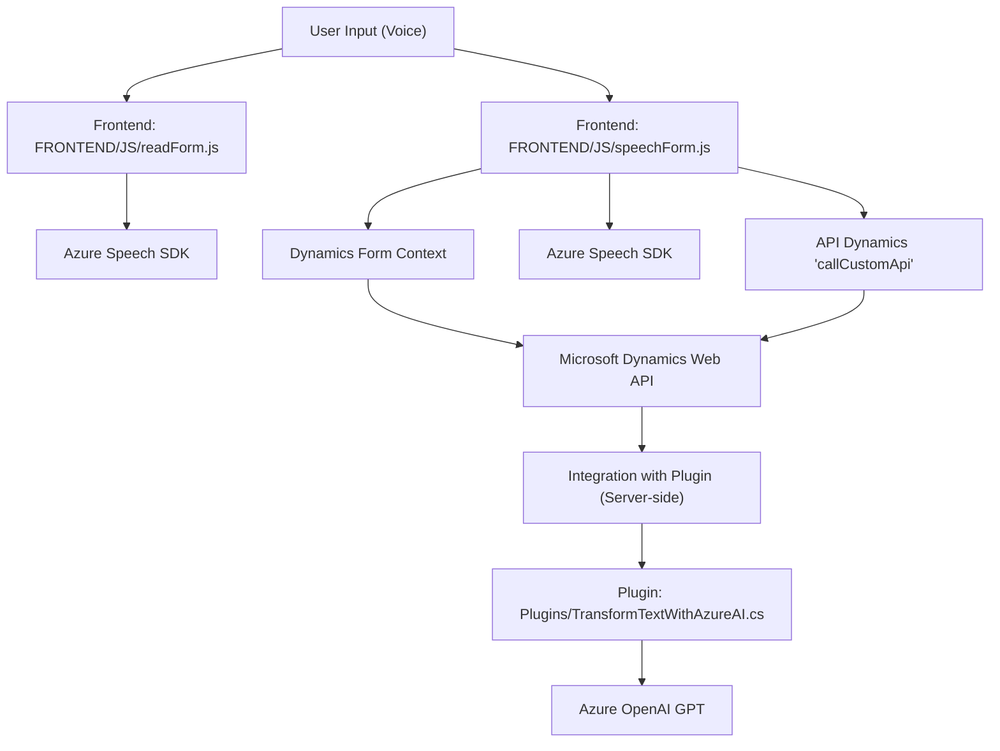

### Breve Resumen Técnico:
El repositorio contiene archivos relacionados con la implementación de funcionalidades que integran servicios de Azure (Speech SDK, OpenAI, etc.) y Microsoft Dynamics 365 (API y formularios). Se enfoca en habilitar el procesamiento de voz a texto, reproducción mediante síntesis de voz, y transformación avanzada de texto estructurado con ayuda de inteligencia artificial.

---

### Descripción de Arquitectura:
La arquitectura parece ser **n capas** con integración basada en servicios externos. Los elementos internos se componen de diferentes niveles de funcionalidad:
1. **Frontend (JS)**: Maneja la interacción con el usuario (grabación y reproducción de voz), entrada y extracción de datos del formulario. También asegura la comunicación con SDKs de Azure Speech y Dynamics API.
2. **Plugin Backend (C#)**: Ejecuta lógica de transformación avanzada mediante Azure OpenAI y registra resultados estructurados en el entorno de Dynamics CRM.
3. **Servicios externos (Azure)**: Son utilizados para funcionalidades críticas como procesamiento de voz y transformar texto utilizando modelos AI de OpenAI.

El diseño general tiene características de una arquitectura **mixta** basada en n capas (backend, frontend, API externa), combinado con patrones de microservicios (Azure Speech SDK y Azure OpenAI como servicios especializados).

---

### Tecnologías Usadas:
1. **Frontend**:
    - Lenguaje: JavaScript.
    - Framework/Servicios: Azure Speech SDK.
    - Estilo: Funciones utilitarias + interacción asincrónica (promises y callbacks).

2. **Plugin Backend**:
    - Lenguaje: C#.
    - Framework: Microsoft Dynamics CRM SDK.
    - Servicios: Azure OpenAI.

3. **Servicios Externos**:
    - **Azure Cognitive Services Speech SDK**: Para reconocimiento de voz y síntesis de audio.
    - **Azure OpenAI GPT**: Procesamiento avanzado de texto.

4. **Patrones de desarrollo**:
    - Cargador dinámico: Implementación de SDK de Speech.
    - Event-driven programming: Callbacks y métodos asincrónicos.
    - Client SDK Integration: Centralizado en Azure Speech y Dynamics API.
    - Plugin Pattern: Uso estándar en Dynamics 365 para ejecutar lógica personalizada a nivel del servidor.

---

### Diagrama **Mermaid**:
Diagrama para representar la interacción entre los componentes del sistema:

---

### Conclusión Final:
Este repositorio implementa una solución orientada a mejorar la interacción con formularios de Microsoft Dynamics 365 mediante capacidades avanzadas de procesamiento de voz y texto. La arquitectura aprovecha tanto los servicios externos basados en la nube (Azure Speech SDK y OpenAI) como la infraestructura local de Dynamics CRM. Los patrones y tecnologías aplicados favorecen la modularidad, facilidad de integración, y reutilización en otras soluciones relacionadas con procesamiento de datos y voz.