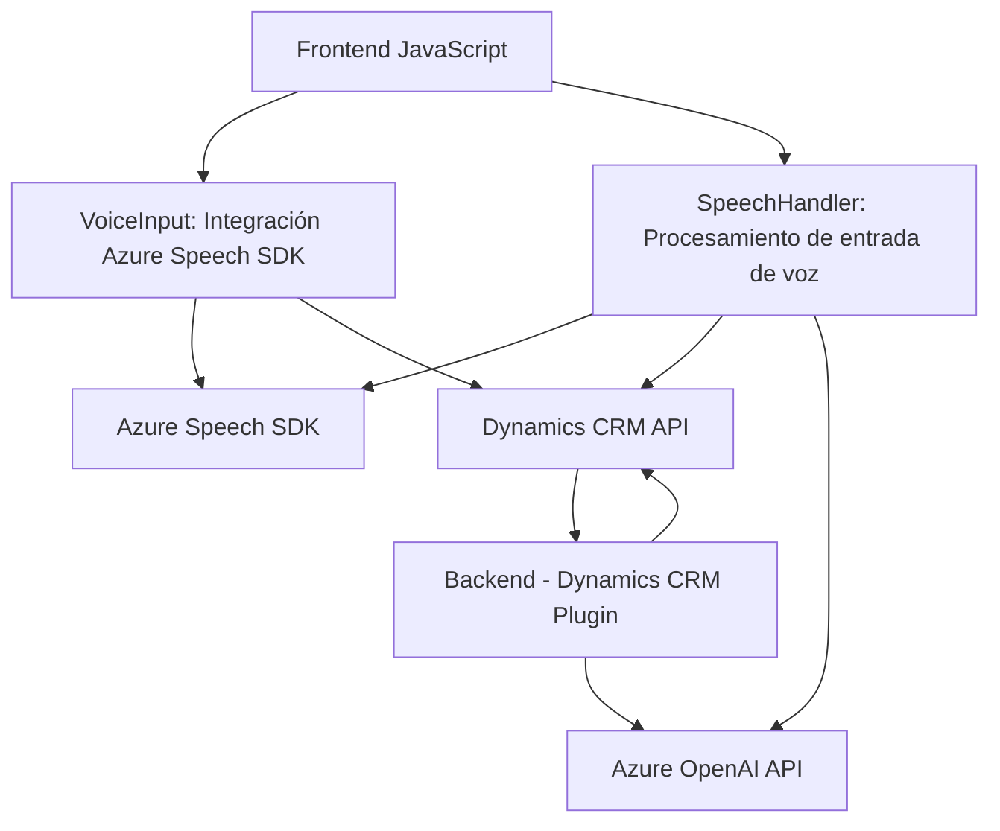

### Breve Resumen Técnico
El repositorio contenido en los archivos analizados implementa una solución para integrar la **Azure Speech SDK** y **Azure OpenAI** con formularios en **Dynamics 365**, una plataforma CRM. Los componentes tienen funciones específicas como síntesis de texto a voz, reconocimiento de voz, transformación de datos mediante inteligencia artificial, y manipulación de formularios basados en eventos y dinámicas de usuario.

---

### Descripción de Arquitectura
La solución sigue una **arquitectura modular orientada a servicios** y se integra a una plataforma CRM (**Dynamics 365**) mediante plugins personalizados. Aunque hay elementos independientes, como archivos JavaScript para interacción con el frontend y un plugin en C#, la arquitectura es de **n capas**, con una capa de presentación (frontend JavaScript), una capa de lógica de negocio (plugins en Dynamics CRM), y servicios externos orientados a AI (Azure Speech SDK y OpenAI).

---

### Tecnologías, Frameworks y Patrones Usados
1. **Tecnologías**:
   - **Frontend**:
     - Lenguaje: JavaScript (cliente).
     - Framework: Dynamics 365 Forms API.
     - Servicio: Azure Speech SDK.
   - **Backend**:
     - Lenguaje: C#.
     - Framework: Microsoft Dynamics CRM SDK.
     - Servicio: Azure OpenAI.

2. **Patrones**:
   - **Event-driven architecture**: Captura e interacción gestionadas por eventos en los formularios de Dynamics 365 y respuesta de SDK de voz.
   - **Facade pattern**: Encapsulación en métodos aislados como `speakText` (para texto a voz) y `callCustomApi` (para llamar servicios externos).
   - **Plug-in Architecture**: Extensión de funcionalidad en Dynamics CRM con **IPlugin**.
   - **Service-Oriented Architecture (SOA)**: Uso de servicios como Azure Speech y OpenAI para delegar capacidades avanzadas, desacoplando la lógica de negocio.

---

### Dependencias y Componentes Externos Potenciales
1. **Externos**:
   - **Azure Speech SDK**: Para síntesis y reconocimiento de voz.
   - **Azure OpenAI**: Para transformación inteligente del texto basado en modelos GPT.
   - **Dynamics 365 Web API**: Operaciones sobre entidades del sistema CRM.
2. **Internos**:
   - Servicio de formularios de Dynamics 365 (`IOrganizationService`, `IPluginExecutionContext`).
   - APIs del contexto de formulario como atributos y entidades visibles.

---

### Diagrama Mermaid

El diagrama a continuación muestra las relaciones entre componentes internos y externos. El sistema tiene capas para frontend, lógica de negocio en el backend, y servicios conectados a Azure.

### Conclusión Final
La estructura analizada implementa una solución para interacción vocal y textual con formularios dinámicos de **Dynamics 365**, utilizando los servicios avanzados de Azure en inteligencia artificial y reconocimiento de voz. La arquitectura, de **n capas**, asegura una separación adecuada entre la capa de presentación, la lógica de negocio y los servicios externos. Este diseño otorga modularidad, extensibilidad y la capacidad de manejar dependencias externas como SDKs y APIs de terceros, ideal para proyectos de integración entre CRM y servicios potentes de AI.