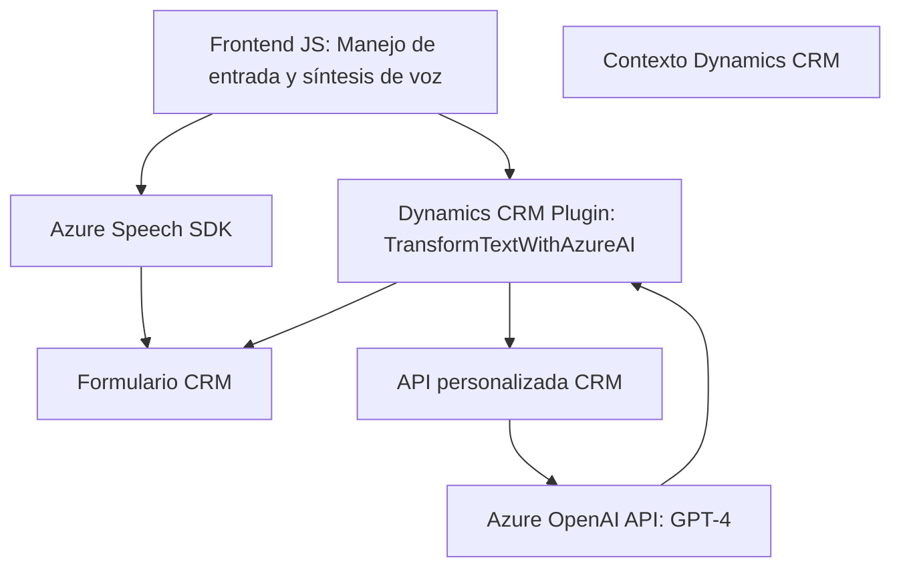

# Análisis técnico centrado en el repositorio

### Breve resumen técnico
El repositorio implementa una solución variada para integrar un CRM con entrada, síntesis y transformación de texto mediante herramientas como el SDK de Azure Speech y Azure OpenAI Service. Los componentes se dividen claramente entre frontend basado en JavaScript y backend mediante plugins para Dynamics CRM.

---

### Descripción de arquitectura
La arquitectura general parece seguir un enfoque **híbrido**, con elementos de complementos en el backend (plugin de Dynamics CRM) y servicios externos (Azure Speech SDK y Azure OpenAI API) para realizar operaciones específicas. La aplicación también emplea una división **modular** entre frontend (JS para entrada y síntesis de voz) y backend (C# para transformación de texto). Aunque los patrones de microservicios son evidentes debido al uso de APIs externas, el plugin principal pertenece a un entorno más acotado y puede considerarse como **monolítico** en su naturaleza dentro de Dynamics CRM.

---

### Tecnologías usadas
**Backend**
- **C#:** Usado para el desarrollo de plugins de Dynamics CRM.
- **Azure OpenAI API:** Para transformación textual avanzada.
- **Dynamics CRM SDK:** Para interacción directa con formularios y servicios del CRM.
- **Newtonsoft.Json:** Para manipulación avanzada de objetos JSON.

**Frontend**
- **JavaScript:** Utilizado para integrar la voz (síntesis y reconocimiento) y el control de datos visibles en los formularios cliente.
- **Azure Speech SDK:** Servicio para entrada y síntesis de voz a través del navegador.
- **DOM API:** Para extracción, manipulación y presentación de datos en los formularios.

---

### Dependencias o componentes externos presentes
**Dependencias clave:**
- **Azure Speech SDK:** Una librería externa cargada dinámicamente que proporciona funcionalidades de reconocimiento y síntesis de voz.
- **Azure OpenAI API:** Utilizada en el backend para transformación avanzada de texto con GPT-4.
- **Dynamics CRM:** Dependencia para el entorno principal del plugin y manipulación de formularios.

**Componentes configurados o posibles:**
- **Esquemas de configuración en un CRM:** El plugin consume datos específicos del formulario CRM y utiliza reglas aplicadas a campos del CRM, lo que sugiere dependencia directa de esquemas existentes.
- **API personalizada (`trial_TransformTextWithAzureAI`):** Parte del entorno CRM complementado.
- **Servicios HTTP:** Requeridos para comunicación con servicios externos (Azure OpenAI).

---

### Diagrama Mermaid válido para GitHub

---

### Conclusión final
El proyecto combina tecnologías avanzadas en un entorno CRM para gestionar entrada y salida de voz, así como transformar datos mediante inteligencia artificial. La solución tiene una arquitectura híbrida, combinando un plugin monolítico interactivo con servicios externos propios de un enfoque basado en microservicios. Recomendamos adecuar la interacción entre los componentes para minimizar posibles puntos de falla, especialmente en la comunicación con servicios remotos como Azure Speech SDK y OpenAI.