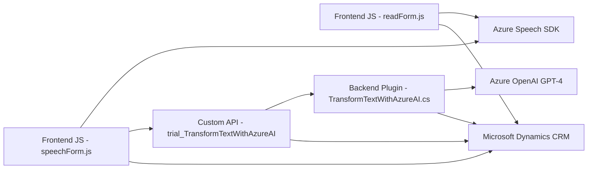

### Breve resumen técnico
Este repositorio encapsula una solución orientada hacia la interacción entre usuarios y un sistema de CRM en Dynamics 365. Incluye tanto frontend como backend, integrándose con tecnologías que usan reconocimiento de voz y procesamiento de lenguaje natural mediante servicios de Microsoft Azure (Speech SDK y OpenAI). La solución facilita una experiencia interactiva y automatizada mediante voz y procesamiento textual avanzado.

---

### Descripción de arquitectura
La solución tiene una arquitectura híbrida centrada en **capas funcionales**:
1. **Frontend**: Implementado en JavaScript, contiene lógica para capturar y procesar datos del formulario dinámico y habilitar reconocimiento de voz y síntesis mediante Azure Speech SDK.
2. **Backend**: Un plugin en C# se encarga del procesamiento avanzado de texto usando Azure OpenAI GPT-4 por medio de una integración directa con Dynamics CRM. Este módulo transforma datos según reglas específicas y estructura un JSON adecuado para los flujos del CRM.
3. **Interacción entre componentes**: El frontend y el backend están integrados a través de la API de Dynamics CRM y funciones personalizadas que permiten mapear datos procesados desde servicios externos directamente al modelo del CRM.

Patrones presentes:
- **SDK Integration**: Azure Speech y OpenAI son utilizados mediante interacción directa con sus API.
- **Modularización**: Funciones separadas según su propósito para facilitar lectura, mantenimiento y prueba.
- **Dependencias asíncronas y HTTP Requests**: La comunicación con servicios externos es manejada de manera no bloqueante, utilizando promesas y respuestas JSON.

---

### Tecnologías usadas
1. **Frontend**:
   - JavaScript (Modular).
   - Azure Speech SDK: Para reconocimiento y síntesis de voz.
   - Dynamics CRM Web API (Xrm.WebApi): Para interactuar con datos del formulario.

2. **Backend**:
   - C#: Para desarrollar el plugin en Dynamics.
   - Azure OpenAI GPT-4 API: Para procesar texto y devolver JSON.
   - Microsoft Dynamics SDK: Para interacción directa con el CRM.
   - Newtonsoft.Json & System.Text.Json: Para manipulación JSON.
   - System.Net.Http: Para llamadas a Azure OpenAI.

---

### Dependencias o componentes externos
- **Azure Speech SDK**: Ligada al frontend para reconocimiento y síntesis de voz.
- **Azure OpenAI Service (GPT-4)**: Utilizado en el backend para la transformación de texto en JSON estructurado.
- **Microsoft Dynamics 365 APIs**: Para manipulación y actualización de datos de formularios.
- **Custom API en Dynamics CRM**: `trial_TransformTextWithAzureAI`.
- **Librerías de manejo JSON**: Newtonsoft.Json y System.Text.Json.
- **Redes y seguridad**:
  - Claves API para Speech SDK y OpenAI.
  - Servicio de autenticación OAuth y permisos basados en roles de Dynamics.

---

### Diagrama Mermaid

---

### Conclusión final
La solución es una **hybrid layered architecture**, diseñada para complementar Microsoft Dynamics CRM con capacidades avanzadas de reconocimiento de voz y procesamiento de texto mediante servicios en la nube. Gracias a la modularización en frontend y backend, la solución es escalable y permite la incorporación de funciones adicionales, como nuevos servicios externos o lógica extendida de procesamiento.

Sin embargo, hay aspectos que requieren atención:
1. Exposición de datos sensibles (por ejemplo, claves API) debe gestionarse de manera segura, como por medio de variables de entorno.
2. Se podrían implementar mecanismos más robustos para manejo de errores en caso de fallos en la comunicación con Azure OpenAI o Speech SDK.