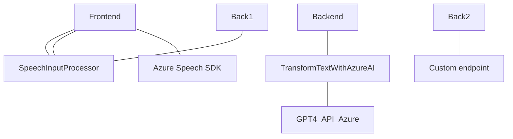

### Breve resumen técnico
El proyecto contiene tres partes principales asociadas con una solución orientada al procesamiento de voz, texto y manipulación en formularios dinámicos. La solución parece ser una integración entre una interfaz de usuario (frontend con JavaScript), un sistema CRM (Microsoft Dynamics 365), y servicios en la nube (Azure Speech SDK y OpenAI).

---
### Descripción de arquitectura
La arquitectura del proyecto sigue un diseño de **n capas** compuesto por tres niveles principales:

1. **Frontend**: 
   - Maneja interacción directa con el usuario mediante formularios y funcionalidad de texto a voz.
   - Dependencia activa del Azure Speech SDK y manipulaciones del DOM para carga dinámica.

2. **Backend (Microsoft Dynamics CRM Plugins)**: 
   - Funcionalidad específica extensible mediante el patrón Plugin. Usa clases basadas en `IPlugin` para procesos definidos, como enviar texto a Azure OpenAI y recibir un JSON estructurado en respuesta.
   - Comunica directamente con servicios externos mediante APIs HTTP.

3. **Servicios externos (Azure)**:
   - Azure Speech SDK para reconocimiento y síntesis de voz.
   - Azure OpenAI API para procesamiento avanzado de texto.
   - Interacción de diferentes capas está basada en modelos síncronos de solicitudes/valores de retorno.

---
### Tecnologías usadas
1. **Frontend (JavaScript)**:
   - **Azure Speech SDK** para voz a texto y texto a voz.
   - Interacción con API y manipulación DOM (dinámica).

2. **Backend (C# en Dynamics Plugins)**:
   - Microsoft Dynamics SDK (`IPlugin` para extensibilidad).
   - JSON Libraries (`System.Text.Json`, Newtonsoft.Json.Linq).
   - Servicios HTTP (`System.Net.Http`).

3. **Servicios en la nube**:
   - AWS Speech SDK (CDN).
   - Azure OpenAI API para procesamiento semántico e IA.

---
### Diagrama Mermaid

---
Conclusión Final:
- Solución completa que conecta capa de presentación DIADYNAMIC.DICTIONARYS