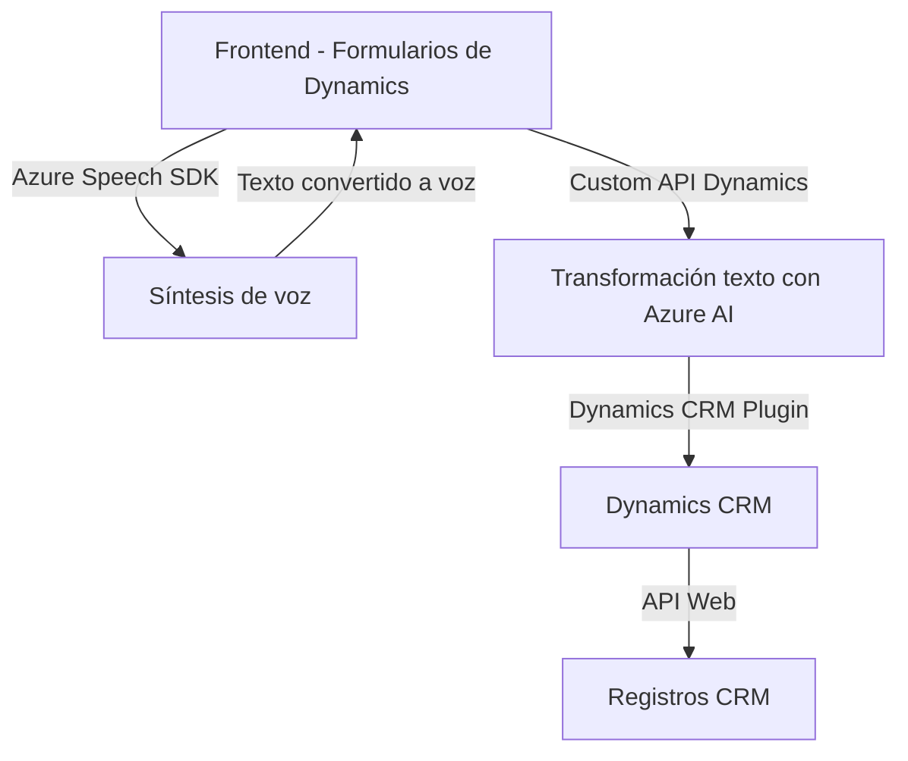

### Breve resumen técnico

Este repositorio forma parte de una solución integrada que combina funcionalidad frontend (JavaScript) y una backend basada en plugins para Microsoft Dynamics CRM. El propósito principal es integrar funcionalidades avanzadas como la síntesis de voz (con Azure Speech SDK) y transformación de texto mediante inteligencia artificial (Azure OpenAI Service). Es probable que el entorno completo esté compuesto por módulos de Dynamics CRM, APIs externas de Azure y lógica personalizada para formularios y automatización de procesos internos.

---

### Descripción de la arquitectura

La solución se fragmenta en **frontal** (en JavaScript, que interactúa con formularios y Azure Speech SDK) y **backend** (implementado como plugins en Dynamics CRM). A nivel de arquitectura:

- **Frontend**:
  - Modulo de lectura de formularios interactivos y síntesis de voz (uso del SDK de Microsoft Azure Speech desde JavaScript).
  - Uso de eventos del modelo de Dynamics 365 (ej. `executionContext`) para gestionar la comunicación entre la interfaz y los datos del CRM.
  
- **Backend**:
  - Plugin desarrollado para Dynamics CRM que utiliza el SDK oficial para conectarse al entorno del CRM, procesar datos y enviar/recibir información hacia Azure OpenAI Service.
  - Arquitectura desacoplada: La comunicación a servicios como Azure Speech SDK y OpenAI se realiza mediante llamadas API, manteniendo cada componente separado en funcionalidad.

El diseño general se ajusta al patrón de arquitectura de **n capas**, donde la capa de presentación (frontend) interactúa con la capa lógica dinámica (plugins) utilizando servicios externos (Azure SDK y APIs personalizadas).

---

### Tecnologías utilizadas

1. **Frontend**:
   - **JavaScript**: Es utilizado para procesar formularios y funcionalidad del cliente.
   - **Azure Speech SDK**: Para síntesis de voz y texto directamente en el navegador.
   - **Dynamics 365 Web API**: Permite interacción con los datos del CRM en tiempo real.

2. **Backend**:
   - **Microsoft Dynamics CRM SDK**: Como framework para construir *plugins* y conectarlos con el sistema CRM.
   - **Azure OpenAI Service (GPT-4)** para transformar, validar y procesar texto.
   - **REST API**: Comunicación con Azure.
   - **Newtonsoft.Json** y `System.Text.Json`: Para la serialización y manejo de respuestas JSON de las APIs.

---

### Dependencias y componentes externos

1. **Azure Speech SDK**: Utilizado en ambos archivos JavaScript para realizar la conversión de texto a voz (`window.SpeechSDK`). Este SDK se carga dinámicamente desde `https://aka.ms/csspeech/jsbrowserpackageraw`.
2. **Azure OpenAI Service**: Procesa y transforma texto (GPT-4 en la implementación del plugin).
3. **Dynamics CRM Web API**: Administra la interacción entre la solución y el sistema CRM.
4. **Graph API** (sospechado): Puede estar en uso para el consumo de usuarios o integración con otros servicios de Microsoft Azure.
5. **Custom API de Dynamics**: Presente en el procesamiento de texto asistido por IA (`trial_TransformTextWithAzureAI`).

---

### Diagrama **Mermaid**

---

### Conclusión final

La solución propuesta está orientada a la integración de tecnologías avanzadas para mejorar accesibilidad y procesamiento automatizado en entornos empresariales como Dynamics CRM. Combina síntesis de texto a voz, reconocimiento de entrada de voz y transformación inteligente de datos utilizando Azure AI y Speech SDK. A nivel de arquitectura, sigue un patrón de **n capas**, promoviendo el desacoplamiento entre frontend, backend y servicios externos. Este diseño lo hace escalable y reutilizable para diferentes casos de uso dentro del ecosistema CRM.