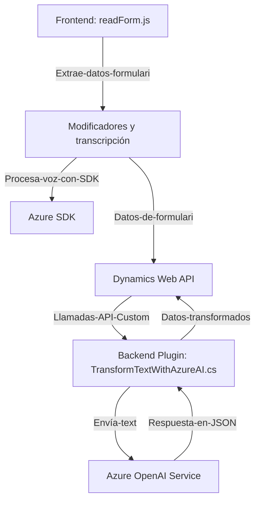

### Análisis técnico detallado

---

#### **Breve resumen técnico**
El repositorio corresponde principalmente a una solución enfocada en mejorar la funcionalidad de la interfaz de Dynamics 365 mediante capacidades de entrada/salida de voz y procesamiento inteligente. Utiliza el **Azure Speech SDK** para transcripción y síntesis de voz, mientras se integra con **Azure OpenAI** para transformar datos en JSON. Los componentes consisten en un **frontend modular en JavaScript** y un **plugin backend en C#**.

---

#### **Descripción de arquitectura**
La solución utiliza una **arquitectura de capas**. Los archivos de frontend se encargan de la interacción directa con la interfaz del usuario. Utilizan APIs y SDK externos (Azure Speech) para proporcionar funcionalidades de voz. Por otro lado, el backend (plugin en C#) es responsable del procesamiento de texto más complejo, incorporando servicios de IA mediante llamadas a API REST (Azure OpenAI).

El diseño también aprovecha patrones como **callback**, **modularidad**, y **asincronía**, con soporte para dependencias externas. Esto sugiere un diseño destinado a interoperar con servicios en la nube y una plataforma empresarial (Dynamics CRM).

---

#### **Tecnologías usadas**
- **Frontend:**
  - Lenguaje: JavaScript (ES6).
  - SDK: **Azure Speech SDK** (Síntesis y transcripción de voz).
  - Plataforma target: Dynamics 365.
  - Patrones: Modularización, callbacks, asincronía con `Promise` y funciones `async`.

- **Backend:**
  - Lenguaje: C#.
  - Framework: **Microsoft Dynamics CRM SDK**.
  - Integraciones: **Azure OpenAI Service** (REST API para procesamiento de texto).

- **Herramientas adicionales:**
  - **Newtonsoft.Json** y `System.Text.Json`: Serialización/deserialización de datos JSON en C#.
  - **HTTP Client** en .NET: Para comunicación REST con servicios externos.
  - **Regular Expressions**: Manipulación de cadenas (elementos JSON procesados internamente).

---

#### **Diagrama Mermaid**
El siguiente diagrama representa la interacción entre los diferentes módulos y servicios. Se destaca el flujo de datos desde el frontend hasta el backend y los servicios externos:

---

#### **Conclusión final**
La solución es una integración avanzada de Dynamics CRM con capacidades de procesamiento de voz e inteligencia artificial basadas en servicios de Azure. Tiene una **arquitectura en capas** que fomenta la **modularidad** y un diseño **extensible** gracias al uso de SDKs, APIs externas y funciones asincrónicas. Adopta patrones de "callback", gestión de errores y manejo de datos en tiempo real, lo que la hace idónea para implementaciones dinámicas en entornos empresariales.