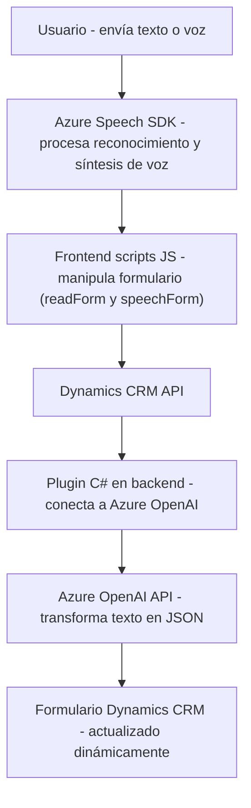

### Breve resumen técnico
Este repositorio implementa un sistema que combina varias tecnologías para dotar a un formulario CRM de capacidades de reconocimiento de voz y síntesis de texto a audio, utilizando servicios cognitivos de Azure y OpenAI. Las funcionalidades se dividen entre un frontend basado en JavaScript para interactuar con la interfaz de usuario y un backend (plugin .NET) que conecta Dynamics CRM con Azure OpenAI.

---

### Descripción de arquitectura
1. **Tipo de solución:** La solución combina:
   - **Frontend**: Scripts JavaScript para la interfaz del usuario y procesamiento en vivo de datos de formularios.
   - **Backend/Plugin**: Código .NET integrado como plugin de Dynamics CRM para procesar datos con Azure OpenAI.

2. **Tipo de arquitectura:** N-capas híbrida:
   - La arquitectura utiliza un modelo de capas (separación de frontend y backend), pero también sigue principios de integración con servicios externos (como Azure OpenAI y Speech SDK). 
   - El backend actúa como un componente autónomo basado en el patrón de plugin (Dynamics CRM) y se comunica con un microservicio externo (Azure OpenAI). 

---

### Tecnologías usadas
1. **Frontend:**
   - **JavaScript**:
     - Manejo de datos dinámicos del formulario (`formContext` y eventos `executionContext`).
     - Integración con **Azure Speech SDK** para reconocimiento de voz y síntesis de texto a audio.
   - **Azure Speech SDK**:
     - Dinámica conexión con el servicio mediante carga remota.
     - Reconocimiento de voz y reproducción como texto hablado.
   - **Microsoft Dynamics CRM API**: para gestión y actualización de datos del formulario directamente desde el frontend.

2. **Backend:**
   - **C#/.NET Framework**:
     - Uso de la interfaz `IPlugin` de Dynamics CRM para lógica de negocios.
   - **Azure OpenAI API**:
     - API GPT-4 para el procesamiento de texto y construcción de JSON mediante normas.
   - **Microsoft SDKs**:
     - `Microsoft.Xrm.Sdk`: Manejo de servicios CRM.
   - **Librerías JSON**:
     - `System.Text.Json` y `Newtonsoft.Json.Linq`.

3. **Patrones aplicados**:
   - **Integración con servicios externos (Azure Speech y OpenAI APIs)**.
   - **Modularidad**: División en funciones y clases especializadas.
   - **Asincronía**: Uso de promesas para manejar los resultados de las APIs remotas.
   - **Event-driven architecture**: Uso de eventos para activar operaciones desde la UI y backend.
   - **Plugin Design Pattern** en el backend.

---

### Dependencias principales
1. **Externas:**
   - Azure Speech SDK para frontend: Análisis de voz, síntesis de audio en navegador.
   - Azure OpenAI API: Procesamiento de lenguaje natural.
   - Dynamics CRM APIs: Extensión integrada para actualizar formularios y entidades CRM.

2. **Internas:**
   - `formContext` (entorno del formulario proporcionado por Dynamics CRM).
   - Código JS para transcripción y síntesis vinculada a eventos del frontend.
   - Plugin en backend para interacciones entre CRM y Azure OpenAI.

---

### Diagrama Mermaid compatible con GitHub Markdown

---

### Conclusión final
La solución presentada combina un frontend dinámico (JavaScript) con un backend basado en un plugin de Dynamics CRM en C#. Utiliza servicios cognitivos avanzados de Azure Speech y OpenAI para crear una experiencia de usuario enriquecida, donde la entrada de voz y texto se procesa y transforma en datos de formulario dinámico. La arquitectura basada en capas con integración a servicios externos es efectiva. El enfoque modular asegura la mantenibilidad y escalabilidad de la solución hacia otras funcionalidades en el futuro.