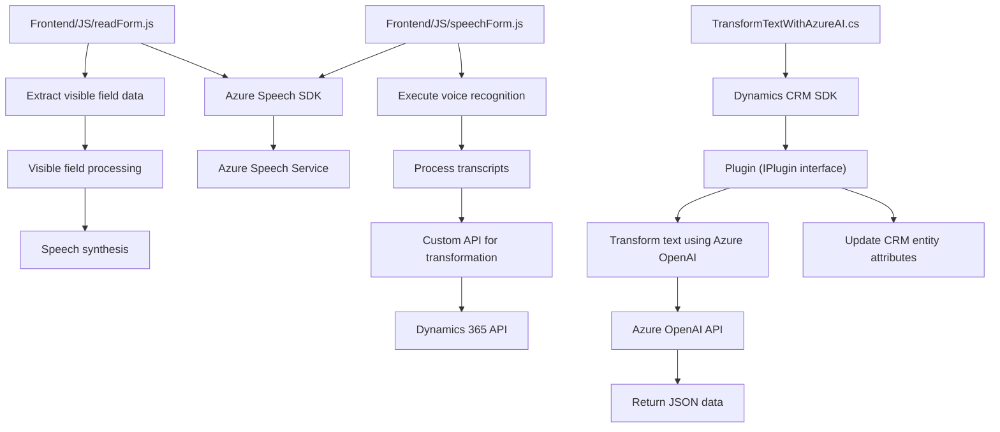

### Breve Resumen Técnico
El repositorio forma parte de una solución que integra servicios externos (como APIs de Azure Speech y Azure OpenAI) para enriquecer interacciones de usuario, específicamente en escenarios relacionados con formularios y datos en Microsoft Dynamics CRM. Sus componentes principales incluyen scripts para interfaces frontend dinámicas y plugins que manejan la lógica de backend en la plataforma CRM.

---

### Descripción de la Arquitectura
La arquitectura consiste en **dos capas principales**:
1. **Frontend**: Archivos JavaScript que interactúan directamente con el usuario. Recopilan, transforman y procesan datos mediante SDKs externos (Azure Speech).
   - Son módulos reutilizables y funcionales que implementan patrones de integración con APIs externas y tienen una estructura modular.
2. **Backend Plugin**: Código de extensibilidad para Dynamics CRM, configurado como **plugins**. Este utiliza servicios externos (API REST de Azure OpenAI) para manejar operaciones avanzadas de procesamiento de datos y transformación a través de inteligencia artificial.
   - Implementa una arquitectura basada en **n capas** para desacoplar la interacción entre los servicios de Dynamics y Azure.

Este diseño no es estrictamente hexagonal o basado en microservicios, sino que representa un sistema de **n capas** con integración a servicios en la nube.

---

### Tecnologías Usadas
1. **Frontend**:
   - **JavaScript**: Scripts para extracción y procesamiento de datos.
   - **Azure Speech SDK**: Sintetización y reconocimiento de voz.
   - **Dynamics 365 SDK**: Interacción con el API, manipulación de formularios, entidades y atributos.

2. **Backend**:
   - **C# Plugins**: Para Microsoft Dynamics CRM.
   - **Microsoft Dynamics CRM SDK**: Interfaces como `IPlugin`, `IOrganizationService`, etc.
   - **Azure OpenAI**: Llamadas RESTful para generar respuestas mediante modelos GPT (como gpt-4).

3. **Dependencias de backend**:
   - **System.Net.Http**: Peticiones externas al servicio.
   - **System.Text.Json**: Manejo de datos JSON.
   - **Newtonsoft.Json.Linq**: Procesamiento de estructuras JSON.
   - **System.Text.RegularExpressions**: Tratamiento de texto.

---

### Diagrama Mermaid

---

### Conclusión Final
Este repositorio se centra en la integración entre un sistema CRM (Microsoft Dynamics) y servicios cloud avanzados para mejorar las capacidades de interacción con el usuario, combinando inteligencia artificial y procesamiento de voz/texto. La solución está implementada sobre una arquitectura **n capas**, con una clara separación entre frontend y backend. Además, prioriza modularidad en el frontend y patrones de extensibilidad en plugins backend.

Aunque no emplea arquitecturas modernas como hexagonal o microservicios, es una implementación eficiente que aprovecha APIs externas sin aumentar la complejidad del diseño. Es adecuada para entornos empresariales con sistemas existentes como Dynamics CRM, donde la integración con servicios inteligentes y módulos enriquecidos es clave.