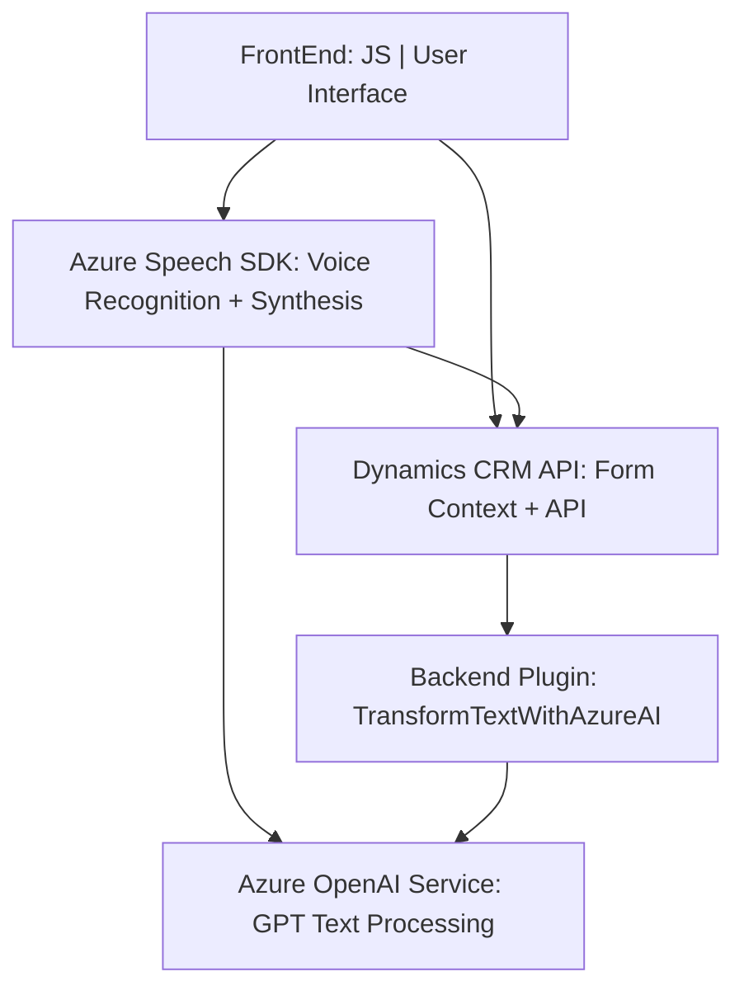

### Breve resumen técnico
El repositorio analiza un conjunto de archivos que enfatizan la integración entre servicios Azure y Dynamics CRM para implementar funcionalidades basadas en reconocimiento y generación de voz o texto. Las tecnologías clave incluyen **Azure Speech SDK**, una API de Dynamics CRM y un plugin escrito en **C#** que usa OpenAI para procesamiento de texto.

---

### Descripción de arquitectura
1. **Tipo de solución:** Esto representa una solución completa que incluye un **frontend** (implementado en JavaScript para la interfaz de usuario), un **backend en forma de plugin** (TransformTextWithAzureAI.cs para Dynamics CRM), y una integración con servicios externos de Azure (Speech SDK y OpenAI GPT).
2. **Arquitectura:** La solución se asemeja a una arquitectura de **dos capas (frontend-backend)**, pero con patrones modulados. Si analizamos las partes, encontramos:
   - El frontend utiliza composición funcional para invocar servicios de Azure (Speech SDK).
   - La lógica del backend está implementada como un **plugin SOA** que interactúa directamente con Dynamics CRM y procesadores de texto basados en IA.
   - Los servicios de Azure (Speech SDK y OpenAI) se utilizan siguiendo patrones de **micro-servicios externos**.

---

### Tecnologías usadas
- **Azure Technologies:**
  - Azure Speech SDK: Reconocimiento de voz, síntesis de texto a voz.
  - Azure OpenAI Service: Transformación de texto con modelos GPT personalizados.
- **Frontend:** JavaScript modular, con patrones orientados a servicios.
- **Backend:** C# (.NET Framework o .NET Core) con Dynamics CRM SDK (Microsoft.Xrm.Sdk).
- **Patrones de diseño:** Modularidad, Service-Oriented Architecture (SOA), Plugin para extensibilidad de CRM, y desacoplamiento en interacción con APIs externas.

---

### Dependencias o componentes externos
1. **Azure Speech SDK:** Utilizado para procesos basados en voz (reconocimiento y síntesis).
2. **Azure OpenAI GPT:** Proporciona procesamiento de texto con un modelo de lenguaje entrenado por IA.
3. **Microsoft Dynamics CRM API:** APIs internas para gestión de datos en formularios del CRM.
4. **Librerías auxiliares:**
   - `HttpClient` para llamadas HTTP.
   - `Newtonsoft.Json.Linq` y `System.Text.Json` para manipulación de objetos JSON y respuestas API.
5. **Environmental Configurations:** Claves de Azure y acceso API, junto con credenciales para el plugin en Dynamics.

---

### Diagrama Mermaid
El siguiente diagrama representa cómo interactúan los componentes del sistema:

---

### Conclusión final
Este repositorio constituye una solución que combina funcionalidades de **frontend dinámico** en JavaScript con una integración compleja de servicios Azure y Microsoft Dynamics CRM API. Adicionalmente, expande la lógica del sistema vía un plugin en **C#**, que interactúa con un modelo GPT alojado en Azure OpenAI. La arquitectura general implica un sistema **n-capas** (con frontend-backend separadas) que se conecta a **microservicios externos** inteligentes. La implementación podría ser mejorada con configuraciones externas para claves API y endpoints, además de instrumentación con logs o políticas de manejo de errores más robustas.