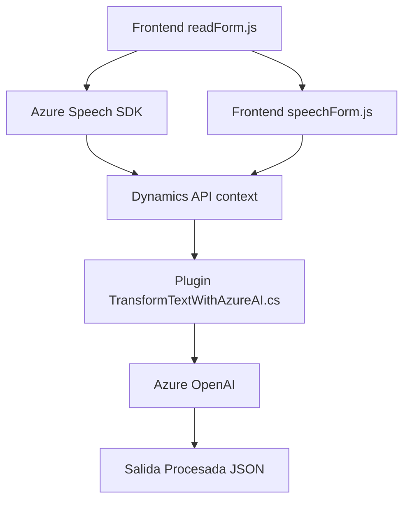

### Breve resumen técnico
El análisis presentado detalla un sistema basado en servicios que combina funcionalidades para la interacción con formularios mediante voz en un cliente web (frontend) y la transformación de datos mediante un plugin integrado en Dynamics CRM y Azure OpenAI. La solución utiliza una arquitectura modular con integración de SDKs y servicios externos (Azure Speech SDK y Azure OpenAI). El objetivo principal es mejorar la accesibilidad y la automatización en procesos que involucren formularios y datos estructurados.

---

### Descripción de arquitectura
La solución parece basada en una arquitectura de **cliente-servidor** con una interacción estrecha entre un frontend (cliente web que utiliza Azure Speech SDK) y la lógica en el lado del servidor implementada como plugins de Dynamics CRM. Además, adopta características propias de una arquitectura **multicapa**:

1. **Capa de presentación:** Implementada en archivos JS (`readForm.js`, `speechForm.js`) que generan interacción con el usuario y el SDK de Azure Speech para la síntesis y reconocimiento de voz.
2. **Capa de negocio:** Implementada en el plugin de Dynamics CRM (`TransformTextWithAzureAI.cs`), manejando reglas para procesar datos y transformar texto con Azure OpenAI.
3. **Capa de integración:** Ambas capas se integran con servicios externos como Azure Speech SDK y Azure OpenAI a través de API REST y lazy loading.

El uso de patrones como lazy loading y delegación de eventos sugiere que el diseño busca minimizar el consumo de recursos y aumentar la extensibilidad.

---

### Tecnologías usadas
Los archivos analizados utilizan una variedad de tecnologías y frameworks:
1. **Frontend (JavaScript):**  
   - Azure Speech SDK para la síntesis y reconocimiento de voz (`https://aka.ms/csspeech/jsbrowserpackageraw`).  
   - Dynamics 365 API para interactuar con formularios (contexto y atributos).  

2. **Backend (C#):**  
   - Microsoft Dynamics CRM SDK (`IPlugin`, `IPluginExecutionContext`, `IOrganizationService`).  
   - Azure OpenAI para transformar texto mediante la interacción con extensiones de GPT usando llamadas HTTP.  
   - `Newtonsoft.Json` y `System.Text.Json` para manejo de JSON.  
   - `System.Net.Http` para realizar solicitudes HTTP.  

3. **Patrones y Principios Arquitectónicos:**
   - Carga bajo demanda (lazy loading) en el frontend.  
   - Modularidad en la separación de las funciones del código.  
   - Patrón delegado con funciones de callback en el frontend.  
   - Plugin architecture inherente a Dynamics CRM, con ejecución en eventos específicos.  

---

### Diagrama Mermaid
El siguiente diagrama describe los principales componentes del sistema y su interacción:

---

### Conclusión final
La solución presentada es un sistema modular y escalable que conecta un cliente dinámico basado en JavaScript con servicios avanzados en la nube (Azure Speech SDK y Azure OpenAI). Aunque utiliza una arquitectura de múltiples capas (multicapa), el sistema aprovecha patrones modernos como la integración externa mediante APIs, lazy loading y delegación, mientras mantiene una orientación clara hacia la accesibilidad (interacción por voz) y la automatización.

Si bien no tiene una arquitectura completamente desacoplada (como hexagonal), el diseño permite adaptarse fácilmente a necesidades futuras mediante la extensión de SDKs y APIs.