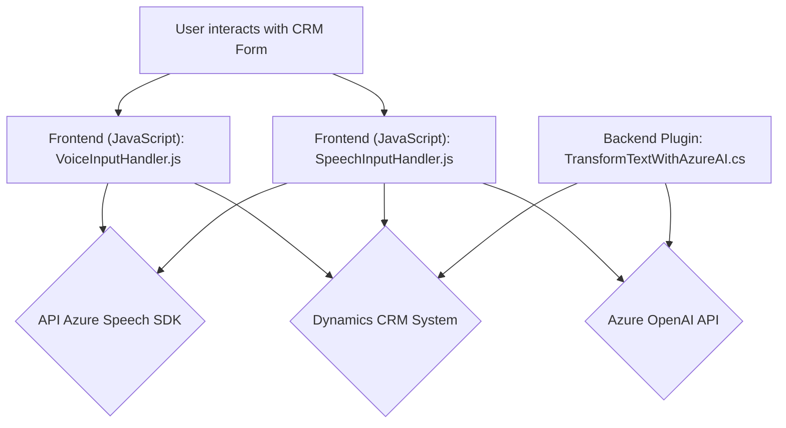

### Breve resumen técnico:

El conjunto de archivos analizados pertenece a una solución software orientada a la integración de tecnologías de reconocimiento de voz, síntesis de texto y procesamiento basado en IA en el contexto de formularios y plugins de **Microsoft Dynamics CRM**. Los archivos están clasificados en tres áreas principales:
1. **Frontend (JavaScript)**: Controlan la interacción con formularios web y el uso del Azure Speech SDK para transcripción de voz a texto y síntesis de texto a voz.
2. **Backend plugin (C#)**: Implementa procesamiento avanzado de datos usando **Azure OpenAI API** para aplicar transformaciones automáticas al texto.
3. **Tecnologías externas**: Azure Speech SDK y OpenAI API se usan para realizar las tareas de reconocimiento y procesamiento de voz/inteligencia artificial.

---

### Descripción de arquitectura:

La solución utiliza una **arquitectura por capas personalizada**, consistente en:

1. **Capa de presentación (frontend)**:
   - Implementada en JavaScript, interactúa directamente con los formularios web mediante funciones que integran el reconocimiento y la síntesis de voz. Estos scripts acceden a las APIs del cliente de Dynamics CRM para extraer datos de formularios visibles o para realizar cambios en ellos.

2. **Capa de lógica de negocio (backend)**:
   - El plugin en C# se ejecuta dentro del contexto del sistema CRM. Proporciona soporte adicional para transformar entradas con reglas avanzadas y procesamiento basado en la API de OpenAI.

3. **Capa de servicios externos**:
   - La integración con **Azure Speech SDK** para tareas de reconocimiento y síntesis de voz.
   - La integración con **Azure OpenAI GPT API**, utilizada para modificar contenido textual enviado desde el sistema CRM.

---

### Tecnologías usadas:

1. **Frontend**:
   - JavaScript como lenguaje principal.
   - Azure Speech SDK para síntesis y transcripción de voz.
   - Dependencias dinámicas para interactuar con APIs de Dynamics CRM.

2. **Backend (Plugins en C#)**:
   - Microsoft Dynamics CRM SDK (`Microsoft.Xrm.Sdk`), `Newtonsoft.Json.Linq` para manejo avanzado de objetos JSON.
   - Envío de solicitudes HTTP mediante `System.Net.Http`.
   - Respuesta procesada con `System.Text.Json` para trabajar con datos serializados.

3. **Servicios externos**:
   - **Azure Speech SDK** para la transcripción y síntesis de voz.
   - **Azure OpenAI GPT-4 API** para procesamiento avanzado de textos en el backend.

---

### Diagrama Mermaid válido para GitHub:

---

### Conclusión final:

La solución presentada implementa funciones de voz e inteligencia artificial integradas en el contexto de formularios Web API de Dynamics CRM mediante una arquitectura por capas. Utiliza tecnologías avanzadas como el Azure Speech SDK para síntesis y reconocimiento de voz y las capacidades de razonamiento textual de la API de Azure OpenAI.

#### Ventajas:
- Aprovechamiento de servicios avanzados de Microsoft: Azure Speech y OpenAI.
- Descomposición clara de responsabilidades, dividiendo operaciones en frontend y backend.
- Uso extensivo de patrones como separación de responsabilidades, carga dinámica de dependencias y patrón de eventos.

#### Áreas de mejora:
1. **Gestión de secretos**: Claves como `azureKey` deben almacenarse de forma segura (ej. Key Vault).
2. **Error handling**: Consolidar mejores flujos de manejo de errores para fallos con dependencias externas (API de terceros).
3. **Configuración parametrizable**: Evitar "hardcoding" de valores mediante archivos de configuración.

En general, esta solución es apta para su propósito, pero garantizar la seguridad y escalabilidad del sistema será crucial en escenarios de producción y alta demanda.