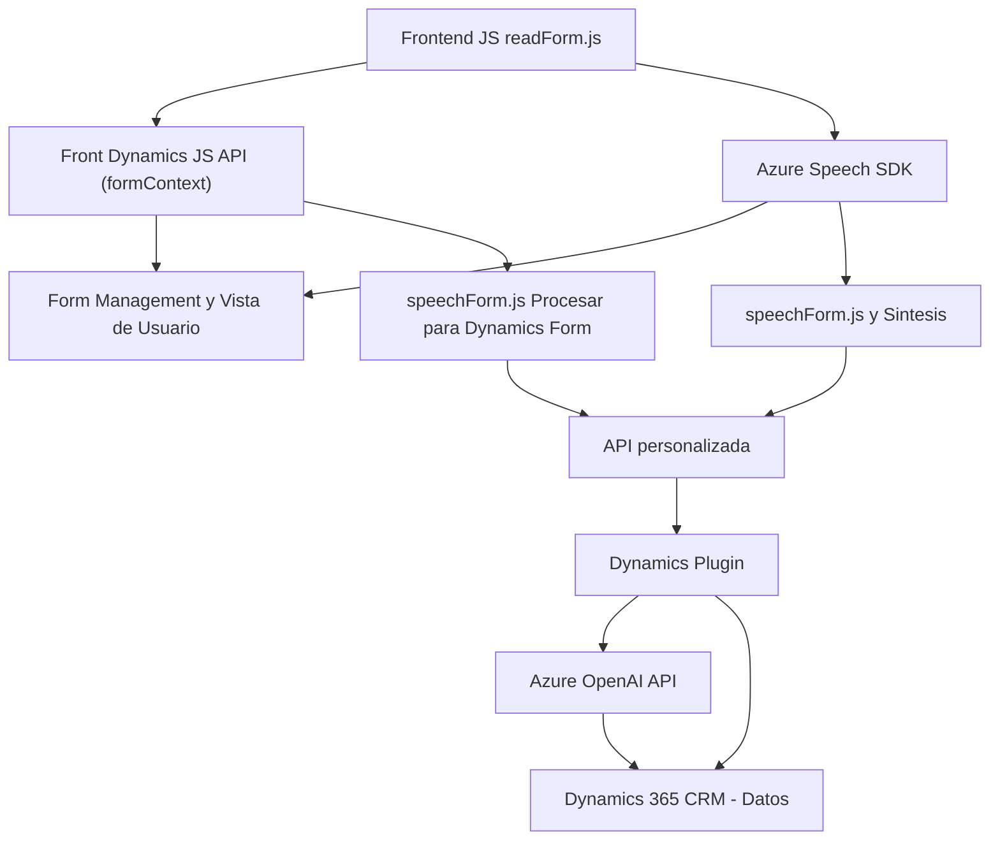

### Breve resumen técnico:

El repositorio se centra en la integración de tecnologías para manejo de datos de formularios mediante entrada de voz (`speechForm.js` y `voiceInputHandler.js`) y procesamiento inteligente de texto con una **API personalizada** de Azure OpenAI (`TransformTextWithAzureAI.cs`). Además, utiliza el `Azure Speech SDK` para sintetizar voz y transcribir datos. La solución se apoya en tecnologías vinculadas a Dynamics 365 y en servicios de Azure como OpenAI y Speech.

---

### Descripción de arquitectura:

La arquitectura parece ser **híbrida**, con componentes diferenciados pero integrados:

1. **Frontend**:
   - Procesamiento de entrada de voz para uso en exposiciones de formularios con `Azure Speech SDK`.
   - Dinamismo mediante JS con programación asincrónica y modular.
   - Lógica basada en interacción directa con datos del cliente (formContext).

2. **Integración con Dynamics 365 CRM**:
   - Plugins y APIs personalizadas conectadas a formularios y a Azure OpenAI. La arquitectura sigue el estándar de **una capa de integración** (plugin) para Dynamics CRM.
   - Plugin en C# implementa metodología clásica de Dynamics CRM para llamar servicios de extracción/modificación de datos externos.

3. **Interacciones de microservicio**:
   - Comunicación directa con **Azure Speech SDK** y **Azure OpenAI Service API** como microservicios externos para habilitar capacidades de IA y síntesis de voz.

En conjunto, la solución posee características de una **arquitectura basada en capas**, donde cada elemento gestiona una parte de la funcionalidad de la aplicación (Frontend y Backend) y delega la ejecución de lógica pesada y transformación al servicio cloud.

---

### Tecnologías utilizadas:

1. **Frontend:**
   - Programación en **JavaScript**.
   - Utilización del **Azure Speech SDK** para síntesis y transcripción usando configuraciones de idioma.
   - Dynamics 365 `formContext` API para manejar datos de los formularios.

2. **Backend (Plugins):**
   - Lenguaje de programación **C#**.
   - Plugin implementado con **IPlugin** para integrarse a Dynamics 365.
   - **Azure OpenAI Service API** para transformar texto mediante GPT, incluyendo uso de parámetros como claves API, reglas, temperatura, y el modelo de lenguaje.

3. **Otros recursos:**
   - **Microsoft.Xrm.Sdk**: Interacción directa con Dynamics CRM.
   - **Newtonsoft.Json** y **System.Text.Json**: Para serialización y deserialización.

---

### Diagrama Mermaid válido para GitHub:

---

### Conclusión final:

La solución tiene un enfoque híbrido **semimodular** con componentes clave en Frontend (JS), Backend (C#/Plugins) y servicios cloud como Azure Speech SDK para la síntesis y transcripción de voz, así como Azure OpenAI para el procesamiento y transformación de texto. Su arquitectura está integrada en capas (Frontend, Backend y API externas), lo cual habilita una separación clara entre lógica de presentación y lógica de procesamiento de datos. Sin embargo, la inclusión de claves de API como texto plano podría representar vulnerabilidades en entornos productivos.

La integración con Microsoft Dynamics 365 CRM enfatiza el patrón **event-driven** mediante la implementación de plugins y uso de servicios externos, lo que proporciona un flujo de datos eficiente actualizado dinámicamente según interacciones de los usuarios en el formulario.