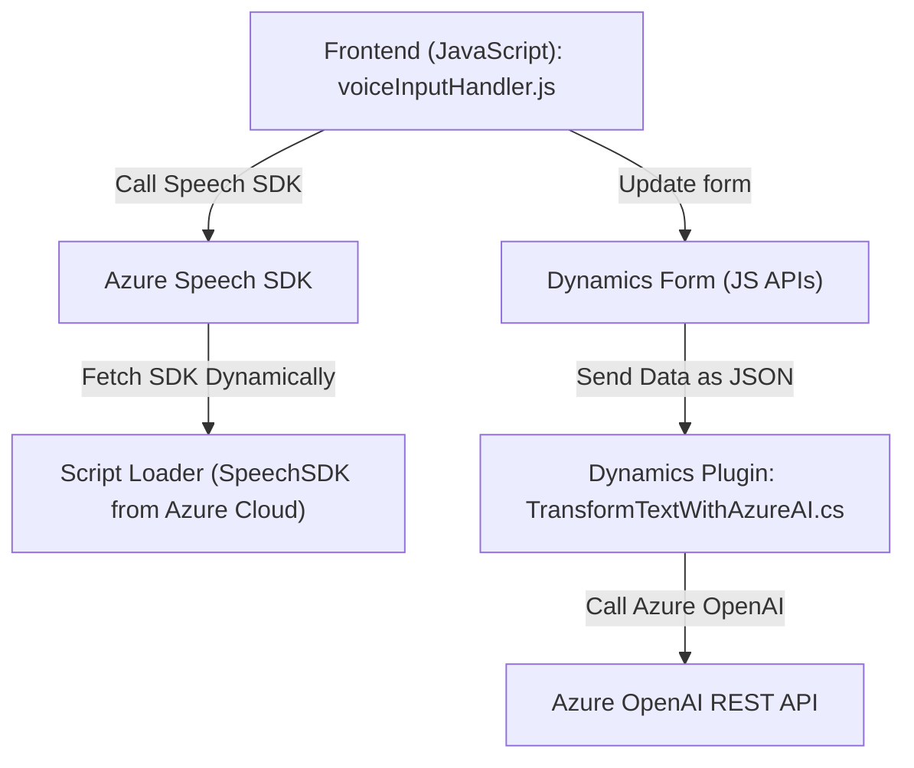

### Breve resumen técnico:  
El repositorio contiene un conjunto de archivos relacionados con la interacción entre un servidor CRM (Microsoft Dynamics) y servicios en la nube (Azure Speech y Azure OpenAI). Además, el código implementa funcionalidades tanto para el **frontend** (interacción con formularios y reconocimiento/síntesis de voz) como para **backend plugins** en Dynamics CRM (transformación de datos mediante Azure OpenAI).  

---

### Descripción de arquitectura:  
La arquitectura se compone de:  

1. **Frontend (JavaScript)**:  
   - Maneja la lógica de interacción con el usuario mediante formularios y voz.  
   - Está diseñado para ejecutarse en navegadores con un enfoque orientado a callbacks y dinámicamente carga SDK externos como `Azure Speech`.  

2. **Backend Plugin en Dynamics CRM (C#)**:  
   - Implementa un modelo basado en plugins para extender las capacidades del servidor CRM.  
   - Consume servicios REST de Azure OpenAI para transformar texto basado en reglas específicas.  
   - Sigue un enfoque **stateless** para integrar con APIs externas.  

### Tipología de arquitectura:  
- **N Capas**: Combina dos capas principales:  
  - **Frontend** con lógica para interactuar con el usuario.  
  - **Backend (plugins)** que procesa y transforma datos en un CRM extendido.  
- **Orquestación API**: Aplica servicios en la nube como Azure Speech SDK y Azure OpenAI a través de HTTP.  

### Tecnologías usadas:  
1. **Frontend**:  
   - **JavaScript**: Para lógica interactiva en formularios.  
   - **Azure Speech SDK**: Reconocimiento de voz en tiempo real y síntesis de texto a voz.  

2. **Backend Plugin**:  
   - **C# (Microsoft Dynamics SDK)**: Usado para extender la funcionalidad del CRM.  
   - **Azure OpenAI Service**: Transformación de texto por modelos de IA personalizados.  
   - **HTTP Client/RESTful Integration**: Para comunicación con Azure APIs.  

3. **Cloud Services**:  
   - Azure Speech Services (SDK para reconocimiento y síntesis de voz).  
   - Azure OpenAI (servicio para procesamiento cognitivo).  

### Dependencias externas:  
- **Azure Speech SDK (JavaScript)**: Integración directa mediante un script dinámico.  
- **Microsoft Dynamics SDK**: Extensiones de CRM mediante `IPluginExecutionContext`.  
- **Azure OpenAI**: REST API para conversión de texto con IA.  
- **Librerías .NET**: Para manipulación JSON, realizar conexiones HTTP y manejar formatos de texto.  

---

### Diagrama Mermaid 👇  

---

### Conclusión final:  
El repositorio combina recursos frontend y backend integrándose con tecnologías Microsoft (Dynamics CRM) y servicios de Azure (Speech SDK y OpenAI). La arquitectura sigue un enfoque modular y orientado a servicios, empleando patrones como **facade** para encapsular SDK externos y **plugin-based architecture** en CRM. Es una solución robusta para formularios interactivos con voz y transformación de texto inteligente.