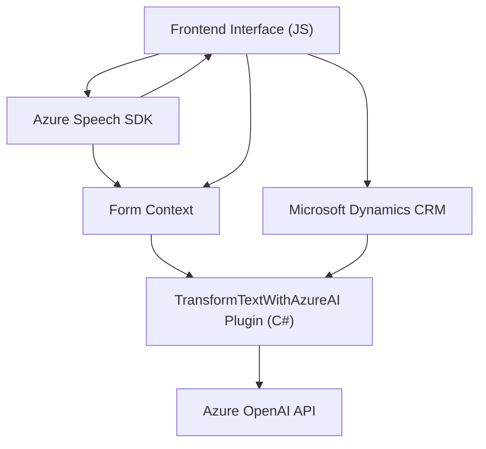

### Breve Resumen Técnico

El repositorio parece contener un sistema que utiliza inteligencia artificial (Azure OpenAI) y Azure Speech SDK para desarrollar funcionalidades relacionadas con el reconocimiento de voz y la transformación de texto. Está integrado en un ecosistema que parece ser Microsoft Dynamics 365 (CRM) para manipular y controlar datos de formularios dinámicos.

- El archivo `readForm.js` implementa la extracción y lectura en voz alta de los datos visibles de formularios utilizando el servicio Azure Speech SDK.
- El archivo `speechForm.js` está enfocado en procesar la entrada por voz, integrándose con formularios dinámicos y APIs personalizadas para interactuar con Dynamics CRM.
- El plugin `TransformTextWithAzureAI.cs` usa los datos proporcionados por los formularios para transformarlos mediante la API de Azure OpenAI en un texto estructurado en JSON.

### Descripción de Arquitectura

Este sistema se puede clasificar como una solución híbrida que combina:
1. **Frontend**: Utilizando JavaScript, el respositorio provee las interacciones de usuario (UI/UX), captura datos y los conecta con herramientas de backend.
2. **Backend (Plugins en Dynamics CRM)**: Los plugins extienden las capacidades del sistema al integrar una capa de inteligencia artificial (OpenAI) para la transformación y procesamiento avanzado del texto.
3. **Servicio externo (microservicio)**: Utilización de SDKs y APIs específicas de terceros, como Azure Speech SDK y Azure OpenAI API, para ofrecer funcionalidades avanzadas.

La arquitectura sigue un enfoque de **arquitectura n-capas** con separación de responsabilidades:
- **Capa de presentación o interfaz**: Representada por los archivos `readForm.js` y `speechForm.js`, que interactúan directamente con el usuario y los datos del formulario.
- **Capa lógica y de negocio**: Encapsulada principalmente en el plugin `TransformTextWithAzureAI.cs`, que realiza la integración con Dynamics CRM y los servicios externos.
- **Capa de servicios externos**: Representada por el uso del SDK de Azure Speech y las solicitudes HTTP al servicio Azure OpenAI.

### Tecnologías y Frameworks Utilizados

1. **Frontend**:
   - **JavaScript**: Lenguaje base para procesar datos del frontend y realizar integraciones.
   - **Azure Speech SDK**: Utilizado para síntesis de texto a voz y reconocimiento de voz.
   - **Dynamics 365 FormContext**: Orientado a interactuar con los formularios y sus controles de Dynamics.

2. **Backend**:
   - **Microsoft Dynamics CRM Framework**: Utilizado para crear plugins que se ejecutan durante eventos específicos.
   - **C#/.NET**: Lenguaje principal para el desarrollo del plugin.
   - **Microsoft.Xrm.SDK**: Framework de Dynamics para la gestión de entidades y API de servidor.
   - **Azure OpenAI API**: Servicio de inteligencia artificial utilizado para transformar texto en JSON estructurado.

### Dependencias y Componentes Externos Probables

- **Azure Speech SDK**: Requisito para la síntesis y el reconocimiento de voz.
- **Azure OpenAI API**: Servicio para transformar texto mediante IA.
- **Dynamics 365**: Todo el sistema parece estar basado en el ecosistema de CRM.
- **Microsoft.Xrm.SDK**: Para la creación de plugins y comunicación con el servidor de Dynamics.
- **Bibliotecas para JSON**: Uso de `System.Text.Json` y `Newtonsoft.Json.Linq`.

### Diagrama Mermaid

### Conclusión Final

El repositorio describe una solución integrada que conecta una interfaz de usuario basada en formularios dinámicos con tecnologías de inteligencia artificial como Azure OpenAI y el Azure Speech SDK. Su diseño modular e híbrido sigue un enfoque de arquitectura n-capas, con separación entre presentación, lógica y servicios externos. Es ideal para entornos donde las capacidades de inteligencia artificial y reconocimiento de voz agreguen valor, como automatización de operaciones en CRM avanzados.