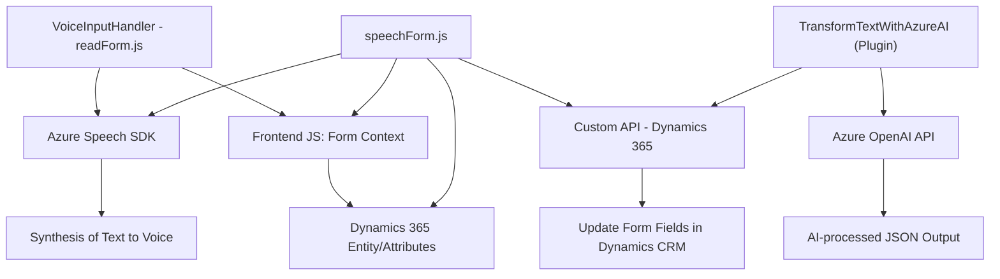

### Breve resumen técnico
El repositorio describe componentes de una solución que implementa accesibilidad y reconocimiento de voz utilizando Azure Speech SDK integrado con Dynamics 365 y Azure OpenAI. Incluye archivos para manejar interacción en formularios, síntesis de voz, reconocimiento de voz y transformación de texto vía plugin en Dynamics CRM.

---

### Descripción de Arquitectura
La solución usa una arquitectura mixta de plugins y extensiones:

- **Monólito extensible**: Basado en Dynamics CRM, que utiliza una arquitectura de plugins y extensiones. Este sistema interactúa principalmente con formularios, usando tanto servidores como componentes para ejecutar lógica integrada.
- **Integración de microservicios externos**: Se conecta con servicios API externos como Azure Speech SDK y Azure OpenAI para ampliar las capacidades de la herramienta base (Dynamics 365).
  
Los archivos "frontend" diseñados en JavaScript aportan una interfaz modular basada en eventos y llamadas asíncronas. El plugin en C# sirve como conector entre Dynamics 365 y Azure OpenAI para transformar texto según formatos específicos.

---

### Tecnologías Usadas
#### Backend:
- **C#/.NET (Dynamics CRM Plugin)**: Lógica empresarial para transformar texto.
- **Azure OpenAI API**: Servicio externo para procesamiento de texto y generación de JSON estructurado.

#### Frontend:
- **JavaScript**: Interacción dinámica con formularios y síntesis de voz.
- **Azure Speech SDK**: Manejo de entrada/salida de voz.

#### Otros:
- **GitHub**: Repositorio de control de versiones.
- **REST APIs (custom)**: Probable uso de Dynamics CRM web API para consultas y operaciones.

#### Patrones de Uso:
- **Modular Programming**: Presencia de funciones encapsuladas para manejar lógica específica en JavaScript.
- **Event-driven Architecture**: Uso de callbacks y eventos para manejar flujos asincrónicos.
- **Plugin Architecture**: Dinámico mediante el patrón de diseño de plugins en Dynamics CRM.
- **Delegación**: Delegación de tareas a servicios externos como Azure Speech SDK y Azure OpenAI.

---

### Diagrama Mermaid (100 % compatible con GitHub Markdown)
En base a los archivos provistos y sus interacciones con otros sistemas:

---

### Conclusión Final
La solución es una extensión de Dynamics CRM que amplía la funcionalidad del sistema nativo, integrando accesibilidad de voz y generación de texto con servicios avanzados de inteligencia artificial como Azure Speech SDK y Azure OpenAI. La arquitectura combina un monólito basado en plugins con microservicios externos para garantizar accesibilidad y procesamiento inteligente.

El enfoque modular y orientado a eventos con capacidades integradas fortalece la adaptabilidad del sistema y la interacción usuario-sistema en entornos corporativos. Sin embargo, la solución está fuertemente acoplada a los servicios externos de Azure, lo que debe considerarse en términos de costo, rendimiento y disponibilidad.