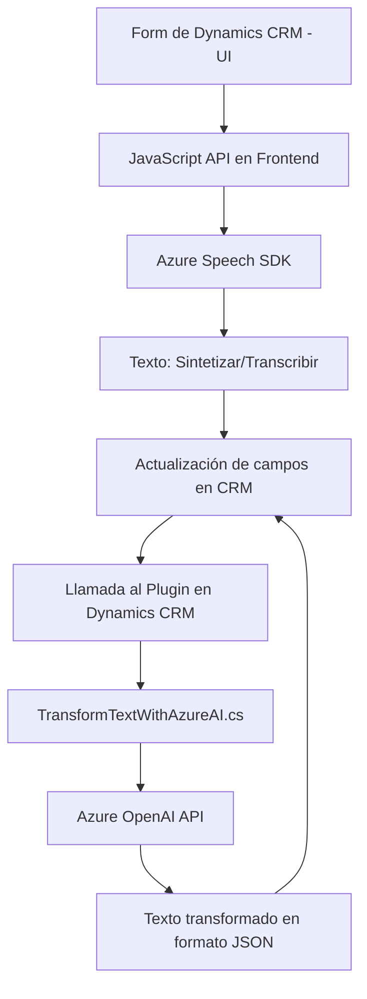

### Breve Resumen Técnico

El repositorio aborda una solución que integra funcionalidades que combinan la síntesis y transcripción de voz con Azure Speech SDK en el frontend (JavaScript) y utiliza un plugin en Dynamics CRM (.NET/C#) para transformar texto mediante Azure OpenAI. Está orientado a enriquecer la interacción de usuario con formularios en un sistema CRM, automatizando tanto el procesamiento de datos como la conversión entre texto y voz.

---

### Descripción de Arquitectura

- **Tipo de Solución:**  
  Una combinación de **frontend interactivo** y componentes server-side (plugin en Dynamics CRM). Es una solución híbrida.
  
- **Arquitectura Principal:**  
  - **Frontend:** Modular y basado en eventos, con integración directa a servicios externos como Azure Speech SDK. Fomenta una arquitectura de capas al manejar lectura de datos, procesamiento, y síntesis por separado.
  - **Plugin Server-Side:** Patrón orientado a eventos (Dynamics CRM Plugin) para transformar datos con dependencias externas como Azure OpenAI.

---

### Tecnologías Usadas

1. **Frontend:**
   - **JavaScript (ES6):** Para implementar funcionalidad de síntesis y procesamiento de voz.
   - **Azure Speech SDK:** Para síntesis de texto a voz y transcripción de voz a texto.
   - **Dynamics CRM Form API:** Para procesar datos del formulario en CRM.

2. **Backend (Plugin):**
   - **C# (.NET Framework):** Usado en Dynamics CRM para el plugin `TransformTextWithAzureAI.cs`.
   - **Azure OpenAI REST API:** Para procesamiento avanzado de texto mediante IA.
   - **Newtonsoft.Json y System.Text.Json:** Para parseo y generación de JSON estructurado.
   - **System.Net.Http:** Para realizar llamadas a servicios externos.

3. **Hosting:**  
   - API y servicios externos vinculados a **Microsoft Azure** (Speech SDK y OpenAI).

---

### Diagrama Mermaid

---

### Conclusión Final

Esta solución combina capacidades avanzadas de las tecnologías de Microsoft para realizar funciones específicas relacionadas con la transcripción y síntesis de texto y voz (Azure Speech SDK) en el **frontend**, mientras estructura datos en el **backend** con el uso de **Azure OpenAI**. La arquitectura es principalmente modular, dividida en dos componentes primarios:

- Un **frontend cliente** que opera mediante una arquitectura de tipo *n capas*: interacción con input-form, procesamiento de datos, síntesis mediante servicio externo y generación de salida vocal.
- Un **plugin server-side** que opera como una integración con sistemas externos (Azure OpenAI) y funcionalidades del **CRM Dynamics** (patrón de plugin de Dynamics CRM).

El sistema es flexible, modular y adecuado para contextos empresariales que requieren interacción personalizada con formularios. El diagrama muestra cómo los componentes se relacionan entre sí para proveer un flujo coherente de datos entre cliente y servidor.