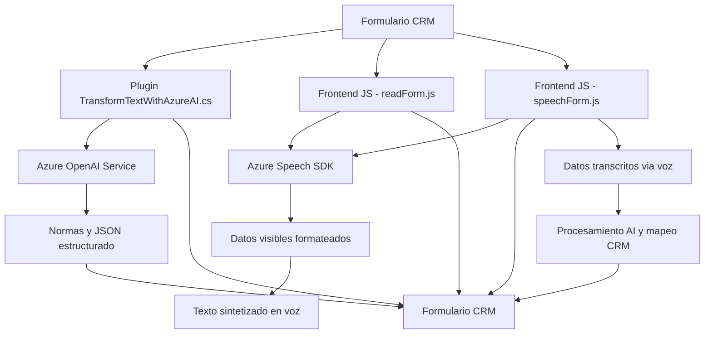

### Breve Resumen Técnico
El repositorio muestra tres archivos con distintos propósitos:
1. **Frontend/JS/readForm.js**: Configura la integración del SDK Azure Speech para convertir formularios de contexto en lectura de voz.
2. **Frontend/JS/speechForm.js**: Implementa reconocimiento de voz en tiempo real con el mismo SDK y manipula atributos de un formulario CRM.
3. **Plugins/TransformTextWithAzureAI.cs**: Define un plugin de Dynamics CRM que transforma texto utilizando Azure OpenAI.

El sistema parece estar integrado en un entorno CRM (Dynamics 365) y maneja interacciones avanzadas con datos de formularios y procesamiento externo.

---

### Descripción de la Arquitectura
El proyecto utiliza una arquitectura de **n capas**, con separación entre lógica del frontend, procesamiento intermedio mediante SDKs en el navegador, y lógica de negocio en el backend (Dynamics CRM plugins). Además, hay integración directa con **Azure OpenAI** y utilidades de los servicios en la nube de **Azure Speech SDK**.

#### Componentes relevantes:
1. **Frontend/Javascript**: Manejador de eventos UI y subprocesos asíncronos (speech-to-text y text-to-speech). Alta especialización en procesamiento de campos de formularios.
2. **CRM Plugins (C#)**: Extiende las funcionalidades de Dynamics CRM con capacidades de transformación vía IA (Azure OpenAI).
3. **Azure Recursos**: Interacción con servicios como Azure Speech y Azure OpenAI.

---

### Tecnologías y Patrones Usados
**Frontend:**
- **Javascript y DOM**: Manipulación directa de formularios y carga dinámica de SDK en el navegador.
- **Azure Speech SDK**: APIs externas para reconocimiento y síntesis de voz.
- **Patrón modular**: Funciones atomizadas, con separación de responsabilidades para lectura/formato de datos, configuración SDK, y síntesis/reconocimiento de voz.

**Backend Plugins:**
- **C#** y **Dynamics CRM SDK**: Extensión basada en eventos nativos (plugin model).
- **Azure OpenAI**: Procesamiento de texto mediante GPT-4 como microservicio externo consumido vía HTTP.
- **Patrón de integración API**: Integración directa con IA y manipulación JSON mediante Newtonsoft.Json.

---

### Dependencias y Componentes Externos (Presentes o Posibles)
1. **Azure Speech SDK y Azure OpenAI**: Servicios basados en la nube para voz y procesamiento de texto.
2. **Microsoft Dynamics CRM SDK**: APIs para manipulación de formularios y eventos dentro de Dynamics CRM.
3. **Newtonsoft.Json / System.Text.Json**: Serialización/deserialización JSON.
4. **HTTP Client**: Llamadas a servicios externos.
5. **DOM Manipulación**: Funcionalidad relevante para el frontend de formularios.

---

### Diagrama Mermaid

---

### Conclusión Final
El sistema está diseñado principalmente para integración con Microsoft Dynamics CRM, aprovechando tecnologías Azure (Speech SDK y OpenAI). Está dividido en capas claras:
1. Frontend dinámico para interacción de usuarios (procesamiento de voz).
2. Backend extensible mediante plugins confiables para manipulación avanzada de datos.

La arquitectura en **n capas**, junto con las dependencias externas, tiene una excelente modularidad y escalabilidad. Su integración con APIs como Azure OpenAI lo hace adecuado para aplicaciones complejas basadas en IA en CRMs empresariales.