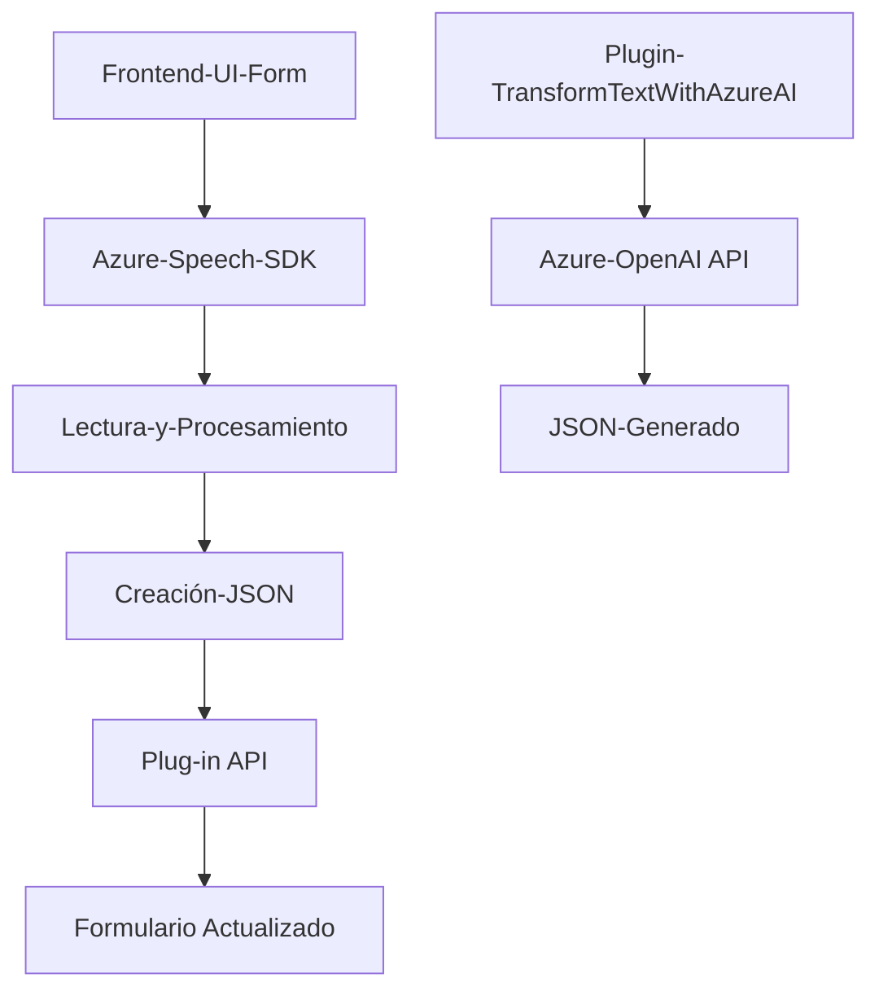
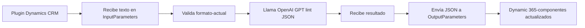

### Resumen técnico

El repositorio incluye tres archivos clave que interactúan entre sí:
1. **Frontend/JavaScript**: Implementan funcionalidades para interacción en tiempo real entre el usuario y el sistema mediante reconocimiento y síntesis de voz. Integran Azure Speech SDK para tareas relacionadas con voz.
2. **Plugin de transformación (Dynamics CRM)**: Utiliza Azure OpenAI para transformar texto en objetos JSON estructurados. Actúa como un middleware avanzado.

### Descripción de arquitectura

La arquitectura representa una combinación de componentes interdependientes:
1. **Frontend**:
   - Interactivo, diseñado para interactuar tanto con formularios como con servicios externos (Azure Speech SDK).
   - Modularización funcional siguiendo principios MVC (Model-View-Controller) para comportamiento en la UI.
   
2. **Backend**:
   - El plugin implementa el patrón de arquitectura de **microservicio** compatible con Microsoft Dynamics CRM, donde cada servicio cumple funciones específicas dentro de un ecosistema modular.

3. **Patrones**:
   - **Declaración de dependencias externas**: Confirmación dinámica de requisitos antes de procesar datos.
   - **Integración de terceros**: Con Azure AI y Speech SDK, demostrando un enfoque extensible.
   - **Modularización**: Funciones bien separadas por responsabilidad (lectura de formularios, procesamiento de voz, actualización dinámica).

### Tecnologías usadas
1. **Frontend**:
   - **JavaScript**: Lenguaje principal.
   - **Azure Speech SDK**: Para reconocimiento (voz a texto) y síntesis (texto a voz).
   - **Browser APIs**: Validación de scripts cargados dinámicamente.
   
2. **Backend (Plugins)**:
   - **Microsoft Dynamics CRM SDK**: Para integrar eventos y procesamiento de datos.
   - **Azure OpenAI (GPT)**: Procesamiento avanzado de texto con IA (JSON generation).
   - **Newtonsoft.Json** y **System.Text.Json**: Manejo de formatos JSON de entrada/salida.

### Diagramas **Mermaid**

#### Diagrama de interacción en el Frontend y Backend

#### Diagrama de flujo lógico del Plugin

---

### Conclusión final
La solución sigue principios de arquitectura **orientados a servicios** con integración de SDK externos (Azure Speech y OpenAI). Es altamente modular, escalable y adaptable a escenarios dinámicos (Front + Backend). Combina componentes frontales para interacción UX con servicios backend configurados en Dynamics CRM orientados hacia modelos de ayuda contextual (por ejemplo: IA en texto). Además, utiliza patrones de **microservicio** en el plugin, incorporando capacidades avanzadas de IA.