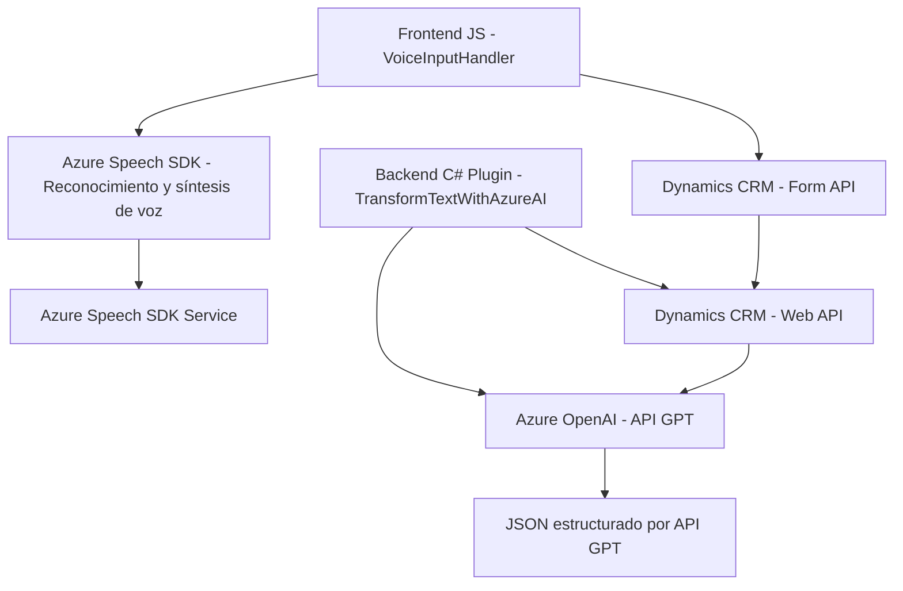

# **Análisis técnico de la solución**

## **Breve resumen técnico**
El repositorio describe una solución híbrida que combina código frontend (JavaScript) con plugins backend (.NET C#) y servicios externos (Azure Speech SDK, Azure OpenAI). Está orientada a la integración de reconocimiento de voz, procesamiento y sintetización de datos desde y hacia Microsoft Dynamics 365. Los componentes están organizados funcionalmente e incluyen interacción modular con servicios externos y personalizados.

---

## **Descripción de arquitectura**
1. **Frontend**:
   - El módulo JavaScript funciona como una capa de cliente para interactuar con formularios de Dynamics 365.
   - Utiliza funciones independientes y el Azure Speech SDK para procesar entrada de voz y sintetizar texto a voz.

2. **Backend**:
   - El plugin `TransformTextWithAzureAI` en C# sigue el patrón de Plugin Architecture para Dynamics CRM. Se conecta con Azure OpenAI para transformar texto y retornarlo al contexto de la plataforma CRM.

3. **Tipo de arquitectura global**:
   - **N capas híbrida**: La solución tiene una separación clara entre frontend y backend. Cada capa interactúa con servicios externos como Azure Speech SDK y Azure OpenAI, integrándose con Dynamics CRM como base de datos central. 

4. **Patrones observados**:
   - **Separación de responsabilidades** entre frontend y backend.
   - Uso de **servicios externos (SDK y API)** para ampliar capacidades funcionales.
   - **Estructura modular basada en funciones** para mantener el encapsulamiento y reutilización.

---

## **Tecnologías usadas**
1. **Frontend:**
   - **JavaScript/ES6**.
   - **Azure Speech SDK** para reconocimiento/síntesis de voz y entrada de datos.
   - **DOM API** para interacción con formularios de Dynamics 365.

2. **Backend:**
   - **C#** (.NET Framework).
   - **Microsoft Dynamics CRM API**: Extensibilidad mediante plugins.
   - **Azure OpenAI GPT** para procesamiento avanzado de texto.

3. **Servicios externos:**
   - **Azure Speech SDK**: Entrada/salida de voz en navegador.
   - **Azure OpenAI API (GPT)**: Transformación y estructura del texto.

4. **Frameworks/librerías:**
   - **Newtonsoft.Json** para procesamiento JSON en el backend.
   - **System.Net.Http** para integración con servicios web.

---

## **Dependencias y componentes externos**
1. **Azure Speech SDK**: Para reconocimiento y síntesis de voz. Requiere clave de Azure API y configuración de región.
2. **Azure OpenAI GPT API**: Utilizado en el plugin .NET para transformar texto en JSON estructurado. Requiere configuración de endpoint y autenticación mediante API Key.
3. **Microsoft Dynamics CRM APIs**: Backend y frontend interactúan con la infraestructura CRM mediante la Web API y los servicios organizacionales.
4. **Custom APIs**: Implementación específica en Dynamics para llamadas como `trial_TransformTextWithAzureAI`.

---

## **Diagrama Mermaid**

---

## **Conclusión final**
La solución está diseñada para convertir datos hablados en texto estructurado y sintetizarlos de vuelta en voz dentro de la infraestructura de Microsoft Dynamics CRM. Utiliza tecnología avanzada como Azure Speech SDK y Azure OpenAI para alcanzar objetivos específicos de entrada/salida de datos y procesamiento automatizado.

- **Principales ventajas**:
  - Modularidad del diseño.
  - Uso de servicios externos para ampliar las capacidades de Dynamics CRM.
  - Escalabilidad basada en la integración de APIs personalizadas.

- **Áreas de mejora**:
  - Consolidar el manejo asincrónico en el backend para optimizar rendimiento.
  - Documentación técnica más detallada sobre configuraciones de entorno (Azure Speech y OpenAI).
