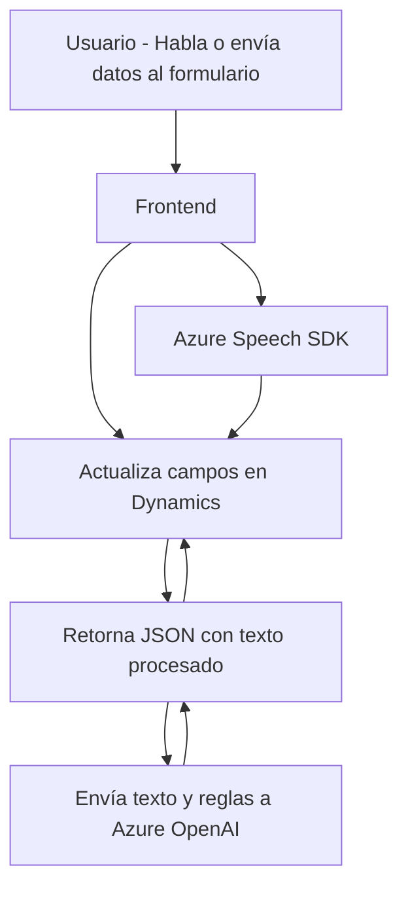

### Breve resumen técnico
La solución descrita corresponde a una aplicación que integra funcionalidades para gestionar interfaces de voz con reconocimiento de texto, síntesis de voz y transformaciones de texto mediante servicios de inteligencia artificial. Los componentes del sistema trabajan principalmente con formularios alojados en Microsoft Dynamics 365 mediante su API, utilizando el **Azure Speech SDK** y **Azure OpenAI API** para aumentar la funcionalidad con capacidades avanzadas como el reconocimiento y síntesis de voz, además de procesamiento de texto con inteligencia artificial.

---

### Descripción de arquitectura
1. **Tipo de solución**: La solución se orienta a ser un sistema de aplicaciones integradas, donde el frontend en **JavaScript** interactúa con Microsoft Dynamics 365 para reconocer y sintetizar voz, y se integra con servicios externos como **Azure OpenAI** para transformar texto. Adicionalmente, se implementa un plugin para extender la funcionalidad del backend de Dynamics 365.

2. **Arquitectura**:
   - La solución tiene una arquitectura distribuida híbrida basada en **microservicios**. Se observa una integración entre las siguientes componentes:
     - **Frontend** en **JavaScript** para la interacción directa con el usuario y recopilación de datos visuales.
     - **API** de Microsoft Dynamics 365 y un **plugin**, que conforman la capa backend de la aplicación.
     - **Azure Speech SDK y Azure OpenAI API**, que actúan como servicios externos para habilitar reconocimiento de voz, síntesis de voz y procesamiento de texto con inteligencia artificial.

3. **Patrones utilizados**:
   - **Facade Pattern**: Simplifica la interacción del usuario con las funcionalidades complejas del reconocimiento de voz y síntesis utilizando puntos de entrada definidos.
   - **Adapter Pattern**: Se utiliza para la conversión de datos al interactuar con formularios (e.g., al adaptar transcripciones a atributos de campos en Dynamics 365).
   - **Dynamic Loader Pattern**: Estrategia para cargar dependencias en tiempo de ejecución, como el **Azure Speech SDK**.
   - **Plugin Pattern**: Mediante la implementación de la interfaz `IPlugin` se asegura la extensión modular de Dynamics CRM con el plugin `TransformTextWithAzureAI`.

---

### Tecnologías usadas
1. **Frontend**: 
   - **JavaScript** para la implementación de lógica del reconocimiento de voz y síntesis de texto (usando el Azure Speech SDK).
   - **Azure Speech SDK** para reconocimiento de habla y síntesis de voz.
   - Integración con Microsoft Dynamics 365 para gestionar los formularios.

2. **Backend (Plugins)**:
   - **Microsoft Dynamics CRM SDK**: Para crear plugins personalizados en la infraestructura de Dynamics 365.
   - **Azure OpenAI API**: Procesamiento avanzado de texto y generación de formatos estructurados como JSON.
   - **C# y .NET Framework**: Desarrollo de plugins y procesos backend en Dynamics CRM.
   - Librerías de manejo de JSON: `System.Text.Json` y `Newtonsoft.Json`.

3. **Servicios externos**:
   - **Azure Speech SDK**: Reconocimiento y síntesis de voz.
   - **Azure OpenAI API**: Transformación de texto mediante inteligencia artificial.

---

### Diagrama Mermaid válido para GitHub

---

### Conclusión final

La solución implementa una arquitectura híbrida que combina la interacción de un frontend en JavaScript con un backend basado en Dynamics 365, extendido mediante plugins. Se observa una clara adopción de servicios externos (Azure Speech SDK y OpenAI API), lo que deriva en un diseño orientado a integración. El uso de principios de diseño como el patrón de fachada, adaptadores y modularidad para encapsular la lógica demuestra una alineación con las mejores prácticas en el desarrollo de software. 

Por otro lado, la seguridad debe ser atendida con mayor rigor (manejo de claves sensibles y eliminación de imports innecesarios). En su estado actual, la arquitectura de código es flexible y reusabilidad es una fortaleza clave, pero parece depender de estructuras específicas de Dynamics 365, lo que puede limitar su portabilidad a otros entornos o sistemas.