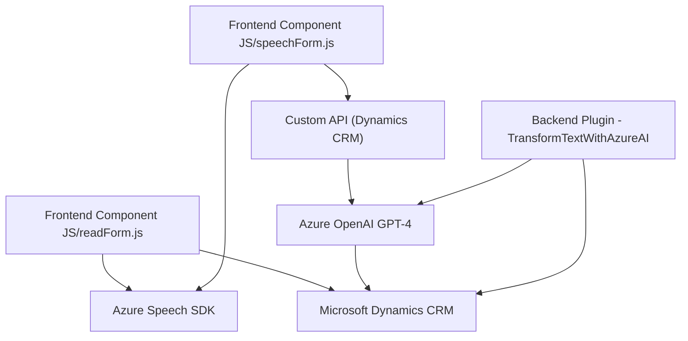

### Breve Resumen Técnico

El repositorio presenta una solución híbrida basada en la integración de frontends con reconocimiento de voz y sistemas backend que emplean inteligencia artificial (IA) para procesamiento de datos. Estos módulos interactúan principalmente con Microsoft Dynamics CRM y el modelo GPT-4 alojado en Azure OpenAI, utilizando servicios como el Azure Speech SDK y APIs personalizadas.

---

### Descripción de Arquitectura

#### Tipo de Solución:
- **Frontend**: JavaScript manejando entradas de voz, transformaciones y manipulación de datos dinámicos en formularios de CRM.
- **Backend**: Plugin en .NET integrado con Dynamics CRM que utiliza IA para procesamiento textual estructurado.

#### Arquitectura:
- **Microservicios Api-Driven + plugins**:
  - La solución combina microservicios basados en el Azure Speech SDK y APIs Personalizadas (Custom API de Dynamics CRM).
- **Integración Horizontal:** Componentes frontend (JavaScript) que interactúan dinámicamente con formularios de CRM están acoplados a servicios externos tipo *API-as-a-Service*.
- **Backend Plugin Monolítico:** Plugins en Dynamics CRM diseñados bajo el patrón de desarrollo "plugin unitario", pero integrados con servicios avanzados como Azure OpenAI.

#### Patrones de Diseño:
1. **API Gateway:** Uso de SDK y APIs para encapsular llamadas a sistemas externos como Azure Speech y OpenAI.
2. **Modularidad:** Códigos orientados a funciones que promueven la reutilización y encapsulan lógica específica.
3. **Event-Driven (Asincrónico):** Callbacks y promesas manejan cargas dinámicas y asincronismo en llamadas API externas.
4. **Factory Pattern:** Uso de `IOrganizationServiceFactory` para desacoplar el servicio de acceso a datos en Dynamics 365.
5. **Service Composition:** Orquestación de diversas dependencias (SDK, Custom API, OpenAI) para funcionalidades avanzadas.

---

### Tecnologías Usadas

#### Frontend:
- **JavaScript:** Scripts para interacción con formularios de Dynamics CRM.
- **Azure Speech SDK:** Servicios de reconocimiento y síntesis de voz.
- **CRM APIs:** Manipulación de datos del formulario, con métodos como `Xrm.WebApi.online`.

#### Backend:
- **.NET (C#):** Plugin extendido para Dynamics.
- **Microsoft Dynamics CRM SDK:** Para integración con el sistema CRM.
- **Azure OpenAI GPT-4:** Procesamiento avanzado de texto en formato JSON.
- **JSON Manipulation:** Uso de Newtonsoft.Json y System.Text.Json para generación y lectura de datos estructurados.
- **HTTP Client:** Comunicación con servicios remotos en Azure.

---

### Dependencias o Componentes Externos

1. **Azure Speech SDK:** Uso de servicios de texto a voz y reconocimiento de voz.
2. **Azure OpenAI GPT-4 (via Custom API):** Procesamiento textual avanzado con IA.
3. **Microsoft Dynamics CRM:** Contexto de formularios y base para integración.
4. **Custom API:** API personalizada que aplica procesamiento adicional a las transcripciones.
5. **Newtonsoft.Json:** Procesamiento de estructuras JSON.
6. **Xrm.WebApi:** Interacción con los servicios online de Dynamics CRM para manipulación de datos.

---

### Diagrama Mermaid

---

### Conclusión Final

La solución explora una combinación de frontend dinámico y backend con inteligencia artificial en el ecosistema de Microsoft Dynamics CRM. El uso de SDKs como Azure Speech y servicios en la nube (Azure OpenAI) promueve una arquitectura escalable que delega el procesamiento intensivo en servicios externos. Tiene un diseño modular y profesional para tareas específicas (reconocimiento de voz, manipulación y transformación de datos CRM), pero su backend bajo el patrón del plugin indica que podría evolucionar hacia un enfoque más desacoplado si se adoptan estándares modernos (ej. microservicios o serverless).