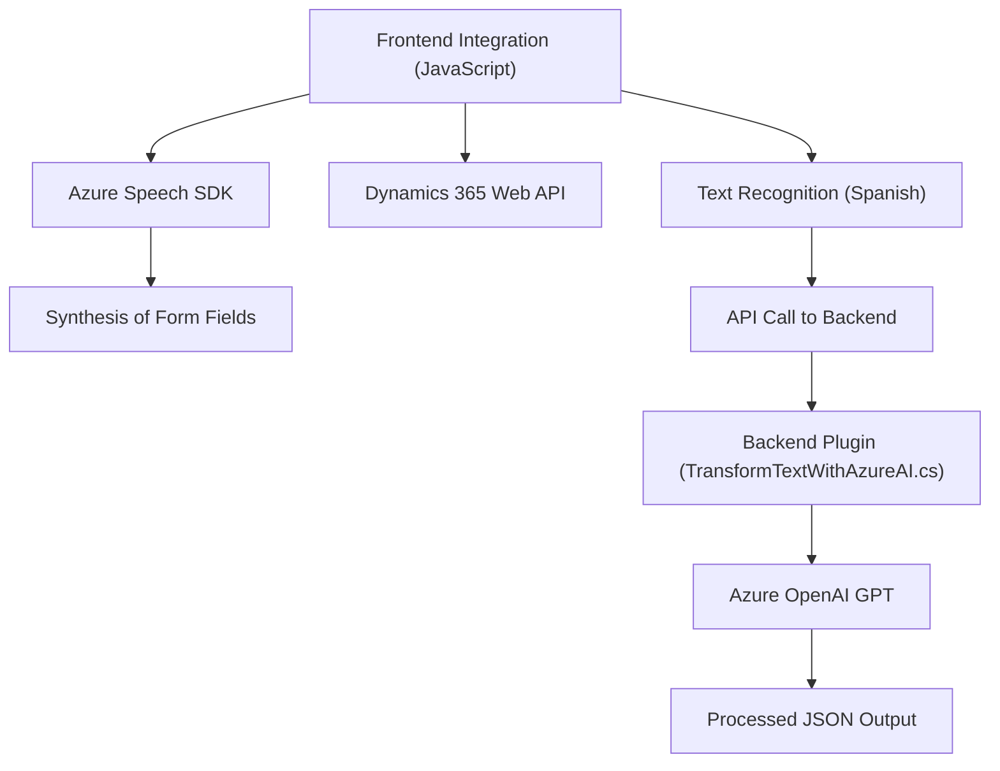

### Breve resumen técnico

El repositorio analizado parece implementar una solución que incluye una mezcla de interacción con formularios dinámicos (Dynamics 365), entrada y salida de voz mediante Azure Speech SDK, y transformación de datos estructurados con Azure OpenAI GPT. Es una arquitectura híbrida orientada a mejorar la accesibilidad (síntesis y reconocimiento de voz) y a extender las capacidades de procesamiento inteligente de texto con servicios de Azure.

---

### Descripción de arquitectura

La solución muestra características de una arquitectura **n-capas** con integración de servicios externos. Los principales módulos son:
1. **Frontend dinámico**: Scripts de JavaScript integrados se utilizan para la extracción y procesamiento de información en los formularios del sistema (Dynamics 365).
2. **Servicios externos de Azure**: Los eventos del frontend invocan SDKs como Azure Speech y Azure OpenAI API para reconocimiento de voz, síntesis y transformación inteligente del texto.
3. **Backend basado en plugins**: A través de una clase C# (`TransformTextWithAzureAI.cs`), se realiza procesamiento especializado del texto desde Dynamics CRM utilizando la API OpenAI y se devuelven respuestas transformadas.

La arquitectura exhibe elementos híbridos como:
1. **Desacoplamiento mediante SDK externo**: Interacción modular con servicios como Azure Speech y Azure GPT.
2. **Servicios distribuidos**: Uso de servicios en la nube para capacidades avanzadas.

---

### Tecnologías usadas

**Frontend:**
- **JavaScript/ES6**: Estructura modular con funciones específicas para la lógica de negocio.
- **Azure Speech SDK**: Reconocimiento y síntesis de voz.
- **Dynamics 365 Web API**: Integración para modificar atributos y valores en formularios.

**Backend:**
- **C# .NET Framework**: Plugin implementado para Dynamics CRM.
- **Azure OpenAI GPT**: Procesamiento avanzado del texto.

**Servicios adicionales:**
- API personalizada de Dynamics (para transcripción con IA).
- Azure Speech y Azure OpenAI como servicios en la nube.

---

### Diagrama Mermaid válido para GitHub

---

### Conclusión final

El repositorio corresponde a una solución orientada a extender la funcionalidad de formularios Dynamics 365 mediante accesibilidad basada en voz y procesamiento inteligente de texto. La arquitectura combina principios de n-capas con servicios distribuidos, destacando la integración con SDKs y APIs de Azure. El enfoque estructurado facilita tanto la accesibilidad (con voz) como procesos automatizados avanzados mediante IA. Una recomendación para el futuro es asegurar que las claves/API estén protegidas adecuadamente mediante almacenamiento seguro y mejorar el manejo de errores de red para servicios externos.