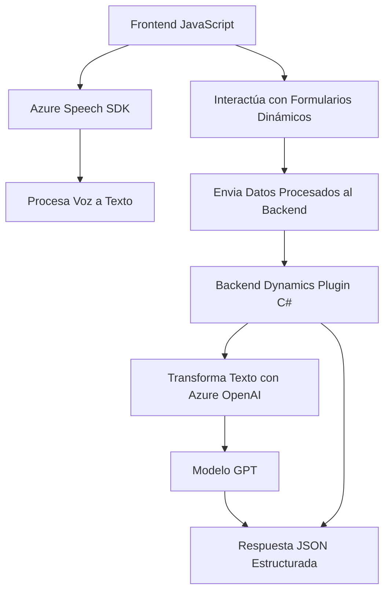

### Breve resumen técnico
El repositorio parece abordar una solución basada en la integración de voz y texto en aplicaciones empresariales usando Microsoft Dynamics CRM. Utiliza el **Azure Speech SDK** para capacidades de síntesis y reconocimiento de voz, y el **Azure OpenAI API** para procesamiento avanzado de texto con inteligencia artificial. La solución maneja formularios dinámicos, permitiendo interacción mediante texto y voz, y transformaciones contextuales en tiempo real, como el mapeo y procesamiento de campos en formularios.

---

### Descripción de la arquitectura
La solución general tiene una arquitectura basada en servicios acoplados a una plataforma existente (Microsoft Dynamics CRM). Es una mezcla entre:
1. **Cliente thin**: Se presenta en forma de ligeros scripts basados en JavaScript que operan a través del **navegador** (frontend).
2. **Plugins dinámicos**: Se integran directamente con la arquitectura de **Microsoft Dynamics CRM** para extender funcionalidades del backend mediante servicios como **Azure Speech SDK y Azure OpenAI API**.

Por tanto, la arquitectura podría clasificarse como:
- **N capas** sobre Microsoft Dynamics CRM (Capa de presentación y plugins para capas de negocio).
- **Enfoque de integración con SaaS** mediante el uso de servicios en la nube de Azure.

---

### Tecnologías usadas
1. **Frontend**:
   - JavaScript como lenguaje principal.
   - **Azure Speech SDK** para sintetizar y reconocer voz.
   - APIs dinámicas integradas con el navegador para consumo de servicios remotos.
2. **Backend**:
   - Microsoft Dynamics CRM: Ecosistema central de la solución.
   - C# (.NET): Usado en plugins que interactúan con Dynamics CRM.
   - **Azure OpenAI API**: Transformación de texto usando el modelo GPT.
3. **Patrones de diseño**:
   - Modularidad funcional: Funciones especializadas con responsabilidades bien definidas.
   - Gestión dinámica de dependencias: Sistema carga SDKs y APIs de forma dinámica.
   - Delegación (Callbacks): Para manejar eventos asincrónicos eficientemente.
   - Separación de capas: Presentación (JS) y lógica empresarial (C#).

---

### Diagrama Mermaid válido para GitHub

---

### Conclusión final
La solución está diseñada para maximizar la integración de capacidades de inteligencia artificial y voz con formularios empresariales gestionados en Microsoft Dynamics CRM. Su estructura modular y el uso de tecnologías en la nube como **Azure Speech SDK** y **Azure OpenAI API** facilitan la elaboración de un sistema escalable, con separaciones claras de responsabilidades en presentación (frontend) y procesamiento empresarial (backend).