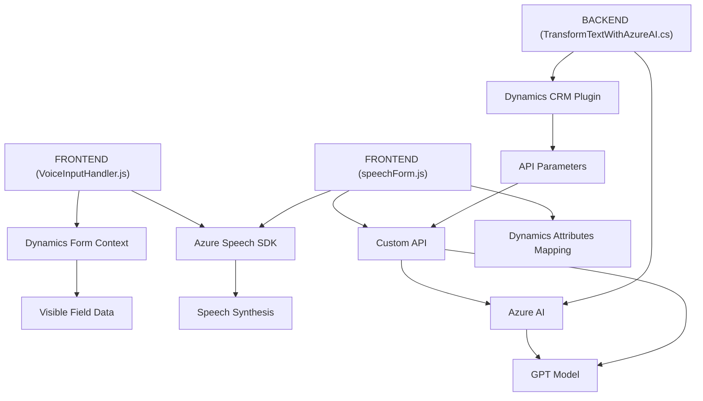

### Breve Resumen Técnico:
El repositorio se integra con servicios Azure (Azure Speech SDK y Azure OpenAI Service) para aportar funcionalidades avanzadas de generación y gestión de voz, procesamiento de datos dinámicos en formularios, así como transformación de texto. Está diseñado para mejorar interacciones en Dynamics CRM y servicios web con enfoque en la voz y la inteligencia artificial.

---

### Descripción de Arquitectura:
La solución combina varias arquitecturas:
1. **Componentes frontales**:
   - Event-driven con modularidad explícita: Funciones cargando dinámicamente SDKs y manejando operaciones contextuales como síntesis de voz.
   - Modularidad y separación de responsabilidades garantizan manejo de lógica para procesamiento de datos y respuesta del lado cliente.

2. **Backend (Plugins)**:
   - Basado en **Plugins de Dynamics CRM**, que encapsulan lógica adherida a la arquitectura de Dynamics.
   - Utiliza integraciones REST para comunicarse con APIs externas (Azure OpenAI).

3. **Patrones aplicados**:
   - **Callbacks y Promesas**: Manejo eficiente de SDKs y servicios.
   - **Data Mapping y Procesamiento Dinámico**: Utilizado extensivamente para formularios.
   - **Integración Microservicios API**: Existe conectividad limpia con SDKs de Azure y Custom APIs.

---

### Tecnologías Usadas:
1. **Frontend**:
   - **JavaScript** con empleos específicos del Azure Speech SDK.
   - Interacciones con formularios de Dynamics CRM (Xrm.WebApi).
   - Promesas para lograr programación asíncrona.
   
2. **Backend**:
   - **C#** usando Microsoft Dynamics SDKs (`IPlugin` y servicios relacionados).
   - **HttpClient** para integrar APIs REST (Azure OpenAI/GPT-4).
   - **Newtonsoft.Json** y **System.Text.Json** para serialización y deserialización.

3. **Servicios Cloud**:
   - **Azure Speech SDK**: Para síntesis y procesamiento de audio.
   - **Azure OpenAI Service**: Interacción con GPT para transformación avanzada de texto.

---

### Dependencias o Componentes Externos:
1. **Azure Speech SDK** para síntesis de voz y reconocimiento.
2. **Azure OpenAI Service** para procesamiento avanzado de texto.
3. **Microsoft Dynamics CRM** como base del framework del plugin y sistemas de formularios.
4. **Custom API** para procesar comandos en modo IA.
5. **Newtonsoft.Json** y **System.Net.Http** en el backend para manejo de respuestas HTTP y APIs.

---

### Diagrama Mermaid:

---

### Conclusión Final:
Este repositorio integra una solución **híbrida** con componentes de frontend y backend que trabajan en conjunto para resolver problemas de interacción del usuario con formularios de Dynamics CRM, mediante control por voz, análisis de comandos con inteligencia artificial y transformación avanzada de texto. La arquitectura aplica principios propios de una **event-driven con módulos frontend dinámicos**, mientras que el backend opera en **pluggable architecture** adaptada para CRM y microservicios API. El uso de tecnologías como **Azure SDKs**, comunicación REST y manipulación JSON muestra un desarrollo moderno y preparado para integraciones en la nube.