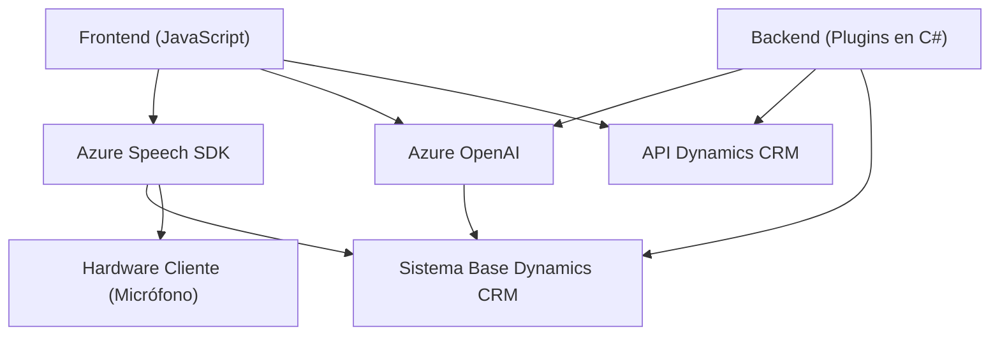

# Análisis Técnico del Repositorio

## Breve Resumen Técnico
El repositorio analiza una solución empresarial que integra funcionalidades de entrada y salida de voz, procesamiento de formularios en un entorno Dynamics CRM, e interacción con Azure OpenAI y Azure Speech SDK. Los componentes combinan tecnologías como JavaScript para el frontend y C# para plugins de Dynamics CRM, con servicios en la nube.

---

## Descripción de Arquitectura
La solución representa un **sistema híbrido basado en cuatro capas principales**:
1. **Frontend (JS)**: Administra la carga dinámica de recursos y la UI mediante integración con Dynamics CRM.
2. **Backend (Plugins en C#)**: Implementa reglas de negocio y lógica para interactuar con datos formateados según estándares específicos.
3. **Servicios Cloud**:
   - **Azure Speech SDK**: Entrada y síntesis de voz.
   - **Azure OpenAI**: Procesamiento de datos con IA.
4. **API Dynamics CRM**: Mediador entre el frontend y los datos del sistema.

### Arquitectura Predominante
Predomina una **arquitectura n capas**, con separación entre:
- Entrada/salida (voz y formulario).
- Lógica de negocio (plugin y procesamiento de datos).
- Integración con servicios externos.
La dependencia notable de servicios de Azure enfatiza un enfoque **client-server con integración en la nube**.

---

## Tecnologías Usadas
1. **Frontend**:
   - **JavaScript/DOM API**: Para la interacción con el formulario y carga dinámica de SDK.
   - **Azure Speech SDK**: Integrado desde CDN para reconocimiento y síntesis de voz.
2. **Backend**:
   - **C# (.NET)**: Desarrollo de plugins de CRM.
   - **Microsoft Dynamics SDK**: Framework para manipular registros CRM.
   - **Newtonsoft.Json**: Procesamiento y manejo de datos JSON.
3. **Servicios Externos**:
   - **Azure OpenAI API**: Gestión de procesamiento semántico mediante inteligencia artificial.
   - **Azure Speech SDK**: Reconocimiento de voz y síntesis en tiempo real.

---

## Dependencias o Componentes Externos
1. **Azure Speech SDK**:
   - Servicio para sintetizar y reconocer voz en múltiples idiomas.
   - Cargado dinámicamente vía CDN (`https://aka.ms/csspeech/jsbrowserpackageraw`).
2. **Azure OpenAI API**:
   - Procesa texto para normalización y genera respuestas en JSON.
3. **Microsoft Dynamics CRM WebApi**:
   - Manipula datos CRM.
4. **Newtonsoft.Json y System.Text.Json**:
   - Frameworks para manejar estructuras JSON en C#.
5. **DOM API**:
   - Gestión de formularios y eventos en el entorno del navegador.

---

## Diagrama Mermaid 100 % Compatible con GitHub Markdown

---

## Conclusión Final
Esta solución implementa un sistema dirigido a la mejora de la interacción usuario-CRM a través de reconocimiento y síntesis de voz, además del procesamiento avanzado con IA. Con una arquitectura escalable basada en n capas más integración directa con los servicios de Azure, enfatiza modularidad y reutilización. Sin embargo, la dependencia de servicios externos podría limitar la flexibilidad en entornos no conectados a internet o de menor presupuesto.