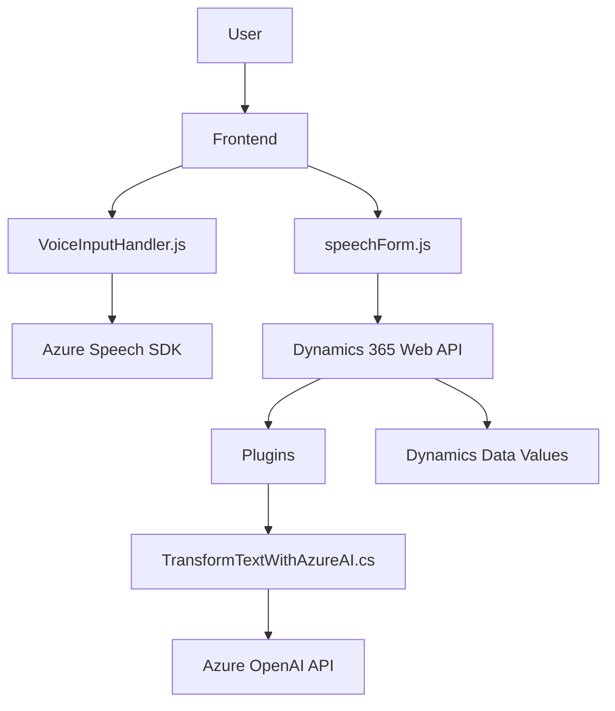

# Análisis del Proyecto

## **Breve Resumen Técnico**
Este repositorio implementa un sistema que combina **entrada/salida de voz**, formularios dinámicos de **Microsoft Dynamics 365**, y **transformación de texto mediante Azure OpenAI**. Es una solución híbrida con un enfoque en el uso de **web APIs**, **Reconocimiento de Voz (Speech SDK)** y procesos de texto basados en IA. Está construido en un enfoque modular y orientado a eventos con elementos adicionales para extender funcionalidades en Dynamics 365 mediante plugins personalizados.

---

## **Descripción de Arquitectura**
La arquitectura sugiere una **n-capas orientada a servicios** donde los componentes frontend interactúan directamente con Microsoft Dynamics y servicios de Azure (Speech SDK y OpenAI) para gestionar la entrada por voz, procesamiento de formularios dinámicos, y transformación avanzada de texto. 

Además, incluye:
1. **Frontend Form Input/Processing Layer**: Archivos JavaScript en carpeta `/FRONTEND/JS`, utilizados para capturar interacción por voz y modificar datos en formularios.
2. **Backend Plugin/Processing Layer**: Archivo `TransformTextWithAzureAI.cs`, que actúa como middleware para ejecutar procesos en Dynamics CRM y delegar operaciones avanzadas a Azure OpenAI.
   
Patrones aplicados:
- **Event-Driven Architecture**: Uso extenso de eventos, callbacks y estado dinámico para acciones dependientes de usuarios.
- **Plugin Architecture**: Extensión modular de funcionalidades mediante integración de Dynamics CRM.
- **Integration Pattern**: Comunicación directa con servicios externos (Azure Speech SDK y Azure OpenAI).

---

## **Tecnologías y Frameworks Usados**
1. **Frontend (JS):**
   - **Azure Speech SDK**:
     - API de Reconocimiento de Voz y Síntesis de Audio.
   - **Dynamics 365 Web APIs**:
     - Para manipular atributos y entidades en tiempo real en formularios dinámicos.
   - **Navegadores comunes**:
     - Gestionando eventos del DOM, manipulación de atributos y elementos dinámicos.

2. **Backend (.NET):**
   - **Microsoft Dynamics CRM SDK**:
     - Gestión de plugins, integración con eventos en entornos empresariales.
   - **Azure OpenAI API**:
     - Servicio basado en IA para transformar texto, accesible mediante solicitudes HTTP.
   - **System.Net.Http, Newtonsoft.Json**:
     - Serialización y manejo de solicitudes a través de JSON y APIs externas.

---

## **Diagrama Mermaid**

Representa la interacción general entre los componentes del sistema. Utiliza gráficos **Mermaid válidos para GitHub Markdown**.

---

## **Conclusión Final**
Este proyecto ofrece una solución híbrida de entrada por voz en formularios, procesado dinámico y transformación avanzada de texto. Es altamente modular, compatible con **Dynamics 365** y utiliza herramientas modernas de **Microsoft Azure** (como el Speech SDK y OpenAI). Su arquitectura está orientada a servicios n-capas con un fuerte enfoque en la integración de APIs, permitiendo escalabilidad, claridad operacional y separación de responsabilidades. 

Esta implementación es efectiva para mejorar la experiencia del usuario con formularios dinámicos y procesamiento por voz, además de ser extensible para incorporaciones futuras.