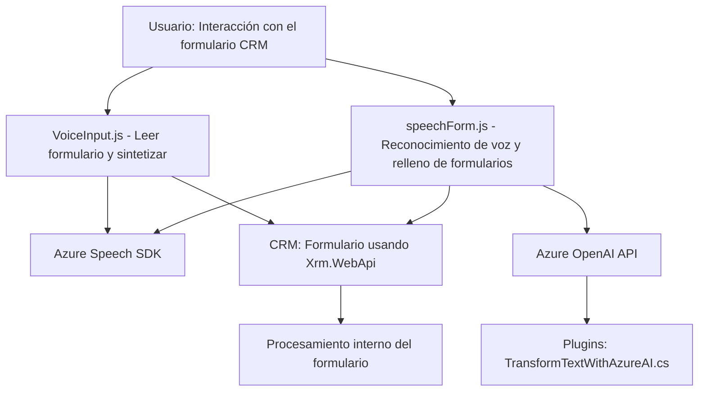

### Breve resumen técnico

El repositorio parece estar centrado en una solución para la integración entre formularios en un sistema CRM (probablemente Microsoft Dynamics 365) y servicios de procesamiento mediante **Azure Speech SDK** y **Azure OpenAI API**. Los archivos incluyen funcionalidades que:
1. Convierten datos visibles del formulario en audio.
2. Capturan entrada por voz, procesan comandos, y aplican valores en formularios.
3. Transforman texto usando AI en un Microsoft Dynamics CRM plugin.

### Descripción de arquitectura

La solución exhibe características de una **arquitectura híbrida**:
1. **Frontend dinámico con módulos de reconocimiento de voz y síntesis de audio**:
   - Implementado en **JavaScript** con integración del SDK de Azure Speech.
   - Interacción directa con la interfaz gráfica del CRM mediante manipulación del DOM y APIs propias (`Xrm.WebApi`).

2. **Backend extensible basado en Plugins para Microsoft Dynamics**:
   - Implementación en **C#**, con integración directa a Dynamics CRM, usando un patrón de **Plugin Design**.
   - Diversos servicios externos (Azure OpenAI y HTTP APIs) para añadir comportamiento avanzado al CRM.

La arquitectura sigue el patrón de **n-capas**, con:
- **Capa de presentación**: Archivos frontend (`readForm.js`, `speechForm.js`) interactúan con usuarios y servicios de Azure.
- **Capa de lógica empresarial**: Plugins implementan lógica de negocio sobre Dynamics CRM.
- **Capa de datos**: Datos del formulario del CRM y respuesta de servicios externos (Speech SDK y OpenAI API).

### Tecnologías usadas

1. **Frontend**:
   - **JavaScript**: Manipulación del DOM, integración async con Azure Speech SDK.
   - **Azure Speech SDK**: Para síntesis y reconocimiento de voz.
   - **Microsoft Dynamics CRM Web API (`Xrm.WebApi`)**: Manejo de datos del formulario y entidades del CRM.

2. **Backend**:
   - **C#**: Implementación de Microsoft CRM plugins.
   - **Newtonsoft.Json** y `System.Text.Json`: Procesamiento JSON.
   - **System.Net.Http**: Comunicación con APIs externas como Azure OpenAI API.
   - **Azure OpenAI API**: Procesamiento AI basado en GPT.

3. **Servicios externos**:
   - Azure Speech SDK para voz.
   - Azure OpenAI para IA.

### Diagrama Mermaid válido para GitHub

### Conclusión final

Esta solución representa un ejemplo claro de integración entre un sistema CRM, servicios de procesamiento de voz y API externas de inteligencia artificial dentro de una arquitectura n-capas. La separación entre frontend dinámico y backend de plug-in proporciona modularidad. No obstante, en cuanto a seguridad, hace falta implementar mecanismos más robustos para proteger las claves o credenciales de acceso a Azure OpenAI y Speech SDK. También sería recomendable que la configuración se externalice mediante variables de entorno o almacenada en un servicio de configuración. 

La solución muestra un nivel avanzado en términos técnicos y es ideal para aplicaciones que buscan mejorar la interacción humano-sistema a través de reconocimiento de voz y procesamiento por IA.