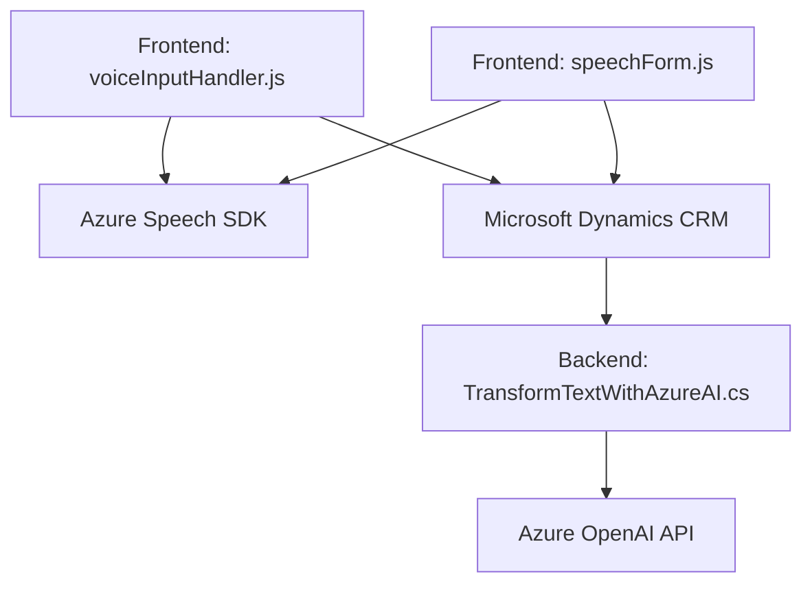

### Breve resumen técnico

El repositorio contiene tres archivos clave que se integran en un entorno basado en Microsoft Dynamics CRM para gestionar formularios mediante reconocimiento de voz, síntesis de voz y procesamiento avanzado de texto a través de servicios de Azure, como Speech SDK y OpenAI. Los principales objetivos incluyen mejorar la accesibilidad y productividad en el manejo de datos de formularios mediante interfaces conversacionales y procesamiento automático.

---

### Descripción de la arquitectura

La solución mezcla múltiples capas de funcionalidad:
1. **Frontend**: Archivos JavaScript (`voiceInputHandler.js`, `speechForm.js`) interactúan directamente con el entorno del navegador para captura de voz, procesamiento textual y actualización de formularios.
2. **Plugins**: Clases C# (`TransformTextWithAzureAI.cs`) extienden las capacidades de Microsoft Dynamics CRM, realizando procesamiento externo de texto mediante Azure OpenAI.
3. **Integración con APIs externas**: Tecnología basada en Azure servicios (Speech SDK y OpenAI) asegura extensibilidad y capacidades avanzadas de procesamiento.

La arquitectura principal parece orientarse hacia un **modelo de n capas**:
- **Capa de presentación**: Frontend con JavaScript (captura y síntesis de voz directa).
- **Capa de negocio**: Plugins y el backend interactúan con APIs externas y CRM para lógica avanzada.
- **Capa de acceso a datos**: Usa la API de Microsoft Dynamics CRM para interacción con datos relevantes de formularios.

Patrones observados incluyen:
- **Event-Driven**: Uso de callbacks y acciones asincrónicas (SDK de Speech, tareas como reconocimiento de voz).
- **Facade Pattern**: Función `execute` en C# sirve como entrada única para el plugin.
- **Modularización**: Separación explícita de funcionalidades como "captura de voz", "procesamiento de resultados", "actualización de formularios".

---

### Tecnologías y frameworks usados

1. **Frontend:**
   - **JavaScript**: Implementación de lógica asociada al cliente.
   - **Azure Speech SDK**: API de síntesis y reconocimiento de voz.
   - **Web APIs (Dynamics)**: Comunicación con Microsoft CRM para recuperación y escritura de datos en formularios.

2. **Backend:**
   - **C# (Plugins)**: Herramientas nativas del framework CRM.
   - **Azure OpenAI**: Procesamiento de texto contextual avanzado.

3. **Dependencias externas**:
   - `Newtonsoft.Json`: Procesamiento avanzado de datos en JSON dentro del backend.
   - `System.Net.Http`, `System.Text.Json`: Comunicación con servicios API REST del ecosistema Azure.

---

### Diagrama **Mermaid** válido para GitHub

---

### Conclusión final

La solución implementada en este repositorio mejora la interacción con los formularios al combinar tecnologías avanzadas de reconocimiento de voz, síntesis de voz y procesamiento de lenguaje natural. Usa Azure Speech SDK para capturar y convertir voz en texto, mientras que los plugins en Dynamics CRM integran Azure OpenAI para transformar entradas textuales. 

La arquitectura evidencia un esquema basado en **n capas**, con una clara separación entre frontend (gestión de voz y datos visuales), backend (plugins procesan texto mediante APIs y reglas definidas) y datos (integración con Microsoft Dynamics). Sin embargo, hay áreas que podrían optimizarse:
- **Seguridad**: Uso de claves y configuraciones sensibles (como `azureKey` y `azureRegion`) directamente en el código puede exponer datos críticos.
- **Configuraciones externas**: Parámetros del servicio y patrones de configuración en el plugin deberían externalizarse para facilitar el mantenimiento y las actualizaciones.

En general, es una solución robusta que evidencia buenas prácticas de modularización e integración con APIs en un ecosistema empresarial.