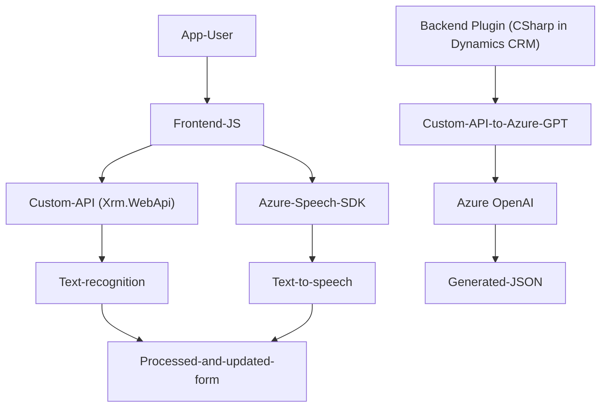

### Análisis Técnico Completo

#### Breve Resumen Técnico
El repositorio contiene múltiples archivos orientados a la interacción mediante voz, procesamiento de formularios y servicios externos (como Azure Speech SDK y Azure OpenAI GPT). Se identifican dos tipos de componentes: un **frontend en JavaScript** para la interacción dinámica con formularios (entrada y salida por voz, manipulación de formularios) y un **plugin de Dynamics CRM** desarrollado en C# para transformar texto mediante inteligencia artificial.

#### Descripción de la Arquitectura
1. **Tipo de solución**:
   - La solución incluye:
     - Un **frontend** desarrollado en **JavaScript** para el manejo de formularios y comunicación con servicios externos para entrada/salida de voz y procesamiento de texto.
     - Un **backend basado en plugins** para **Microsoft Dynamics CRM**, configurado para interactuar con Azure OpenAI GPT mediante solicitudes HTTP desde C#.

2. **Arquitectura general**:
   - **N capas**: Arquitectura distribuida con una separación clara:
     - **Presentación (Frontend)**: Módulos JavaScript que interactúan con el usuario en el navegador.
     - **Lógica de Negocio/Procesamiento (Plugins)**: Desarrollo de una integración personalizada con Dynamics CRM y Azure OpenAI para el backend.
     - **Servicios externos**:
       - Azure Speech SDK.
       - Azure OpenAI GPT (comunicación API en plugins).
   - Se utiliza ampliamente la programación **modular**, **event-driven** y **desacoplada**, característica de soluciones modernas para integración y extensibilidad.

#### Tecnologías usadas
1. **Frontend (JavaScript)**:
   - **Azure Speech SDK**: Para reconocimiento y síntesis de voz.
   - **Callback-based execution**: Uso de funciones callback para ejecutar operaciones tras eventos (como la carga del SDK o la ejecución de reconocimiento de voz).
   - **Dynamic imports**: Carga de recursos (SDK) sobre demanda desde una URL específica.
   - **Event-based processing**: Las acciones principales del frontend se desencadenan en respuesta a eventos del SDK o interacción del usuario.

2. **Backend (C# Plugins)**:
   - Framework de desarrollo: **.NET Framework/C#**.
   - **Microsoft Dynamics CRM SDK**: Extender la funcionalidad del CRM mediante plugins.
   - **Newtonsoft.Json** y **System.Text.Json**: Para manejar objetos JSON de manera eficiente.
   - **Azure OpenAI API**: Comunicación con la API GPT para procesamiento inteligente de texto.
   - **System.Net.Http**: Realización de solicitudes HTTP al servicio OpenAI para generar transcripciones JSON.

#### Dependencias o Componentes Externos
1. **Azure Speech SDK**: Carga dinámica desde una CDN (`https://aka.ms/csspeech/jsbrowserpackageraw`) para reconocimiento y síntesis de voz.
2. **Azure OpenAI (API)**: Utilizada por el plugin en Dynamics CRM para transformar texto en JSON.
3. **Microsoft Dynamics CRM**: Flujo principal del negocio soportado en un entorno CRM.
4. **Newtonsoft.Json / System.Text.Json**: Manejo de JSON en los plugins.
5. **Xrm.WebApi**: Servicio web para comunicación interna en Dynamics CRM.
6. **Regex**: Validación y procesamiento avanzado de texto.

---

#### Diagrama Mermaid válido para GitHub

---

### Conclusión Final
El repositorio define una solución de **n capas**, compuesta por un **frontend con funcionalidad de síntesis de voz y reconocimiento de voz** desarrollado en **JavaScript** utilizando el **Azure Speech SDK** y **APIs externas relacionadas con Microsoft Dynamics CRM**, con funcionalidades distribuidas en módulos. Además, se desarrolló un **plugin de Dynamics CRM en C#** que adopta un enfoque de **microservicio externo** al integrar la funcionalidad de textos estructurados mediante Azure OpenAI GPT-4.

La solución sigue patrones modernos como la modularización, la integración de servicios externos (API-based approach), y la arquitectura orientada a eventos, lo cual garantiza flexibilidad y fácilmente escalabilidad en entornos empresariales.