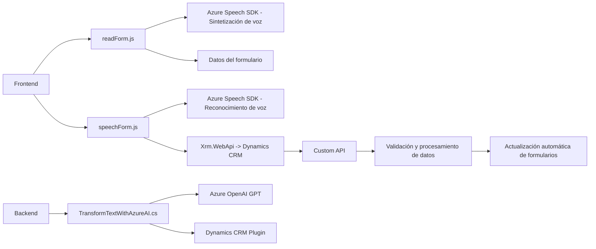

### Resumen técnico
El análisis de los archivos provistos indica la implementación de funcionalidades relacionadas con formularios, reconocimiento de voz, síntesis de texto a audio y consumo de APIs de Inteligencia Artificial y Speech SDK por parte de Azure. Estos archivos parecen ser componentes de una solución que integra un **frontend web** con un **CRM**, utilizando servicios de Azure y plugins de Dynamics CRM.

---

### Descripción de la arquitectura
La solución consiste en una arquitectura híbrida que mezcla un frontend modular y una extensión de Microsoft Dynamics CRM a través de plugins. Además:
1. **Frontend:** Es modular con foco en servicios y capacidades específicas (readForm.js y speechForm.js). Utiliza patrones de delegación para coordinar diferentes tareas relacionadas con formularios y servicios externos (Azure Speech y APIs de Dynamics CRM).
2. **Backend (Plugins):** La parte de la arquitectura que interactúa con el modelo GPT alojado en Azure OpenAI sigue el patrón de **plugin** típico en Dynamics CRM, encapsulando la lógica de integración con la API externa en una clase de procesamiento de datos.
3. El sistema parece alinearse parcialmente con el patrón **n capas** o **modelo cliente-servidor**, al tener una capa de presentación (JavaScript en frontend) que interactúa con un backend mediante APIs propias y de terceros.
4. **Componentes distribuidos:** Se manejan dependencias externas (SDK de Azure) y APIs personalizadas. Esto sugiere que algunos servicios son "microservicios externos" integrados en el cliente y el CRM.

---

### Tecnologías utilizadas
1. **Frontend (JavaScript):**
   - **Frameworks y SDK:** Azure Speech SDK.
   - **Patrones:** Modularización, delegación de flujos y composición de funciones independientes.
   - **CRM Integration:** Manejo avanzado de `Xrm.WebApi` para interactuar con formularios de Dynamics CRM.
   - **Seguridad:** El uso de claves y regiones sugiere conexión con cuentas de Azure.

2. **Backend (C# Plugin en Dynamics CRM):**
   - **Tech stack:**
     - Microsoft Dynamics CRM SDK.
     - Azure OpenAI Services (consumiendo el modelo GPT directamente).
     - JSON utilities como `Newtonsoft.JSON` y `System.Text.Json`.
   - **Patron de extensiones:** Plugin architecture.

---

### Dependencias presentes:
1. **Tecnologías externas:**
   - **Azure Speech SDK**: Reconocimiento de voz y síntesis de texto en voz.
   - **Azure OpenAI GPT API**: Transformación avanzada basada en modelos de lenguaje.
   - **Custom APIs de Dynamics CRM**: Personalizadas (mencionadas en SpeechForm.js).
   - **HttpClient** y endpoints REST (para consumir servicios externos).

2. **Frameworks internos:**
   - Dynamics CRM SDK (integración directa con WebAPI y ejecución de plugins).
   - `Xrm.WebApi.online` (operaciones CRUD en Dynamics CRM).

---

### Diagrama **Mermaid** compatible con GitHub Markdown

---

### Conclusión final
La solución consiste en una integración avanzada de múltiples servicios orientada al procesamiento de entrada de voz, síntesis de audio y manipulación de formularios en aplicaciones empresariales basadas en Dynamics CRM. Se estructura como un sistema modular híbrido que utiliza JavaScript en el frontend y plugins en el backend, manteniendo una arquitectura ágil y flexible. Sin embargo, observamos posibles puntos de fallo en el manejo directo de configuraciones críticas como claves y URL, lo que podría mejorarse siguiendo prácticas de arquitectura moderna como externalizar configuraciones sensibles.