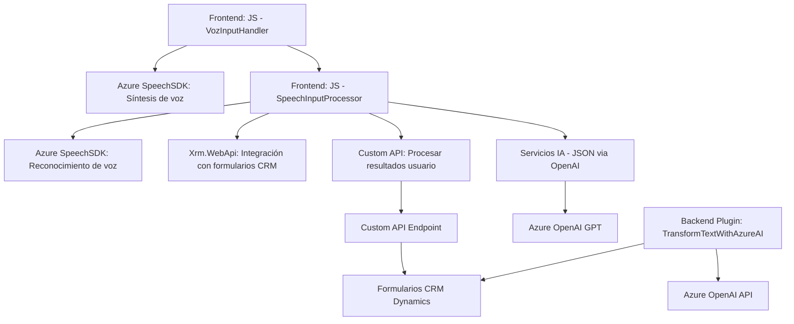

## Breve resumen técnico

Este repositorio integra cliente y lógica de negocio para procesar formularios dinámicos con entrada de voz y generación de resultados dinámicos mediante servicios de IA de Azure. Combina tecnologías externas (Azure SDK) y específicas (Dynamics CRM) para extender funcionalidades como reconocimiento de voz, síntesis de voz y transformación de texto por medio de plugins en un ecosistema Microsoft.

---

## Descripción de arquitectura

La solución sigue una arquitectura orientada a **client-server** con componentes responsables de distintas tareas:
1. **Frontend**:
   - JavaScript maneja la interfaz y la interacción con SDKs externos (como Azure Speech).
   - Procesamiento basado en eventos que asegura que el SDK se cargue y funcione correctamente.
2. **Backend/Plugin**:
   - Un componente basado en **Microsoft Dynamics CRM** construido en .NET que responde a eventos del sistema CRM y se comunica con Azure OpenAI para transformar texto utilizando APIs externas.

La arquitectura se encuentra en un formato híbrido:
- **Cliente API Gateway** (Frontend) accediendo a servicios de síntesis de voz y procesamiento textual usando patrones estructurados.
- **Plugin/Event-driven backend** integrado con Dynamics CRM que opera con Azure OpenAI para ampliar la lógica de negocio en escenarios específicos.

---

## Tecnologías usadas

1. **Frontend**:
   - *JavaScript* como lenguaje principal.
   - Azure Speech SDK para integración de voz (cargado dinámicamente desde el navegador).

2. **Backend/Plugins**:
   - *C# (ASP.NET Framework)* y el SDK de Dynamics CRM.
   - Azure OpenAI y servicios estructurados REST.
   - Serialización y deserialización en JSON mediante las librerías `System.Text.Json` y `Newtonsoft.Json`.

3. **Ecosistema**:
   - Integración extendida dentro de Microsoft Dynamics CRM.
   - Dependencia del servicio Azure Speech SDK y Azure OpenAI para capacidades de IA.

---

## Diagrama Mermaid válido para GitHub

---

## Conclusión Final

Esta solución implementa una integración de varios servicios de Microsoft Azure y Dynamics CRM para permitir la entrada por voz, síntesis de voz y procesamiento de lenguaje natural en un entorno corporativo basado en formularios dinámicos. La arquitectura demuestra buenas prácticas de separación de responsabilidades, como uso adecuado de SDKs, APIs y plugins. Sin embargo, algunos aspectos del diseño podrían mejorarse, como la externalización de las claves de API (para mayor seguridad) y mayor abstracción en el uso de servicios externos.