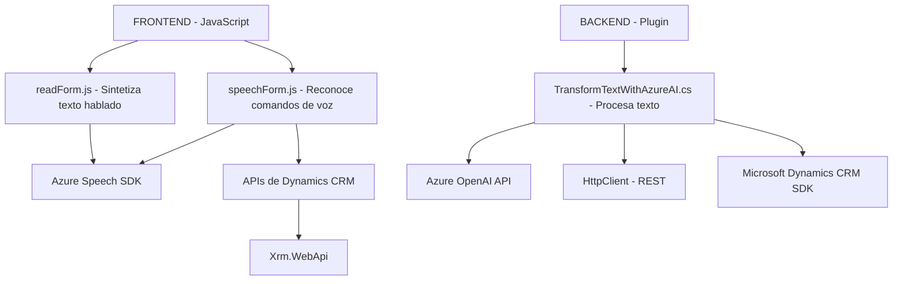

### Breve resumen técnico

El código proporcionado abarca tres componentes:
1. **Frontend:** Dos archivos (`readForm.js` y `speechForm.js`) implementan funcionalidad para lectura y entrada de voz usando Azure Speech SDK junto con manipulación de formularios dinámicos.
2. **Backend Plugin:** Un archivo (`TransformTextWithAzureAI.cs`) define un plugin de Dynamics CRM para transformar texto mediante la API de Azure OpenAI, estructurándolo como JSON.

### Descripción de arquitectura

La solución combina la interacción del usuario en la interfaz con un procesamiento de entrada de voz en el frontend basado en Azure Speech SDK. La arquitectura incluye conectividad backend centrada en un plugin que actúa como intermediario entre Dynamics CRM y servicios de Azure AI. Este enfoque apunta hacia una arquitectura **n-capas**:
1. **Capa de presentación:** Archivos del frontend manejan interacción y datos provenientes de formularios.
2. **Capa de lógica de negocio:** El plugin `TransformTextWithAzureAI.cs` encapsula la lógica de transformación de texto y validación en Dynamics.
3. **Capa de integración:** Manipulación vía APIs de Dynamics y Azure (Azure Speech SDK y Azure OpenAI API).

Sin embargo, debido a la presencia de un plugin específico en Dynamics CRM y el enfoque modular en el frontend, se puede categorizar como una arquitectura **modular** integrada.

### Tecnologías usadas

- **Frontend:**
  - **JavaScript/HTML DOM API:** Para manipulación de formularios y campos.
  - **Azure Speech SDK:** Reconocimiento de voz y síntesis de voz.
  - **Dynamics CRM APIs:** Manejo de modelo de datos y controles.

- **Backend:**
  - **C#:** Implementación de plugin de Dynamics CRM.
  - **Microsoft Dynamics SDK:** Extensión de la plataforma CRM.
  - **Azure OpenAI API:** Transformación de texto en JSON mediante inteligencia artificial.
  - **HttpClient:** Integración HTTP para llamadas REST.
  - **Newtonsoft.Json:** Manejo de datos en JSON.

### Diagrama Mermaid válido para GitHub

### Conclusión final

La solución combina un frontend de lectura y entrada de voz con un plugin para procesamiento avanzado en el backend utilizando servicios en la nube. El diseño modular facilita la integración con servicios externos como **Azure Speech SDK** y **Azure OpenAI API**, siendo compatible con entornos B2B como Dynamics CRM. La arquitectura n-capas desacopla el frontend del backend, optimizando la escalabilidad y extensibilidad. Sin embargo, es altamente dependiente de la infraestructura de Azure y Dynamics CRM.