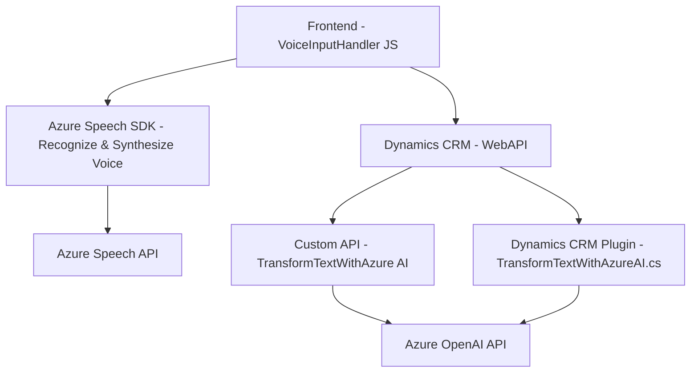

### Breve resumen técnico

El repositorio contiene elementos que implementan soluciones para el procesamiento de formularios mediante entrada de voz, gestión de datos, y transformación avanzada de texto usando Azure AI. Combinando un frontend en JS y una integración de plugins de Dynamics CRM, el sistema está diseñado para interactuar con servicios en la nube de Azure (Speech API y OpenAI).

---

### Descripción de arquitectura

La arquitectura parece ser **modular** y **integrada asíncronamente** con servicios externos. Mientras los archivos relacionados con el frontend tratan el reconocimiento de voz, la síntesis y el preprocesamiento de datos del formulario, el **plugin en C#** se encarga de transformar datos utilizando Azure OpenAI y de integrarlos con Dynamics CRM. 

La distribución sugiere una arquitectura **n-capas** con módulos separados que interactúan vía APIs. Sin embargo, la presencia del plugin determina que parte de la lógica esté fuertemente acoplada al entorno de Dynamics CRM. Esto puede integrar tanto patrones de **n-capas** como algunos componentes **basados en microservicios** (Azure Speech y Azure OpenAI son microservicios externos).

---

### Tecnologías usadas

1. **Frontend (JavaScript):**
   - Azure Speech SDK: Para síntesis de voz y reconocimiento de voz.
   - Dynamics CRM APIs: Manipulación y actualización de formularios de datos.
   - HTTP requests: Para consumir la API personalizada que transforma datos con IA.

2. **Backend (C#):**
   - Microsoft Dynamics CRM Plugin Framework (`IPlugin`).
   - .NET SDK.
   - JSON manipulation libraries (e.g. `Newtonsoft.Json`, System namespaces).
   - Azure OpenAI API for natural language processing.

---

### Dependencias o componentes externos

1. **Azure APIs:**
   - Azure Speech SDK: Usado en el frontend para el reconocimiento de voz y síntesis de voz.
   - Azure OpenAI API: Usado en el plugin para transformar datos de texto.

2. **Dynamics CRM** (Microsoft Dataverse/Cloud Service):
   - Interacción con CRM para obtener, manipular y actualizar datos del sistema de formularios.

3. **External API Integration:**
   - Posiblemente accesible solo mediante credenciales como `api-key` y regional settings (e.g., `azureRegion`).

---

### Diagrama Mermaid válido

---

### Conclusión final

La solución presentada es un **multicapa híbrida**, donde partes del procesamiento ocurren en el frontend (reconocimiento de voz y síntesis), mientras que la transformación y manipulación de texto en un formato estructurado se realizan en un plugin de Dynamics CRM. Se integra con servicios externos de Azure Speech y Azure OpenAI para implementar capacidades avanzadas de interacción por voz, lo que fortalece su diseño como solución moderna para aplicaciones orientadas a datos y usuarios. Sin embargo, la dependencia en servicios externos y en el entorno de Dynamics CRM limita un poco la escalabilidad independiente del sistema fuera de estos contextos.