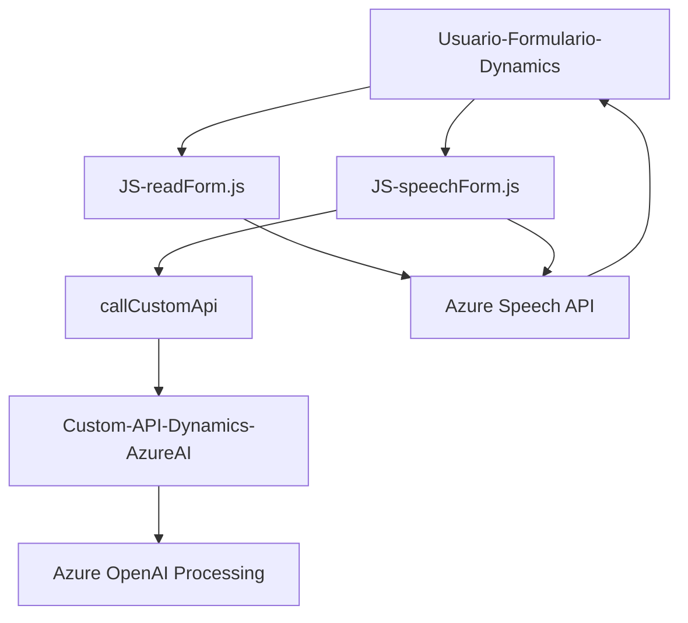

### Breve Resumen Técnico

Este repositorio representa una solución multipropósito que combina una interfaz **frontend** desarrollada en **JavaScript**, que interactúa con formularios y maneja datos de entrada/salida desde el usuario, con un backend que contiene un **plugin de Dynamics 365** desarrollado en **C#**. La solución aprovecha servicios en la nube ofrecidos por Azure, como **Azure Speech Service** y **Azure OpenAI**, para tareas avanzadas como síntesis y reconocimiento de voz, así como procesamiento de texto estructurado.

---

### Descripción de Arquitectura

La solución puede considerarse como una **arquitectura híbrida** que combina un **modelo n-capas** y elementos de integración con microservicios externos. El frontend sigue patrones orientados al cliente para manejar datos y eventos de usuario, mientras que el backend actúa como un plugin extendido de Dynamics 365. En conjunto:
1. **Frontend** maneja la interfaz de usuario y la interacción directa, delegando las tareas avanzadas a servicios de Azure (API externas).
2. **Backend** funciona como una extensión de Dynamics para transformar y procesar texto entrante mediante una arquitectura plugin altamente modular.

El patrón primario es una combinación de:
- **Cliente-Servidor**: Interacción entre cliente web y servicios en la nube.
- **Delegación**: Uso de funciones auxiliares y callbacks para tareas específicas en el flujo.
- **Integración de Servicios Externos**: Utilización de APIs externas de Azure para funcionalidades clave como síntesis de voz y procesamiento estructurado de texto.

---

### Tecnologías Utilizadas

1. **Frontend:**
   - **JavaScript**: Lenguaje principal del frontend.
   - **Azure Speech SDK**: Integración para reconocimiento de voz y síntesis de texto a audio.
   - **Dynamics Xrm API**: Manipulación de formularios y contexto en Dynamics 365.
   - **Custom APIs**: Interacción con APIs propias configuradas en Dynamics.

2. **Backend:**
   - **C#:** Lenguaje para programación del plugin de Dynamics.
   - **Microsoft.Xrm.Sdk:** SDK para desarrollo de extensiones en Dynamics.
   - **Azure OpenAI API:** API externa para procesamiento avanzado de texto.
   - **JSON Manipulation:** Uso de bibliotecas como `System.Text.Json` y `Newtonsoft.Json.Linq`.

3. **Servicios Externos:**
   - **Azure Speech Services:** Para síntesis y reconocimiento de voz.
   - **Azure OpenAI Services:** Para transformación y procesamiento inteligente de texto.

---

### Diagrama Mermaid **(100% compatible con GitHub Markdown)**

Este diagrama muestra las interacciones entre los componentes principales de la solución:
1. Frontend (JS / voz).
2. Plugin de Dynamics 365.
3. Servicios externos en Azure.

---

### Conclusión Final

La solución presentada es una integración robusta entre un **frontend interactivo basado en JavaScript** y un **backend tipo plugin de Dynamics 365**. Está diseñada para optimizar la experiencia del usuario mediante funcionalidades avanzadas como reconocimiento y síntesis de voz, además de incorporar inteligencia artificial para el procesamiento de texto.

Los principales beneficios son:
1. **Escalabilidad**: Los servicios externos (Azure Speech y Azure OpenAI) permiten manejar mayores volúmenes sin necesidad de infraestructura interna.
2. **Modularidad**: La solución divide claramente las responsabilidades, haciendo que cada módulo sea independiente.
3. **Mantenimiento**: La arquitectura organizada y el uso de herramientas modernas facilitan el mantenimiento y expansión de la solución.

Para mejorar la solución, se podrían optimizar las redundancias en las funciones del frontend y ampliar el manejo de errores en los plugins para escenarios complejos. Además, sería útil incluir pruebas automatizadas tanto en el frontend como en el plugin para garantizar la estabilidad de la integración.