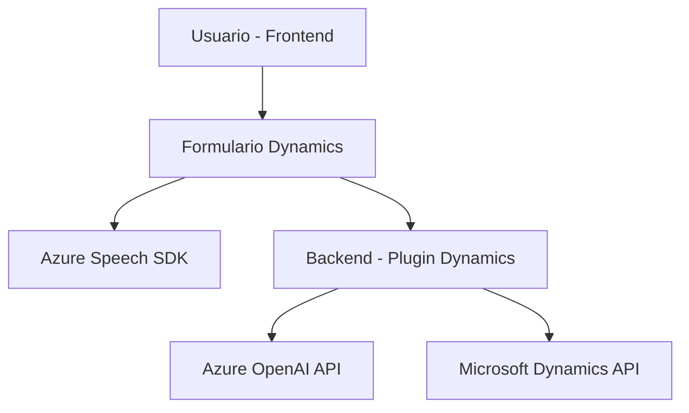

### Breve resumen técnico

El repositorio expuesto implementa una solución de tipo **integración funcional** para procesar datos dentro de formularios de Dynamics 365. La prioridad principal es permitir la interacción entre usuarios y aplicaciones mediante reconocimiento y síntesis de voz (usando Azure Speech SDK) y procesar y transformar datos utilizando las capacidades de texto-enriquecido de Azure OpenAI API (GPT-4).

La solución incluye:
- **Frontend**: Archivos de JavaScript para la síntesis y transcripción de voz, así como procesamiento de texto en formularios de Dynamics 365.
- **Backend/Plugins**: Un plugin desarrollado en C# para transformar texto con Azure OpenAI API en un contexto de Dynamics CRM.

---

### Descripción de arquitectura

La solución sigue un modelo **híbrido** basado en dos principios:
1. **Interpretación en múltiples capas**:
   - Capa de interacción: Captura y reproducción de datos mediante Azure Speech SDK en el frontend.
   - Capa de procesamiento: Ajuste y transformación de datos utilizando lógica de negocio en Dynamics CRM backend y un servicio de API externa (Azure OpenAI).
   - Capa de integración: Gestión dinámica entre los formularios de Dynamics y las APIs.

2. **Plugin-based architecture**:
   - El plugin desarrollado en C# se registra en los eventos del ciclo de vida del formulario en Dynamics CRM, procesando datos directamente en los campos de la entidad.

3. **SOA & External SDK Integration**:
   - Uso de APIs externas como Azure Speech SDK para operaciones de síntesis y transcripción de voz en el frontend.
   - Uso de la API REST de Azure OpenAI para la transformación de texto mediante IA en el backend.

4. **Modular architecture**:
   - Responsabilidades separadas entre módulos: Cada función tiene un propósito específico y facilita el mantenimiento del código.

---

### Tecnologías usadas

1. **Frontend**:
   - **JavaScript**: Implementación de lógica de cliente para formularios en Dynamics 365.
   - SDK externo: Azure Speech SDK para sintetizar y transcribir voz.

2. **Backend**:
   - **C# (.NET Framework)**: Plataforma base para desarrollar el plugin.
   - **Microsoft Dynamics CRM SDK (`Microsoft.Xrm.Sdk`)**: Para integración con las APIs y ciclo de vida de los plugins en Dynamics.
   - **System.Net.Http** y **System.Text.Json**: Para llamadas y manipulación de datos de la API REST de Azure OpenAI.

3. **Integraciones externas**:
   - **Azure Speech SDK** (texto a voz/vos a texto).
   - **Azure OpenAI API**: Procesamiento de texto avanzado con capacidad GPT-4.

### Dependencias

- **Microsoft Dynamics 365**:
  - Contexto CRM (`ExecutionContext`, `formContext`)
  - API del cliente de Dynamics 365 (`IOrganizationService`, `IPluginExecutionContext`).
- **Azure Speech SDK**:
  - Carga dinámica en el frontend para síntesis y transcripción.
- **Azure OpenAI API**:
  - Transformación de texto mediante GPT-4.
- **HttpClient APIs**:
  - Realizan los llamados HTTP hacia los endpoints de Azure OpenAI.

---

### Diagrama Mermaid válido para GitHub

Este diagrama simplifica las relaciones y flujo entre los tres elementos esenciales del sistema: frontend, backend y servicios externos (Azure y Dynamics).

---

### Conclusión final

Este repositorio representa una solución que integra Dynamics 365 con tecnologías avanzadas como Azure Speech SDK y Azure OpenAI API. La arquitectura predominante es modular y orientada a servicios (SOA), con un enfoque directo hacia separación de funciones y componentes. El uso de plugins en Dynamics CRM para procesamiento backend demuestra un diseño compacto y eficiente para resolver problemas relacionados con formularios y datos.

El código de frontend se encarga principalmente de manejo de voz (síntesis y transcripción), mientras que el plugin en backend realiza transformaciones avanzadas usando IA para enriquecer la experiencia del usuario en Dynamics 365. La aproximación es adecuada para entornos empresariales que demandan interacción natural y análisis enriquecido de datos.