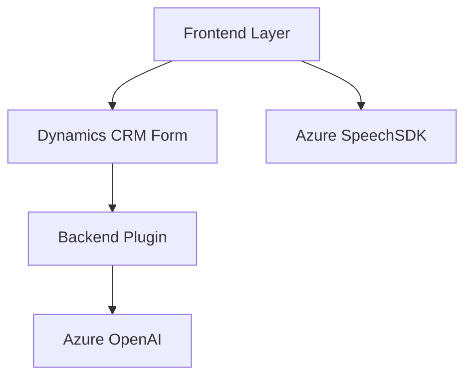

### Breve Resumen Técnico

El repositorio analiza la interacción entre distintos componentes involucrados en la implementación de servicios basados en voz e inteligencia artificial, integrados en formularios de Dynamics 365 CRM. Se divide en funcionalidades de frontend (`readForm.js`, `speechForm.js`) y un plugin backend (`TransformTextWithAzureAI.cs`) que consume servicios de Azure OpenAI. Las principales funciones incluyen lectura y síntesis de voz, captura de entrada de voz, transformación de texto mediante IA, y actualización dinámica de formularios.

---

### Descripción de Arquitectura

La arquitectura de la solución puede clasificarse como una **n-capas distribuida**, que integra componentes frontend y backend para Dynamics CRM. Tiene las siguientes características:
1. **Frontend Layer:**
   - Más centrada en UX, utiliza el Azure Speech SDK para interactuar con los usuarios mediante síntesis y reconocimiento de voz.
   - Incluye patrones como modularidad y cargadores dinámicos.
   
2. **Backend Layer:**
   - Basado en `Plugins` de Dynamics CRM que integran servicios concretos para transformación de datos mediante APIs externas (Azure OpenAI). 
   - Implementa una interacción entre entidades CRM y el servicio OpenAI.

3. **Hub de servicio externo:**
   - Relaciones acopladas con Azure Speech SDK y Azure OpenAI, mostrando un patrón de **API Composition**.

---

### Tecnologías Usadas

1. **Frontend:**
   - **JavaScript/ES6:** Manejo de eventos y DOM para formularios interactivos.
   - **Azure Speech SDK:** Para texto a voz (readForm.js) y reconocimiento de voz (speechForm.js).
   - **Dynamics 365 WebApi (Xrm.WebApi):** Uso para actualizar atributos mediante APIs personalizadas.

2. **Backend Plugin:**
   - **C# (ASP.NET):** Implementación de lógica en plugins.
   - **Microsoft Dynamics CRM SDK:** Contexto del CRM y sus elementos.
   - **Azure OpenAI REST API:** Usada para transformación de texto.
   - **Newtonsoft.Json:** Simplificación en manejo del JSON devuelto por la API.

---

### Dependencias o Componentes Externos

1. **Azure OpenAI (GPT-4):** Proporciona servicios de transformación de lenguaje natural.
2. **Microsoft Dynamics CRM SDK:** Para ejecución e integración de plugins con el contexto de formularios y entidades.
3. **Azure Speech SDK:** Servicios de texto a voz y reconocimiento de voz.
4. **Supported Dynamics APIs** (e.g., Xrm.WebApi): Para actualización dinámica de campos.

---

### Diagrama Mermaid

El diagrama representa los principales componentes de la solución y cómo interactúan con servicios externos:

---

### Conclusión Final

El diseño del repositorio implementa una solución integrada para aplicaciones de CRM en Dynamics 365 que requieren interacción basada en voz e inteligencia artificial. Los patrones de modularidad y uso de SDK externos aseguran escalabilidad dentro de un ecosistema n-capas. 

La solución está bien orientada para manejar interacciones avanzadas de voz y texto mediante Azure Speech SDK y OpenAI. Sin embargo, ciertas consideraciones adicionales como validaciones avanzadas de entrada y manejo de errores críticas pueden ampliar la robustez del sistema.