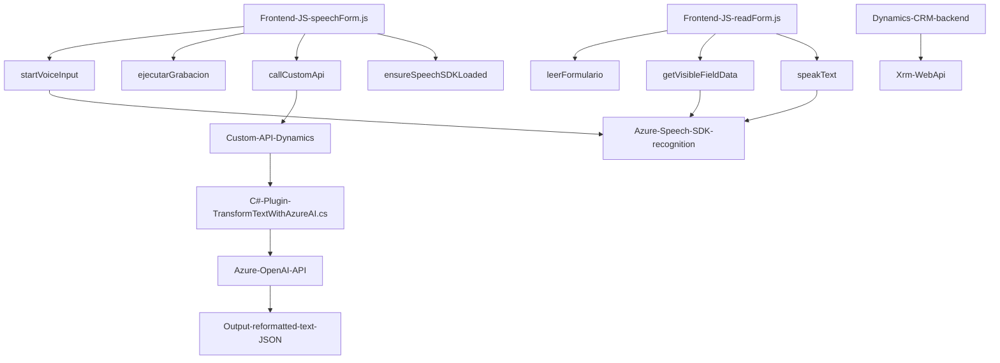

## Breve Resumen Técnico

El repositorio parece estar orientado al desarrollo de funcionalidades para interacción de usuarios con Microsoft Dynamics CRM, mediante reconocimiento de voz, síntesis de habla y transformación de texto. Se utilizan servicios de Azure (Speech SDK y OpenAI) para proporcionar capacidades avanzadas como conversión de texto a voz, reconocimiento de voz y procesamiento con inteligencia artificial. Además, un plugin en C# permite integrar funcionalidad personalizada directamente en el backend de Dynamics CRM.

---

## Descripción de Arquitectura

La arquitectura es híbrida, combinando las siguientes características:
1. **Frontend:** Funcionalidad basada en JavaScript integra la experiencia de interacción de voz en los formularios de Dynamics CRM. Utiliza el modelo de eventos del SDK del formulario.
2. **Backend en Dynamics CRM:** Un plugin basado en `.NET` que implementa lógica personalizada extendiendo el sistema CRM.
3. **Integración externa:** Uso intensivo de servicios de Microsoft Azure como Speech SDK (Frontend) y Azure OpenAI (C# Backend Plugin).
4. **Patrones arquitectónicos aplicados:**
   - **Arquitectura modular:** Los módulos frontales están organizados por archivos independientes y con funciones separadas según responsabilidad.
   - **Cliente-Servidor:** El frontend basado en JS actúa como cliente que interactúa con un servidor CRM.
   - **N-capas:** Backend estructurado en capas con un plugin que interactúa con Dynamics CRM y servicios externos como Azure OpenAI.

---

## Tecnologías Usadas

### **Entorno Frontend (JavaScript)**
- **Microsoft Dynamics CRM SDK:** Base del entorno donde operan los formularios y ejecución de scripts JavaScript.
- **Azure Speech SDK:** Usado para reconocimiento de voz y síntesis de texto en audio.
- **Custom APIs:** Integradas en Dynamics CRM para realizar transformaciones personalizadas (procesamiento AI/voz).
- **Xrm.WebApi:** SDK incorporado en Dynamics CRM para comunicación con sus servicios backend.

### **Entorno Backend (C# Plugin)**
- **Microsoft Dynamics CRM Plugins:** Extensibilidad del CRM basada en `IPlugin` de `Microsoft.Xrm.Sdk`.
- **Azure OpenAI Service:** API para transformación y análisis de texto.
- **System.Text.Json / Newtonsoft.Json:** Manipulación y serialización de objetos JSON.

### Patrones de diseño
- **Modularización:** Fragmentación del código en funciones y clases según su responsabilidad específica.
- **Carga dinámica:** Speech SDK se carga dinámicamente para reducir la carga inicial y aplicar el patrón Lazy Loading.
- **Repository Pattern:** Uso del API de Dynamics CRM para interactuar con datos del sistema como si fueran repositorios.
- **Fachada:** El plugin estructura funcionalidad externa encapsulándola en un único método para simplificar la interacción.

---

## Diagrama Mermaid

---

## Conclusión Final

Este repositorio integrates seamlessly various technical layers to enhance user interaction while leveraging Microsoft Dynamics CRM as the foundational business platform. By combining Azure technologies like Speech SDK and OpenAI alongside CRM's extensible architecture (`IPlugin` in .NET and `Xrm.WebApi` in JS), the solution facilitates voice-guided interaction with sophisticated text-to-speech conversion and AI-based text transformation. 

The modular architecture supports separation of concerns and scalability, where frontend handles user interaction and the backend plugin manages enterprise-level data processing efficiently. The comprehensive use of service integration ensures compatibility while providing extensible mechanisms for future expansion.