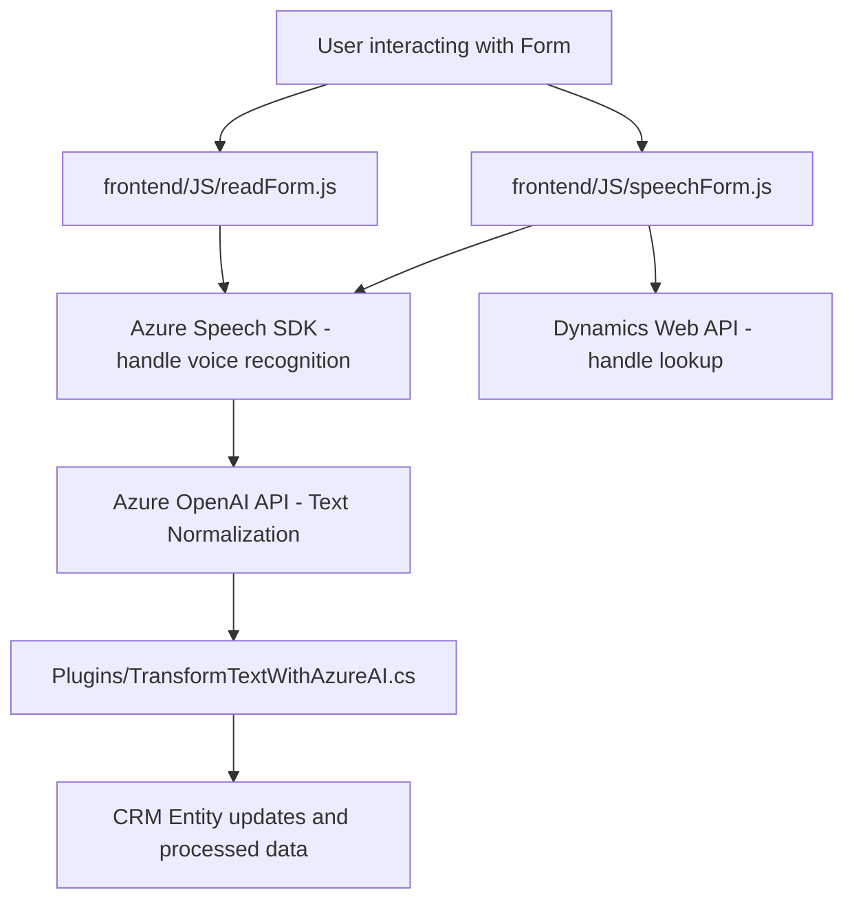

### Breve resumen técnico
El repositorio implementa funcionalidades para la interacción entre formularios web (Dynamics 365) y servicios externos de Azure, incluyendo síntesis y reconocimiento de voz (Azure Speech SDK) y transformación de texto estructurado (Azure OpenAI). Se distribuye en dos capas principales:
1. **Frontend:** Archivos JavaScript que interactúan con los formularios del CRM utilizando el Speech SDK.
2. **Plugin:** Código backend basado en C# que actúa como un plugin para Dynamics CRM, procesando texto mediante Azure OpenAI.

---

### Descripción de arquitectura
**Tipo de solución**: Combinación de APIs y frontend integrados en un sistema CRM (Dynamics 365).
**Arquitectura**:
- **n Capas:** El sistema está compuesto por diferentes capas que trabajan en conjunto:
  - **Frontend:** Archivos JavaScript que manejan la interacción del usuario y la conexión con Azure Speech SDK.
  - **Backend:** Plugin de Dynamics CRM que procesa texto en segundo plano con la ayuda de Azure OpenAI.
- Este diseño facilita la encapsulación de responsabilidades: interacción del usuario en el front y procesamiento profundo en el backend.

Los archivos usan patrones de modularidad, encapsulación y delegación. Hay una separación clara entre la extracción de datos, procesamiento local y las llamadas a servicios externos (Azure).

---

### Tecnologías usadas
**Frontend (JavaScript):**
- **Azure Speech SDK:** Manejo de síntesis y reconocimiento de voz.
- **Dynamics 365 Web API:** Manipulación de datos de formularios en CRM.
- **JavaScript (modular):** Lógica para extraer, procesar y aplicar datos en formularios.

**Backend (C# Plugin):**
- **Azure OpenAI API:** Realización de transformaciones de texto mediante modelos GPT.
- **Microsoft.Xrm.Sdk:** Interacción con objetos y servicios de Dynamics CRM.
- **Newtonsoft.Json.Linq / System.Text.Json:** Manejo de datos JSON provenientes de la API de Azure.
- **HttpClient:** Envio de solicitudes REST al endpoint de Azure.

---

### Diagrama Mermaid válido para GitHub Markdown

---

### Conclusión final
Este repositorio implementa una solución híbrida que combina funcionalidades de frontend interactivo y backend avanzado para integrar capacidades de voz y transformación de texto en un sistema CRM (Dynamics 365). La arquitectura modular y orientada a eventos aprovecha servicios cognitivos de Azure para lograr una experiencia flexible y altamente configurable. El diseño se encuentra bien estructurado para su propósito y facilita el mantenimiento al separar responsabilidades entre el frontend y el backend.