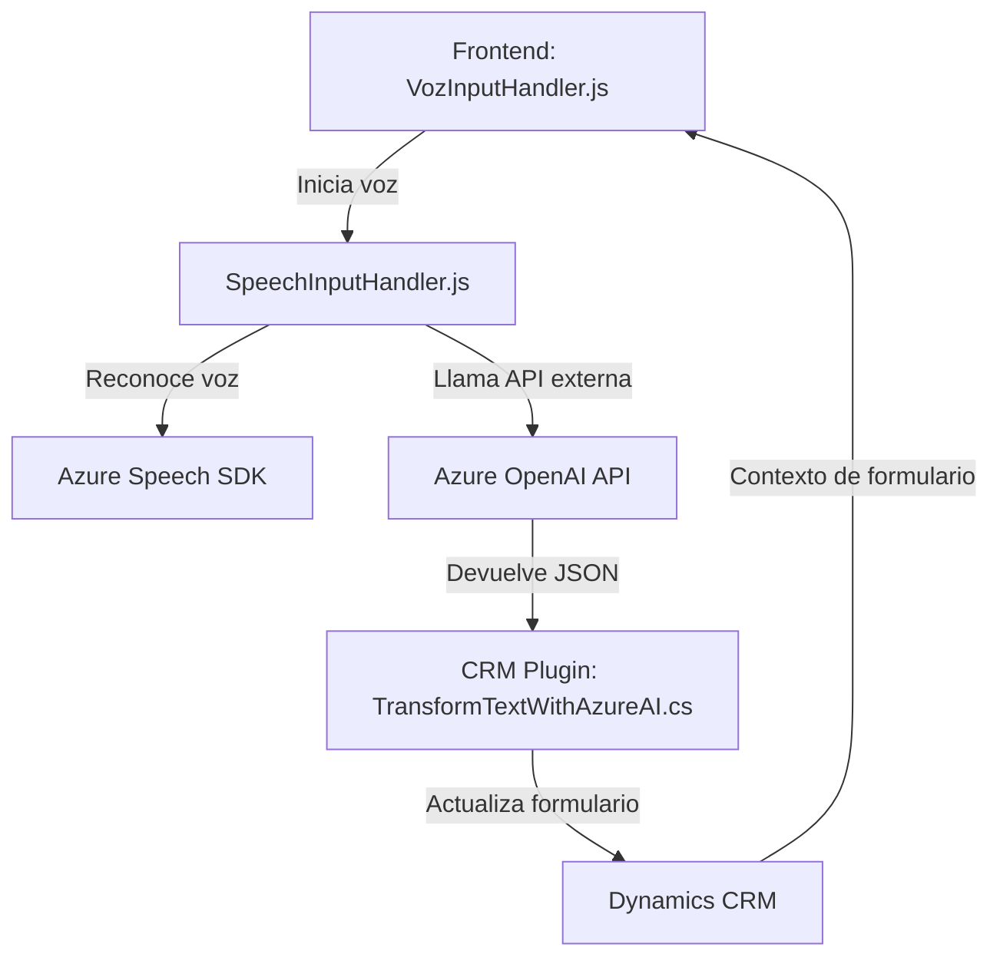

### Breve resumen técnico
El repositorio contiene una solución orientada a integrar funcionalidades de reconocimiento de voz y síntesis de texto con formularios de Dynamics CRM. Utiliza **Azure Speech SDK** y **Azure OpenAI API** para la administración de voz y transformación de texto. Tiene tanto componentes de frontend en JavaScript como extensiones backend en C# para Dynamics CRM.

---

### Descripción de arquitectura
1. **Tipo de solución:**  
   Es una solución híbrida que combina una API backend (plugin en Dynamics CRM) y funciones de frontend para interacción de usuarios con formularios mediante reconocimiento y síntesis de voz.

2. **Arquitectura:**  
   - **Frontend/Cliente:** Arquitectura basada en módulos orientada a eventos para manipular formularios con voz y servicios externos.  
   - **Backend/Plugin:** Arquitectura basada en patrones de plugins para Dynamics CRM; también utiliza el patrón **microservicio** al consumir APIs externas como **Azure OpenAI API**.  
   En conjunto, la arquitectura es **componente distribuida**, con separación de responsabilidades entre el frontend y el backend.  

---

### Tecnologías usadas
1. **Frontend:**  
   - **JavaScript:** Funciones para manejar formularios y voz.  
   - **Azure Speech SDK:** Para procesamiento de voz en el navegador.  
   - **Dynamics CRM Xrm Context:** Para manipulación de datos de formularios.  
   
2. **Backend (Dynamics CRM Plugin):**  
   - **C#:** Implementación del plugin.  
   - **Microsoft.Xrm.Sdk:** Para integrar con elementos de Dynamics CRM.  
   - **Azure OpenAI API:** Para transformar texto en estructuras JSON.  
   - **Newtonsoft.Json:** Manejo dinámico de JSON.  

3. **Patrones de diseño:**  
   - **Facade Pattern:** Simplificación de la interacción entre varios servicios mediante métodos principales (como `Execute` y el método API del frontend).  
   - **Factory Pattern:** Modularización de configuraciones (como los lookups y field mappings).  
   - **Separación de Concerns:** Gestión de voz y datos separados por funciones.  

---

### Diagrama Mermaid

---

### Conclusión final
Esta solución representa una implementación modular y escalable para integrar capacidades de voz y texto con formularios de Dynamics CRM. Se apoya en la potencia de servicios de nube como **Azure Speech SDK** y **Azure OpenAI**, distribuyendo las responsabilidades entre un frontend interactivo y extensiones de backend (plugin en Dynamics CRM). La arquitectura sigue principios de separación de responsabilidades, modularidad y extensibilidad, lo que la hace apta para escalar en escenarios empresariales más complejos. Sin embargo, mejorar la seguridad y reducir la carga del SDK externo pueden ser posibles áreas de mejora.