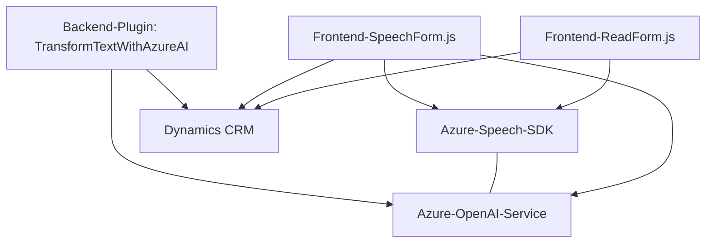

### Breve resumen técnico
El repositorio incluye dos módulos principales en el frontend, diseñados para la interacción y procesamiento de datos de formularios mediante reconocimiento de voz, además de un plugin en el backend que emplea los servicios de Azure OpenAI para transformar texto siguiendo reglas específicas. La solución utiliza APIs de Azure (Azure Speech SDK y OpenAI) para habilitar funcionalidades de voz y transformación de texto. 

---

### Descripción de arquitectura
La solución tiene una arquitectura **mixta** que combina los siguientes conceptos:
1. **Desarrollo web modular con componentes frontend** centrados en la funcionalidad específica de procesamiento y síntesis de voz, formando un sistema orientado a servicios (aplicando patrones como Service/Utility).
2. **Backend basado en Dynamics CRM plugin** que emplea lógica de negocio personalizada y se integra con servicios externos (Azure OpenAI) mediante peticiones REST. Este componente se ejecuta en el contexto de Dynamics CRM, lo que implica un diseño ligado a las interacciones con el sistema CRM.
   
El modelo arquitectónico podría calificarse como **arquitectura en capas** con separación clara entre las capas de interactuación con formularios (frontend) y procesamiento de datos en el servidor (plugin para integración CRM y servicios remotos).

---

### Tecnologías usadas
1. **Frontend:**
   - JavaScript.
   - **Azure Speech SDK** para síntesis y reconocimiento de voz (SDK cargado desde una URL externa).
   - Event-driven architecture utilizando callbacks y promesas.
   - Técnicas propias de Dynamics CRM (`executionContext`, configuración de formularios).

2. **Backend:**
   - **C# (.NET Framework)** para desarrollo del plugin.
   - **Azure OpenAI Service** como API remota para la transformación del texto.
   - Bibliotecas como `Microsoft.Xrm.Sdk` para interacción con Dynamics CRM.
   - Uso de protocolos HTTP y serialización/deserialización JSON (`Newtonsoft.Json`, `System.Text.Json`).

---

### Diagrama Mermaid

---

### Conclusión final
El repositorio implementa una solución híbrida basada en servicios que combina un frontend web para interactuar con usuarios y un backend que mejora las capacidades de procesamiento mediante servicios de inteligencia artificial como Azure OpenAI. La arquitectura refleja una separación funcional lógica entre los roles del frontend y backend, con una integración inteligente con Dynamics CRM. Sin embargo, se puede mejorar la seguridad haciendo uso de configuraciones más robustas para variables sensibles como las claves de acceso a API externas.