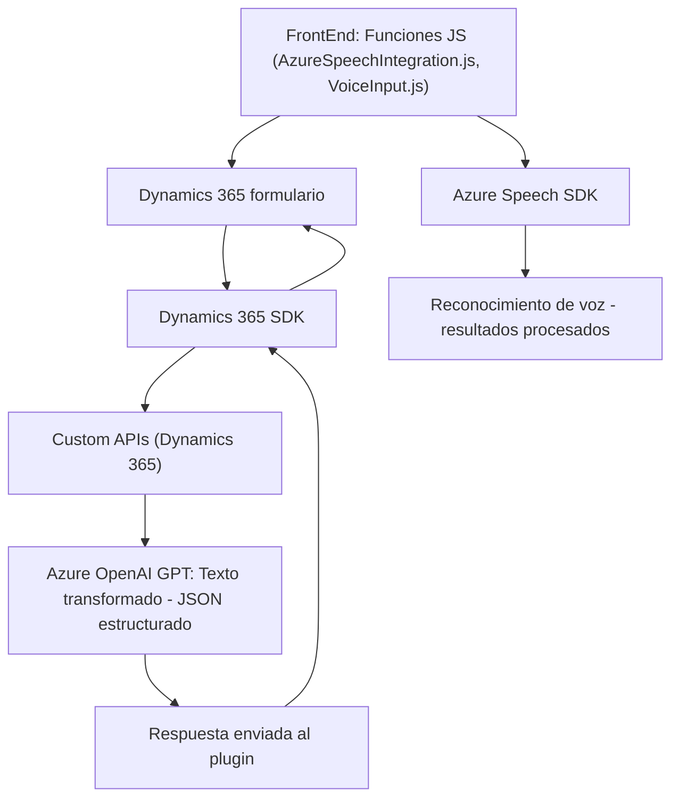

### Resumen técnico
El repositorio analiza aplicaciones integradas con **Microsoft Dynamics 365**, que implementan funcionalidades de reconocimiento de voz y procesamiento de texto mediante **Azure Speech SDK y Azure OpenAI GPT**. Los componentes están organizados en múltiples capas, interactuando con servicios externos como APIs de Azure y entidades de Dynamics 365.

---

### Descripción de la arquitectura
La solución utiliza una **arquitectura N-capas**, estructurada como sigue:
1. **Capa de presentación (frontend)**:
   - Realiza reconocimiento de voz y síntesis de voz utilizando **Azure Speech SDK**.
   - Actualiza dinámicamente el formulario en Dynamics 365 mediante JavaScript, integrando datos procesados por IA.
2. **Capa de lógica de negocio**:
   - Incluye un plugin de **Dynamics CRM** para enviar peticiones a **Azure OpenAI GPT** para transformar texto de acuerdo a reglas personalizadas.
   - Utiliza SDK de Dynamics para la manipulación de formularios y APIs Custom.
3. **Capa de integración**:
   - Interactúa con servicios externos (Azure Speech SDK y Azure OpenAI) mediante llamadas API y solicitudes HTTP.
   - Realiza la gestión dinámica del SDK en tiempo de ejecución (callback pattern).

---

### Tecnologías y patrones usados
#### **Tecnologías**:
1. **Frontend**:
   - Lenguajes: JavaScript.
   - Servicios externos: Azure Speech SDK (para síntesis de voz y reconocimiento).
   - Dynamics 365 SDK: Manipulación de formularios.
   - JSON para formato de salida y transmisión de datos.
   
2. **Backend/Plugins**:
   - Lenguajes: C# (.NET Framework).
   - Frameworks/Librerías: Dynamics CRM SDK, Newtonsoft.Json, System.Net.Http.
   - Servicio externo: Azure OpenAI GPT-4 para procesamiento de texto.

#### **Patrones arquitectónicos**:
1. **N-Capas**: División clara de responsabilidades entre presentación, lógica de negocio e integración.
2. **Callback pattern**: Uso de callbacks en el frontend para procesos asíncronos como la carga de SDK.
3. **Plugin pattern**: Implementación estándar de Dynamics CRM para manejar lógica específica.
4. **Integración basada en APIs externas**: Uso de Azure Speech SDK y OpenAI GPT-4.

---

### Dependencias y componentes externos
1. **Azure Speech SDK**:
   - URL externa: `https://aka.ms/csspeech/jsbrowserpackageraw`.
   - Utilizado para reconocimiento y síntesis de voz.
2. **Azure OpenAI GPT-4**:
   - API que procesa texto según reglas definidas y devuelve un JSON estructurado.
3. **Dynamics 365 SDK**:
   - Lógica para manipulación de formularios y llamadas a APIs Custom.
4. **Newtonsoft.Json** y **System.Text.Json**:
   - Serialización y manejo de datos estructurados en formato JSON.
5. **System.Net.Http**:
   - Envío de solicitudes HTTP hacia APIs externas.

---

### Diagrama Mermaid

---

### Conclusión final
La solución implementa un sistema de reconocimiento y síntesis de voz, junto con procesamiento de texto mediante IA, que optimiza la interacción con formularios de **Dynamics 365**. Está basada en una **arquitectura N-capas** con integración de componentes externos (Azure Speech SDK y OpenAI GPT-4), utilizando configuraciones dinámicas para garantizar la modularidad y ampliar funcionalidad según sea necesario.