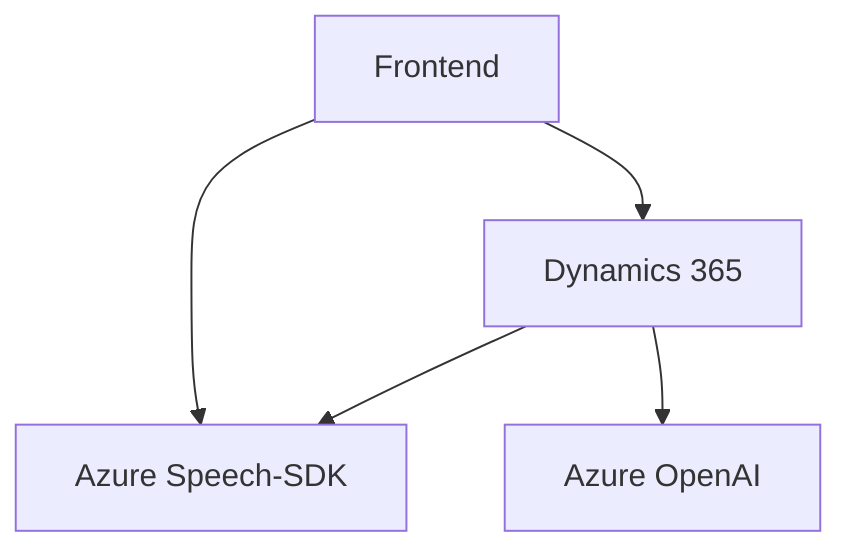

### Breve resumen técnico

La solución presentada es una integración de varias piezas de software para proporcionar funcionalidades específicas en el contexto de formularios de Dynamics 365 (Microsoft CRM). Utiliza la plataforma de Azure para implementar reconocimiento y síntesis de voz a través de su SDK Speech y el servicio OpenAI para procesamiento de texto avanzado.

---

### Descripción de arquitectura

#### Tipo de solución
- La solución es un **ecosistema híbrido** que combina **frontend**, **backend**, y **plugins integrados** para extender las capacidades del sistema Dynamics 365 con funcionalidades de reconocimiento de voz y transformación de datos.
- Es una integración especializada que mezcla lógica de negocio con servicios de inteligencia artificial, específicamente:
  - **Transformación de texto y comandos hablados** (mediante Azure OpenAI y Azure Speech SDK).
  - **Actualización dinámica de formularios en Dynamics 365**.
  - **Implementación de plugins personalizados para manejo de negocio**.

#### Tipo de arquitectura
- **Distribuida en capas** con una mezcla de enfoques:
  - Por un lado, el frontend utiliza una arquitectura basada en **n capas** con funciones distribuidas por responsabilidades (lectura de campos, síntesis de voz, grabación, transcripción y ejecución de comandos).
  - Por otro lado, en el backend destaca el uso de la arquitectura **plugin-based** de Dynamics CRM, que encapsula lógica específica en objetos reutilizables (basados en `IPlugin`).
  - El sistema emplea un **patrón Client-Server** para interacción entre frontend/browser y Dynamics 365 API.
  - Usa **Patrones externos de servicios** mediante Azure (Speech SDK y OpenAI).

---

### Tecnologías usadas

1. **Azure Speech SDK**
   - Reconocimiento y síntesis de voz.
   - Grabación y transcripción de audio.

2. **Azure OpenAI**
   - Procesamiento de texto mediante parámetros preconfigurados/normas.

3. **Dynamics CRM API**
   - Contexto de formularios (`formContext`) y operaciones en entidades.

4. **JavaScript** y **C#**
   - **JavaScript**: Para lógica del frontend, interactuando con formularios y servicios externos.
   - **C#**: Para plugins que extienden la funcionalidad de Dynamics 365.

5. **Frameworks/Librerías:**
   - `Newtonsoft.Json`: Manejo avanzado de JSON en C#.
   - `System.Net.Http`: Conexiones HTTP para servicios externos en C#.

6. **Patrones identificados:**
   - **Observer**: Carga dinámica de SDK (frontend) con callbacks.
   - **Plugin CRM**: Extensión de eventos en Dynamics mediante `IPlugin`.
   - **REST API Gateway**: Integración con servicios externos (Azure Speech, OpenAI).
   - **Mapeo dinámico de atributos**: En frontend, mapeando entre etiquetas y estructuras internas.
   - **Gestión de errores robusta**: Validación de SDK, API y datos.

---

### Diagrama Mermaid válido para GitHub Markdown

### Conclusión final

La solución se posiciona como una integración altamente especializada en el ecosistema de Microsoft Dynamics. Por un lado, utiliza el SDK de Azure Speech para realizar reconocimiento y síntesis de voz de manera eficiente en el frontend. Por otro lado, extiende las capacidades del CRM mediante plugins dinámicos y uso de servicios de OpenAI para transformar texto en base a estructuras predefinidas. 

La arquitectura exhibe una alta cohesión y modularidad, lo cual facilita la evolución del sistema ante cambios tecnológicos. El uso de tecnologías como Azure y Dynamics permite una escalabilidad robusta, alineada con las mejores prácticas corporativas actuales en entornos de IA y software como servicio (SaaS).