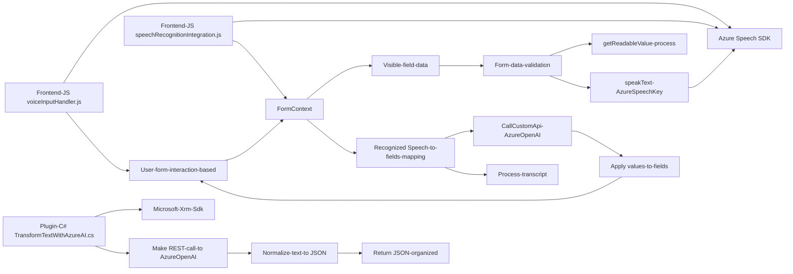

### Breve resumen técnico
Este repositorio contiene una solución que incluye un sistema de integración con **Microsoft Dynamics CRM**. Utiliza una combinación de un frontend en JavaScript para operaciones en un formulario dinámico junto con un plugin en C# que emplea servicios externos (Azure Speech SDK, Azure OpenAI y APIs de Dynamics CRM). Las funcionalidades principales incluyen reconocimiento de voz, síntesis de texto a voz y transformación de texto utilizando OpenAI.

---

### Descripción de arquitectura

La arquitectura general incluye una integración entre módulos frontend en JavaScript y backend con plugins de Dynamics CRM en C#. Aunque utiliza herramientas externas como Azure Speech SDK y Azure OpenAI, el núcleo de funcionalidades se mantiene conectado mediante los endpoints REST de Dynamics CRM.  
La arquitectura puede describirse como una combinación entre **n capas** y **event-driven architecture**. El sistema cuenta con:
1. **Frontend:** Capacidades de interacción dinámicas con el usuario (reconocimiento de voz, síntesis de texto, operaciones sobre el formulario).
2. **API Backend:** Enfoque de plugin pattern de Dynamics CRM y conexión REST con Azure OpenAI.
3. **Service Communication Layer:** Integración con Azure a través de SDKs y peticiones HTTP.

---

### Tecnologías usadas
1. **Azure Speech SDK v1.20.0:** Servicios de reconocimiento de voz y síntesis de texto a voz.
2. **Azure OpenAI (REST API):** Transformación de texto según normas específicas.
3. **Microsoft Dynamics CRM SDKs:**
   - **Microsoft.Xrm.Sdk**: Para manipulación del contexto de Dynamics CRM.
   - **Xrm.WebApi**: Llamadas API para manipulación de datos en el cliente (Frontend).
4. **JavaScript:** Manejo dinámico del formulario y procesamiento de voz.
5. **C#:** Para desarrollar plugins que interactúan con Dynamics CRM y servicios externos.
6. **Newtonsoft.Json.Linq y System.Text.Json:** Para la manipulación y generación de objetos JSON.

---

### Diagrama Mermaid válido para GitHub Markdown

---

### Conclusión final

Este repositorio exhibe una solución especializada para integración avanzada con Microsoft Dynamics CRM y Azure services. Mientras el frontend se enfoca en la interacción con el usuario y la entrada dinámica basada en reconocimiento de voz, en el backend los plugins en C# se ocupan de conectar con Azure OpenAI para realizar sofisticadas transformaciones de texto.  
La arquitectura, aunque distribuida entre frontend y plugins, preserva modularidad y adherencia a patrones comunes en n capas y event-driven architecture.

### Observaciones:
1. Se destaca el uso de Azure Speech SDK y OpenAI para operaciones cognitivas avanzadas.
2. Hay una alta dependencia de servicios externos (Azure) que requieren configuración segura y escalabilidad.
3. La estructura modular y reusable favorece modificaciones futuras, proporcionando flexibilidad.