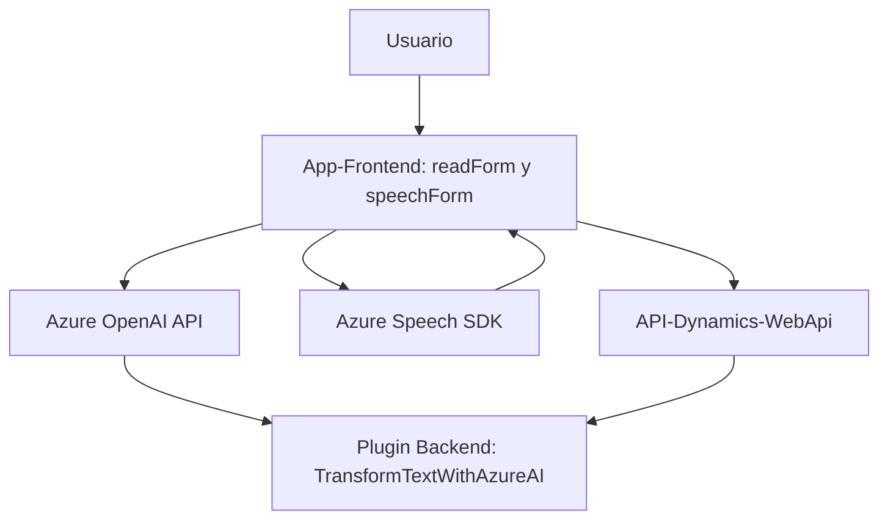

### Breve resumen técnico

El repositorio contiene tres archivos principales que implementan distintas funcionalidades relacionadas con **reconocimiento de voz**, **procesamiento de datos estructurados** y **integración con servicios en la nube**. Están vinculados a un flujo de entrada de voz y procesamiento de datos en aplicaciones empresariales, específicamente en Dynamics 365.

### Descripción de arquitectura

La solución utiliza un enfoque **modular dividido en capas**:
1. **Frontend (JavaScript)**: Manejo de interacción directa con el usuario y procesamiento de datos desde voz a texto, utilizando Azure Speech SDK para síntesis y reconocimiento de voz.
2. **Backend (Plugins)**: Integración con Dynamics CRM mediante un plugin que transforma texto con Azure OpenAI y aplica normas específicas para estructuración de datos.
3. **Servicios en la nube**: Uso de Azure Speech SDK para voz y Azure OpenAI para procesamiento avanzado de texto.

La arquitectura **n-capas** incluye:
- **Capa de presentación**: Implementada en el frontend con JavaScript.
- **Capa de aplicación**: Lógica de entrada de voz y procesamiento, con integración a APIs, dinámicamente extensible por IA.
- **Capa de dominio/Datos**: Plugins en Dynamics 365 procesan y estructuran datos.

**Patrones utilizados**:
- **Carga dinámica de dependencias**: Lazy-loading de Speech SDK.
- **Adaptador de API**: Encapsulación de lógica para consumir Azure Speech SDK y Azure OpenAI.
- **Promesas y asincronía**: Uso intensivo de programación asíncrona para llamadas a API.
- **Mapa de campos**: Validación y transformación de datos, utilizando estructuras como objetos y JSON.

### Tecnologías usadas

1. **Frontend**:
   - JavaScript.
   - Azure Speech SDK (usado para reconocimiento y síntesis de voz).
   - Dynamics Web API (para integración con formularios en Dynamics 365).

2. **Backend**:
   - C# (.NET Framework).
   - Microsoft Dynamics CRM SDK.
   - NewtonSoft.Json para manejo avanzado de JSON.
   - Azure OpenAI API (GPT para estructuración de datos).

3. **Servicios en la nube**:
   - Azure Speech SDK.
   - Azure OpenAI (con modelos GPT).

4. **Otros componentes**:
   - Lazy-loading y configuración dinámica para dependencias como SDK y API.

### Diagrama Mermaid válido para GitHub

### Conclusión final

La solución implementada en este repositorio se centra en proporcionar capacidades de interacción con voz, enfocada en aplicaciones empresariales como Dynamics 365. La arquitectura modular y en capas permite una integración extensiva con servicios en la nube, como Azure Speech SDK y Azure OpenAI, mientras utiliza patrones como lazy-loading y adaptadores de API. Es robusta, extensible y adecuada para entornos corporativos donde la automatización de procesos y la interacción por voz son requerimientos clave.