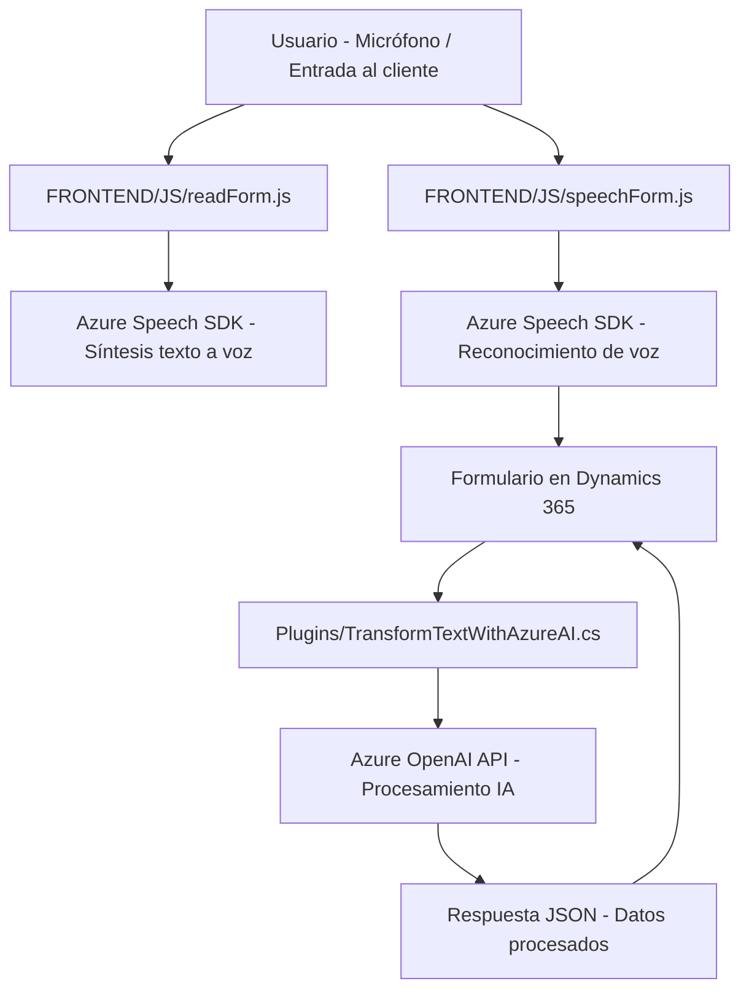

**Resumen técnico:**

El repositorio contiene archivos que implementan funcionalidades para una solución que integra el control por voz en formularios de Dynamics 365 utilizando el **Azure Speech SDK** y una **Custom API** basada en la **Azure OpenAI API**. Esto permite realizar síntesis de texto a voz, reconocimiento de voz, procesamiento de texto hablado y su transformación en formato JSON para la actualización de formularios.

---

### **Descripción de la arquitectura**

La solución sigue una arquitectura modular basada en "Cliente-Servidor" con integración a APIs externas. Los archivos sugiere un diseño basado en componentes distribuidos:

- **Frontend**: 
  - Funcionalidades implementadas en JavaScript que operan en el entorno del navegador, actuando como una capa de presentación y lógica de negocio específica para Dynamics 365. 
  - Las interacciones de voz y texto a voz aprovechan el **Azure Speech SDK**.

- **Middleware (Plugins)**: 
  - Un plugin en C# llamado `TransformTextWithAzureAI.cs` en Dynamics CRM que usa las capacidades avanzadas de IA del **Azure OpenAI API**. Este componente facilita la interacción con las APIs y la transformación de datos del lado del servidor.

### **Modelo Arquitectónico**

La arquitectura implementa un modelo **n-capas** combinado con integración de API externas:
1. **Capa de Presentación**:
   - Los scripts de JavaScript en el cliente integrados con formularios de Dynamics 365 sirven como punto de interacción y presentación al usuario.
   - El sistema obtiene datos del formulario, interactúa con el usuario mediante voz y los actualiza dinámicamente.
2. **Capa de Negocio**:
   - La lógica de negocio reside en el cliente y en el servidor (plugin). La capa de negocio cliente administra el reconocimiento de voz y la actualización de valores en el formulario mediante mapeos dinámicos.
   - En el servidor (plugin), se implementa la transformación del texto hablado usando reglas definidas y la interacción con el servicio de IA de Azure.
3. **Capa de Integración**:
   - La integración se realiza principalmente con el **Azure Speech SDK** para uso nativo del navegador y el **Azure OpenAI API** para procesamiento avanzado de texto en tiempo casi real.
4. **Capa de Datos**:
   - Dynamics 365 como sistema CRM, con gestión de entidades y atributos para formularios y registros.

### **Tecnologías utilizadas**

1. **Frontend:**
   - **JavaScript**: Principal lenguaje utilizado para la lógica de negocio del cliente.
   - **Azure Speech SDK**: Para reconocimiento de voz y síntesis de texto a voz.
   - **Dynamics 365 SDK (en cliente)**: Manipulación de formularios y atributos.
2. **Backend:**
   - **C# / .NET Framework**: Para desarrollo del plugin.
   - **Azure OpenAI API**: Servicio externo para transformación de texto mediante IA avanzada.
   - **Dynamics CRM SDK**: Para gestión del contexto del plugin y las entidades de CRM.

### **Dependencias y componentes externos**
- **Azure Speech SDK**: Cargado dinámicamente en los archivos de frontend para permitir texto a voz y reconocimiento de voz.
- **Azure OpenAI API**: Utilizada en el plugin para transformar texto en JSON siguiendo reglas predefinidas.
- **Dynamics 365 SDK**: Utilizado tanto en el cliente como en el plugin para acceso a atributos y entidades de CRM.
- **Newtonsoft.Json.Linq**: Para manipulación de datos JSON en el lado del servidor.
- **Browser APIs**: Manipulación del DOM y manejo de eventos en los scripts cliente (JavaScript).

---

### **Diagrama Mermaid**

---

### **Conclusión final**

La solución sigue un enfoque de arquitectura modular que integra tecnologías de reconocimiento de voz (**Azure Speech SDK**) y procesamiento IA (**Azure OpenAI API**) con **Dynamics 365 CRM**. La capa de frontend gestiona la interacción usuario-sistema en el navegador mientras que el backend, mediante un plugin en C#, amplía las capacidades de Dynamics CRM con integración de servicios externos. El proyecto está diseñado para manejar interacciones por voz, procesar datos, y reflejar cambios dinámicos en los formularios del CRM, mostrando un buen uso de las capacidades modernas de integración de servicios en la nube.