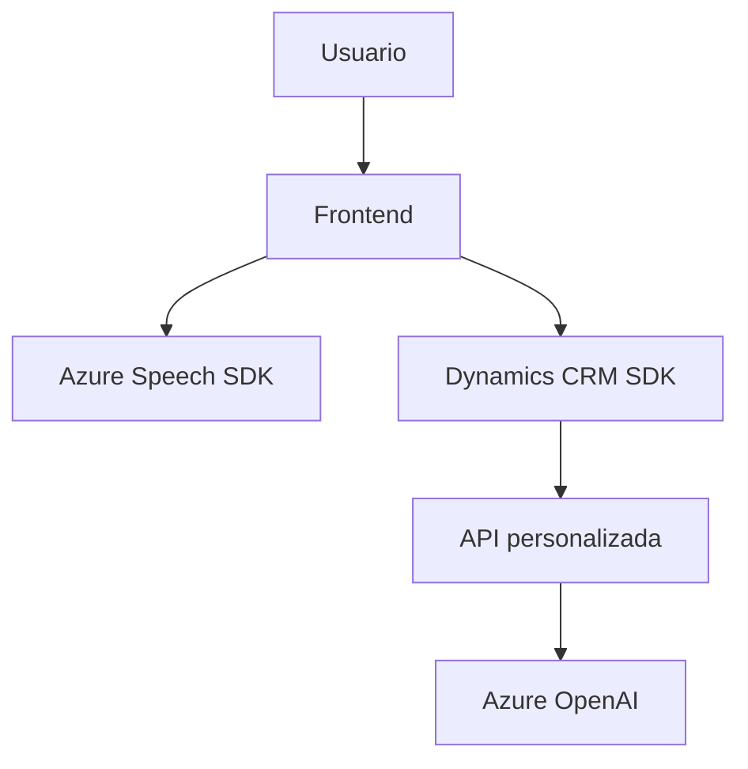

### Breve resumen técnico
El repositorio presenta tres piezas de código orientadas a mejorar la accesibilidad e integración de una solución para formularios en Dynamics CRM mediante el uso de SDKs de Azure (Speech y OpenAI). Los archivos implementan lectura de formularios, entrada de datos por voz, transcripción de texto, y procesamiento de datos con inteligencia artificial.

---

### Descripción de arquitectura
La solución tiene características propias de una arquitectura **modular orientada a eventos**, en donde:
1. El **frontend** utiliza módulos independientes para la interacción del usuario (voz y texto), diseñados con separación de responsabilidades.
2. El **backend** usa **plugins** en Dynamics CRM, bajo la arquitectura **n-capas**, para integrar funcionalidades avanzadas como el procesamiento de texto vía Azure OpenAI.

La interacción entre frontend y backend se da principalmente mediante APIs personalizadas de Dynamics CRM (Xrm.WebApi) como punto de comunicación.

---

### Tecnologías usadas
#### Entorno:
- **Dynamics CRM**: Sistema central que gestiona la interacción con formularios y eventos.
#### Frontend:
- **Azure Speech SDK**: Para sintetizar texto a voz y para realizar transcripción de voz a texto.
- **JavaScript**: Manipulación dinámica; uso de eventos asíncronos.
#### Backend:
- **Azure OpenAI**: Procesamiento de texto inteligente con reglas específicas.
- **C# & Dynamics CRM SDK**: Desarrollo de plugins y gestión del contexto en eventos del CRM.
#### Otros:
- **System.Text.Json** & **Newtonsoft.Json**: Manejo de datos en formato JSON para la comunicación con APIs.
#### Patrones de diseño:
1. Modularidad: Clases y funciones son autónomas y representan unidades específicas.
2. Carga dinámica: El frontend asegura la carga del SDK solo cuando es necesario.
3. Integración directa de APIs externas para extender funcionalidades.

---

### Diagrama Mermaid

---

### Conclusión final
Este repositorio implementa una solución para accesibilidad e interacción basada en voz y procesamiento inteligente de texto. Está diseñado modularmente para reutilización y claridad en funciones específicas. La aplicación tiene una arquitectura híbrida entre frontend-eventos y backend n-capas, integrando servicios cloud de Azure (Speech y OpenAI) como dependencias externas críticas.

**Fortalezas:**
- Modularidad y claridad en las funciones del frontend y los plugins.
- Integración robusta con APIs externas para extender funcionalidades de Dynamics CRM.
- Uso de estándares modernos de desarrollo como eventos asíncronos, SDKs y APIs.

**Oportunidades de optimización:**
- Documentar exhaustivamente ejemplos de configuración de las claves de Azure Speech y OpenAI.
- Ampliar pruebas unitarias para garantizar resiliencia en conexiones API.