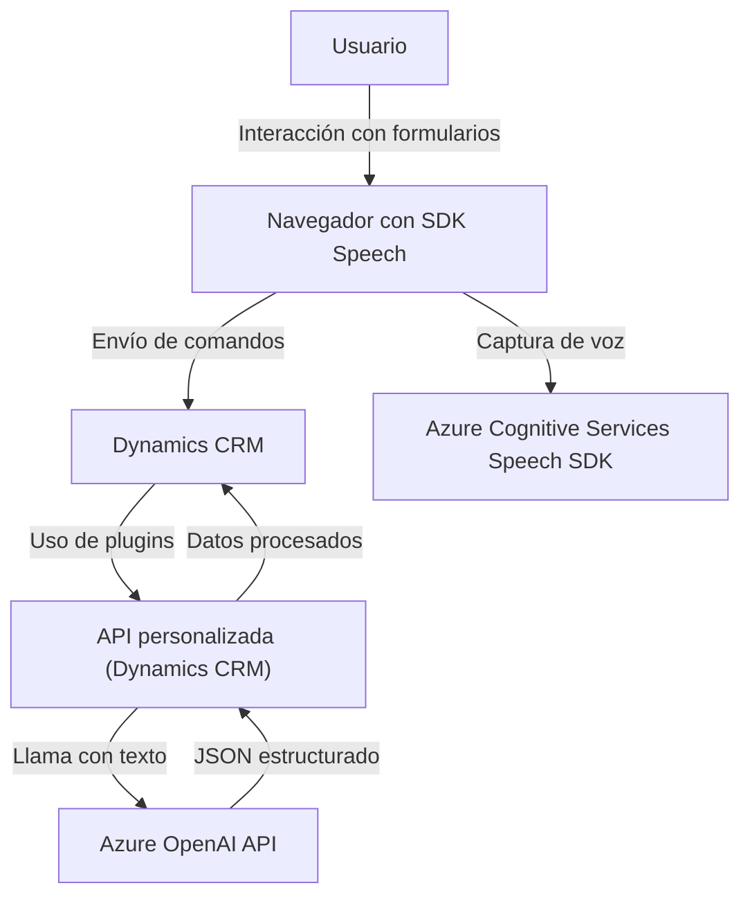

**Resumen técnico**
El repositorio parece ser una solución compuesta que tiene tres niveles de desarrollo: un módulo frontend (JavaScript), una interacción backend basada en un API de Dynamics 365, y un sistema de integración con Azure Cognitive Services (Speech SDK y OpenAI). Estos componentes trabajan en conjunto para ofrecer una funcionalidad avanzada de entrada, síntesis, y transformación de voz en formularios dentro de un sistema CRM. Está diseñado con una arquitectura modular y basada en eventos, implementando conceptos de microservicios y dependencia de servicios externos en la nube.

---

### **1. Tipo de solución**
Esta solución es una integración avanzada para plataformas CRM basada en:
- **Frontend**: Funciones en JavaScript que interactúan con Dynamics 365, el Azure Speech SDK y una API personalizada para entrada y síntesis de datos.
- **Backend**: Plugins de Dynamics CRM que procesan datos y realizan transformaciones mediante el modelo Azure OpenAI.

---

### **2. Tecnologías, frameworks y patrones usados**
#### Entorno de desarrollo:
- **Frontend (JavaScript)**:
  - **Azure Cognitive Services Speech SDK**: Para síntesis y transcripciones de voz.
  - **Dynamics 365 JavaScript APIs**: Para interacción con el contexto de formularios.
  - **Modularización**: Cada funcionalidad está separada y organizada en funciones reutilizables.
  - **Patrón Observer**: La función `ensureSpeechSDKLoaded` sigue un enfoque asíncrono que asegura la carga antes de continuar.
  - **Event-driven**: Activación de procesos en respuesta a eventos como captura de voz o entrada en formularios.

- **Backend (.NET)**:
  - **Microsoft Dynamics CRM SDK**: Extensión de funcionalidades del CRM usando `IPlugin`.
  - **Azure OpenAI API**: Transformación de texto a través de AI en un enfoque microservicio.
  - **REST API Workflow**: Comunicación directa con endpoints de Azure para procesamiento de datos.
  - **Plugin-based Architecture**: Integración como extensiones (`Plugin DLLs`) en Dynamics CRM.

---

### **3. Tipo de arquitectura**
La arquitectura es mixta:
- **Frontend**: Organizado por módulos individuales con una orientación hacia la separación de responsabilidades. Se podrían considerar de diseño "N-capas" en el ámbito del cliente.
- **Backend**: Plugin-based dentro de Dynamics CRM con integración hacia Azure OpenAI, lo cual fomenta una estructura de microservicios para el procesamiento externo.
- **General**: Uso de integración con APIs externas (Azure Speech/AI) y eventos en Dynamics CRM define una **arquitectura orientada a eventos y servicios externos**.

---

### **4. Dependencias o componentes externos presentes**
#### Dependencias externas:
1. **Azure Cognitive Services Speech SDK**: Procesos de síntesis y transcripción de voz.
2. **Azure OpenAI Service**: Transformación de texto en JSON con reglas predefinidas.
3. **Microsoft Dynamics CRM SDK**: Extensiones de funcionalidades dentro de formularios y contextos CRM.
4. **REST APIs**: Comunicación entre Dynamics y servicios de Azure.

#### Dependencias internas:
- Funciones auxiliares y módulos JavaScript (`getVisibleFieldData`, `callCustomApi`) que soportan la interacción con los contextos de formulario en Dynamics CRM.

---

### **5. Diagrama Mermaid**

---

### **Conclusión final**
El repositorio es una solución orientada a integrar funcionalidades avanzadas de entrada y procesamiento de voz en un sistema CRM como Dynamics 365, potenciando la automatización y simplificación en la captura de datos. Aprovecha tecnologías de Azure (Speech y OpenAI) para sintetizar y transformar datos con un enfoque modular y patrones basados en eventos. Su arquitectura mixta combina N-capas en frontend y microservicios en backend, optimizando la escalabilidad y reutilización.