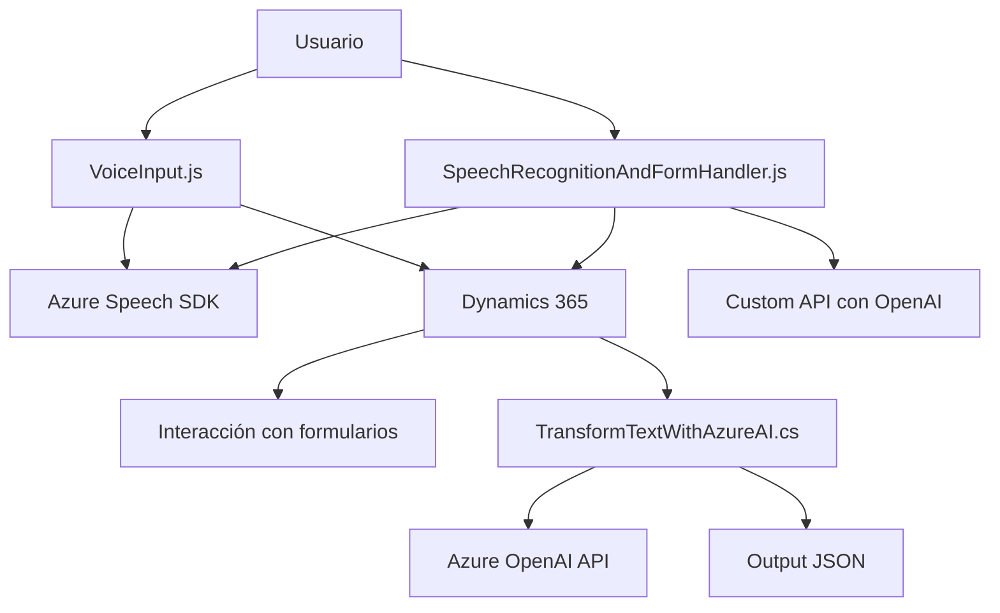

### Breve resumen técnico
El repositorio pertenece a una solución orientada a suplir las necesidades de interacción entre usuarios y formularios basados en Dynamics 365 mediante voz y procesamiento de inteligencia artificial. Está compuesto por dos módulos principales: **frontend** en JavaScript y un **plugin backend** en C#.

---

### Descripción de arquitectura
La arquitectura combina dos grandes enfoques:
1. **Frontend modular basado en SDKs:**
   - Implementa funciones que encapsulan la síntesis y reconocimiento de voz usando **Azure Speech SDK**.
   - La capa frontend se organiza mediante funciones específicas para subdividir tareas (recopilación de datos, voz a texto, conexión a APIs externas).

2. **Backend Plugin para Dynamics 365:**
   - El plugin en C# sigue un patrón de **monolito liviano** para procesos específicos de texto aplicados dentro del ecosistema Dynamics CRM.
   - Diseñado para ejecutar en un entorno servido por Dynamics 365, y delega la funcionalidad de transformación textual al servicio externo **Azure OpenAI** vía REST.

La arquitectura global puede ser descrita como una solución híbrida:
- Modularidad en frontend siguiendo principios de arquitectura orientada a eventos.
- Interfaz de comunicación RESTful para integración de lógica AI con Dynamics 365.

---

### Tecnologías usadas
#### Frontend:
1. **Azure Speech SDK**: Para síntesis de voz y reconocimiento de voz.
2. **JavaScript**: Usado para lógica interactiva y procesamiento del SDK.
3. **Dynamics 365 Web API**: Integración directa para manejar datos de formularios.

#### Backend:
1. **.NET Framework (C#)**: Implementa lógica del plugin sobre Dynamics 365.
2. **Azure OpenAI API**: Procesamiento avanzado mediante IA para texto.
3. **Newtonsoft.Json**: Utilizada posiblemente para manipulación avanzada de JSON (aunque no implementada explícitamente).

#### Arquitectura y patrones
1. **Event-Driven Architecture**: Usada principalmente en frontend (`SDK callbacks`).
2. **Facades**: Las funciones del frontend y métodos del plugin encubren la complejidad y la exposición directa de APIs externas.
3. **Single Responsibility**: Separación de tareas por función/método para legibilidad y mantenimiento.
4. **Service-Oriented Architecture (SOA)**: Abstracción de servicios externos (Speech SDK y OpenAI API) en la solución.

---

### Diagrama Mermaid para GitHub

---

### Conclusión final
La solución presentada integra potentes herramientas y servicios externos como **Azure Speech SDK** y **Azure OpenAI API** con el ecosistema de **Dynamics 365**, brindando una interfaz rica basada en interacción por voz y procesamiento textual avanzado. La arquitectura es híbrida y utiliza patrones como orientación a eventos, modularidad y servicio enfocado, lo que la hace flexible pero dependiente de servicios externos como Azure. Este diseño resulta ideal para escenarios que demandan procesamiento de voz, transcripción y transformación de datos mediante inteligencia artificial.