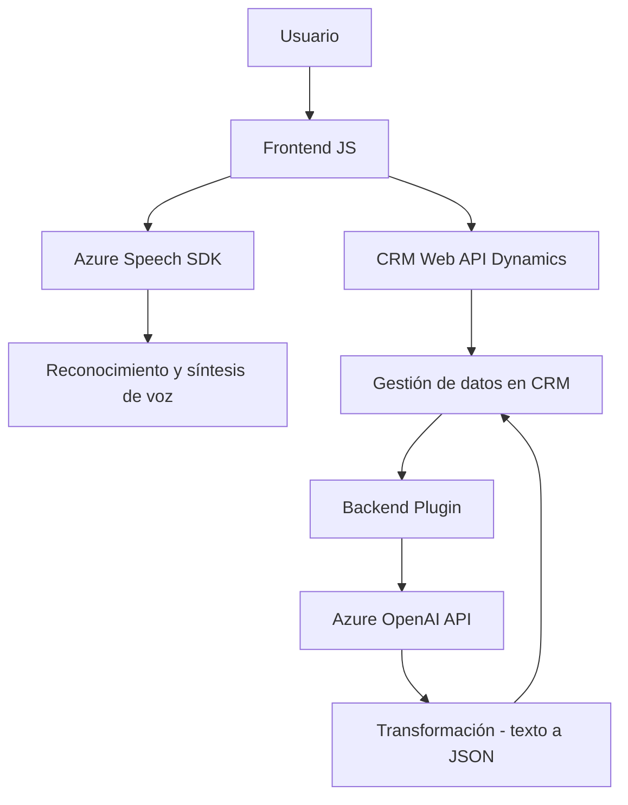

### Breve Resumen Técnico
El repositorio contiene tres componentes principales que tienen como foco la integración entre un sistema de formularios (presumiblemente parte de un CRM como Dynamics 365) y servicios externos basados en la nube, concretamente Azure AI y Azure Speech SDK. Estas aplicaciones fomentan accesibilidad y procesamiento de datos mediante reconocimiento de voz, síntesis de voz y transformación de texto.

---

### Descripción de Arquitectura
La solución utiliza una arquitectura **n-capas**, donde diferentes capas atienden funcionalidades específicas:

#### Capas principales:
1. **Frontend (JavaScript)**: 
   - Implementa funcionalidad para la lectura y transcripción de datos en formularios. Maneja la interacción entre el usuario, el SDK de Azure Speech y las APIs de Dynamics 365.
   
2. **Backend (Plugins en Dynamics 365)**:
   - Utiliza Azure OpenAI para transformar texto hacia un formato estructurado antes de actualizar los datos en los campos de Dynamics CRM.

3. **API de terceros**: 
   - Azure Speech SDK y Azure OpenAI para acceder a funcionalidades de síntesis de voz y transformación de datos.

La unión entre el frontend (JavaScript) y el backend (C#) trabaja en conjunto con servicios externos para proporcionar una solución completa de accesibilidad, procesamiento de voz y automatización en un entorno CRM.

#### Estructura arquitectónica:
1. **El frontend encaja en una solución modular y basada en servicios**, facilitando la integración con un SDK externo (Azure Speech).
   
2. **El backend utiliza el diseño de plugins**, que sigue un modelo de desarrollo basado en eventos de Dynamics CRM, y el patrón orientado a servicios para interactuar con Azure APIs.

3. **Integración basada en APIs y SDKs**:  
   Toda la comunicación entre el frontend y el backend se hace mediante integración de APIs (Dynamics 365 APIs y Azure APIs).

---

### Tecnologías Usadas
1. **Frontend**:
   - **Vanilla JavaScript**: Gestión de lógica de frontend.
   - **Azure Speech SDK**: Para transcripción y síntesis de voz.
   - **Dynamics 365 Web API**: Para interacción con el sistema CRM.

2. **Backend**:
   - **C#**: Lenguaje de programación para desarrollo del plugin.
   - **Azure OpenAI**: Servicio externo para procesamiento textual.
   - **Newtonsoft.Json**: Manipulación y procesamiento de JSON.
   - **Microsoft.Xrm.Sdk**: Comunicación con Dynamics CRM.

3. **Servicios Terceros**:
   - Azure Speech SDK
   - Azure OpenAI (API GPT)

---

### Diagrama Mermaid
El siguiente diagrama detalla los componentes y sus interacciones:

---

### Conclusión Final
Este repositorio implementa una solución moderna de accesibilidad y automatización empleando servicios en la nube (Azure). La arquitectura **n-capas** junto con la **integración basada en servicios** hace que este diseño sea extensible y fácil de escalar. Las capacidades de reconocimiento de voz, síntesis de texto por voz y transformación textual garantizan una funcionalidad avanzada enfocada en accesibilidad y procesamiento automatizado.